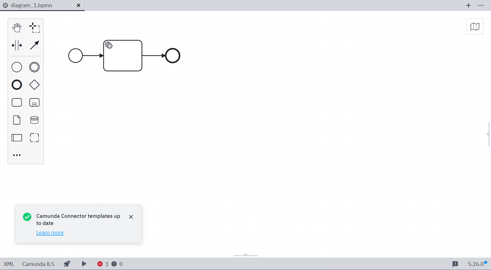
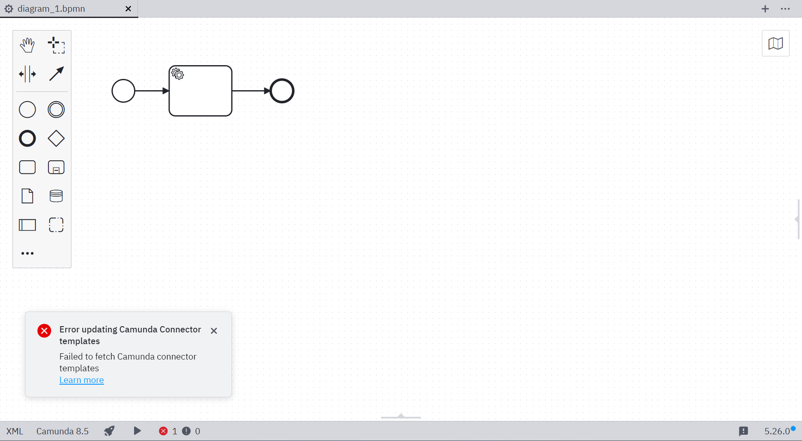
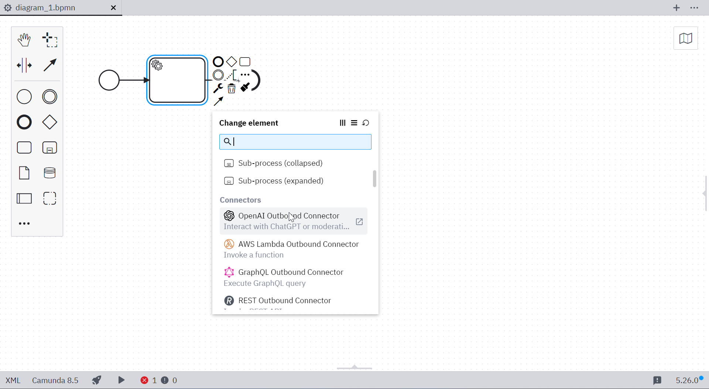

Camunda 8 only

Use [Camunda 8 Connectors](../../connectors/introduction.md) to access a growing range of external services or communication protocols.

Desktop Modeler automatically fetches and updates [element templates](./element-templates/about-templates.md) for [pre-built Connectors](../../connectors/out-of-the-box-connectors/available-connectors-overview.md) from the [Camunda Marketplace](https://marketplace.camunda.com/en-US/listing?pl=3038&attr=20486&cat=107792&locale=en-US). This happens automatically, in the background, unless explicitly [disabled](#disable-automatic-connector-template-fetching). Connector templates can also be provided [manually](#add-connector-templates-manually), offering you full control over the building blocks provided by the modeler.

## Automatic Connector template fetching

Automatic Connector template fetching is enabled by default, and notifies you of any updates or errors. The fetch is triggered whenever you start the application, or every 24 hours if the application is not closed.

After an update check has concluded, a notification indicates if the templates are up to date or have been updated:

In case of an error you'll see a notification:

Once fetched, you can use the templates in the Camunda 8 BPMN editor.

## Disable automatic Connector template fetching

Disable automatic fetching of Connector templates using the `#disable-connector-templates` [feature flag](./flags/flags.md#disable-connector-templates).

## Add Connector templates manually

For full control over the building blocks offered by Desktop Modeler, download element templates for individual Camunda 8 Connectors manually (for example, through the [Camunda Marketplace](https://marketplace.camunda.com/)). Make them available to Desktop Modeler via the element template [search paths](./element-templates/configuring-templates.md).

## Additional resources

- [About Camunda 8 Connectors](../../connectors/out-of-the-box-connectors/available-connectors-overview.md)
- [About Element Templates](./element-templates/about-templates.md)
- [Desktop Modeler flags](./flags/flags.md#disable-connector-templates)
