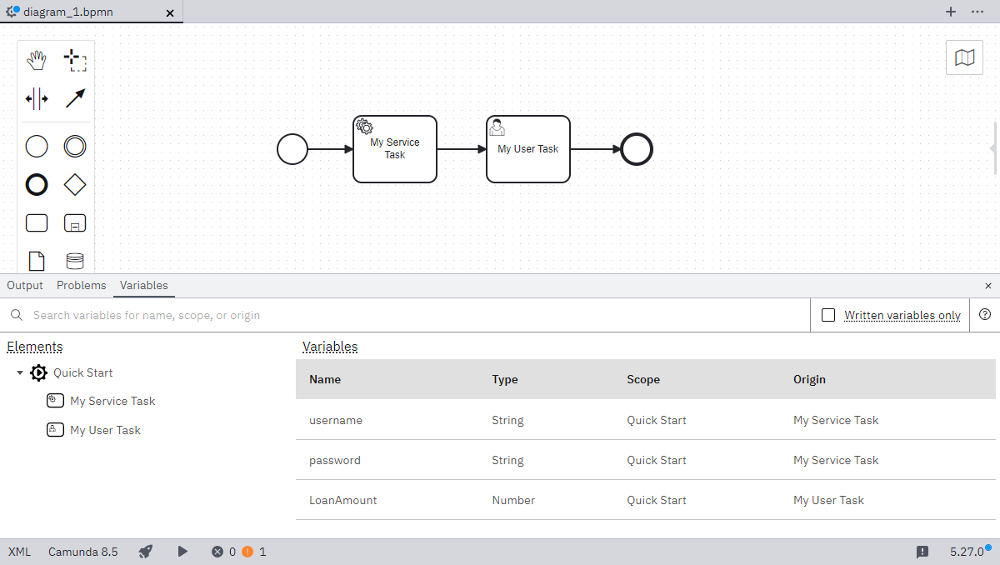

Track variables defined in the process diagram using the **Variables** view. This shows where a variable was created, which elements write to the variable, and the variable’s scope. Use this view to see which variables are available for use in an element and to troubleshoot problems with variables.

The **Elements** list in the **Variables** panel shows the process and all elements that write to variables.

- To see the variables in the scope of an element in the list, select the element, or hold `Shift` to select multiple elements.
- To keep the list readable, elements that don’t write to variables are omitted. To see the variables available to an element that’s not in the list, select the element on the canvas.

The table in the **Variables** panel shows information about each variable in the scope of the selected element:

- To show only the variables that the selected element writes to, check `Written variables only`.
- To see which elements use a variable, click on the variable name in the table. To return to the previous view, clear the **Filters** field.
- To find values in a column, you can also sort the column.
