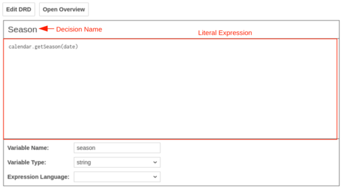
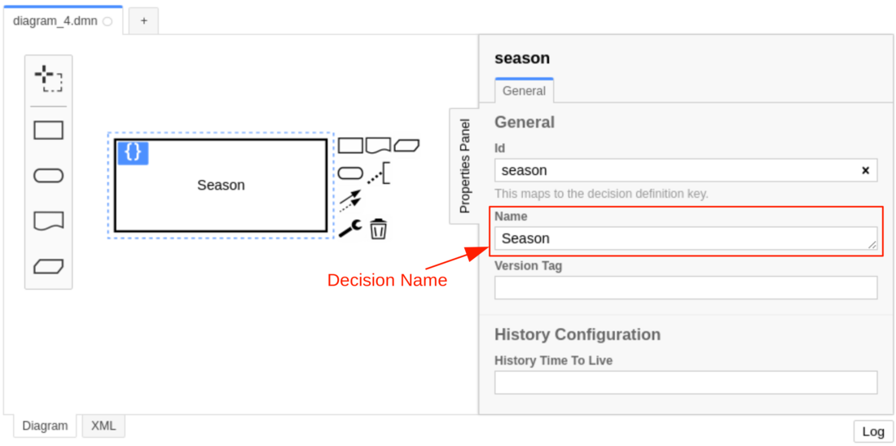
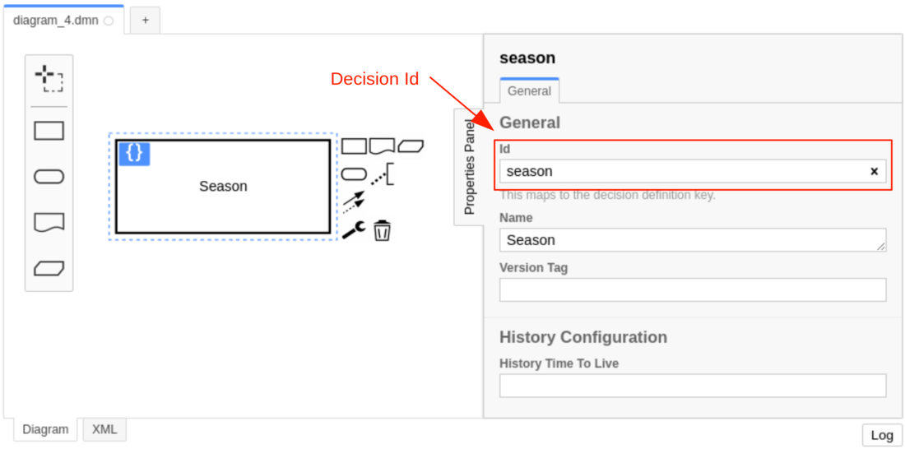

A decision literal expression represents decision logic which can be depicted as an expression. It consists of
a [literal expression](#literal-expression) and a [variable](#variable).

A decision literal expression is represented by a `literalExpression` element inside a `decision` XML element.

```xml

<definitions xmlns="https://www.omg.org/spec/DMN/20191111/MODEL/" id="definitions" name="definitions"
             namespace="http://camunda.org/schema/1.0/dmn">
    <decision id="season" name="Season">
        <variable name="season" typeRef="string"/>
        <literalExpression>
            <text>calendar.getSeason(date)</text>
        </literalExpression>
    </decision>
</definitions>
```

## Decision name



The name describes the decision for which the literal expression provides the decision logic. It is set as the `name`
attribute on the `decision` element.

```xml

<decision id="season" name="Season">
    <!-- ... -->
</decision>
```

## Decision id



The ID is the technical identifier of the decision. It is set in the `id`
attribute on the `decision` element.

Each decision should have an unique ID when it is deployed to Camunda.

:::caution

The decision ID may not contain any special characters or symbols (e.g. whitespace, dashes, etc.).

The decision ID can be any alphanumeric string including the `_` symbol. For a combination of words, it's recommended to
use the `camelCase` or the `snake_case` format. The `kebab-case` format is not allowed because it contains the
operator `-`.

If the decision ID contain a special character or symbol then the decision result can't be accessed in
a [dependent decision](decision-requirements-graph.md#required-decisions).

:::

```xml

<decision id="season" name="Season">
    <!-- ... -->
</decision>
```

## Literal expression

The literal expression specifies how the value of the decision is generated. It can be used to do a complex calculation,
or to combine the output values of [required decisions](decision-requirements-graph.md#required-decisions).

The expression language of the literal expression
is [FEEL](/components/modeler/feel/language-guide/feel-expressions-introduction.md).

The expression is set inside a `text` element that is a child of the `literalExpression` XML element.

```xml

<literalExpression>
    <text>calendar.getSeason(date)</text>
</literalExpression>
```

## Variable

A decision literal expression must have a variable which specifies the name and the type of the decision result. A
variable is represented by a `variable` element inside a `decision` XML element.

```xml

<decision id="season" name="Season">
    <variable name="season"/>
</decision>
```

### Variable name

The name of the variable is used to reference the value of the literal expression in the decision result. It is
specified by the `name` attribute on the `variable` XML element.

:::caution

The variable name may not contain any special characters or symbols (e.g. whitespace, dashes, etc.).

The variable name can be any alphanumeric string including the `_` symbol. For a combination of words, it's recommended
to use the `camelCase` or the `snake_case` format. The `kebab-case` format is not allowed because it contains the
operator `-`.

If the variable name contain a special character or symbol then the decision result can't be accessed in
a [dependent decision](decision-requirements-graph.md#required-decisions).

:::

:::tip

It is recommended to use the decision ID as the variable name.

In contrast to decision tables, the result of a decision literal expression can be accessed in
a [dependent decision](decision-requirements-graph.md#required-decisions) by its variable name instead of its decision
id.

:::

```xml

<variable name="season"/>
```

### Variable type definition

The type of the decision result can be specified by the `typeRef` attribute on the
`variable` XML element.

After the expression is evaluated it checks if the result converts to the specified type. The type should be one of the
supported [data types](dmn-data-types.md).

```xml

<variable name="season" typeRef="string"/>
```

Note that the type is not required but recommended since it provides a type safety of the expression result.
