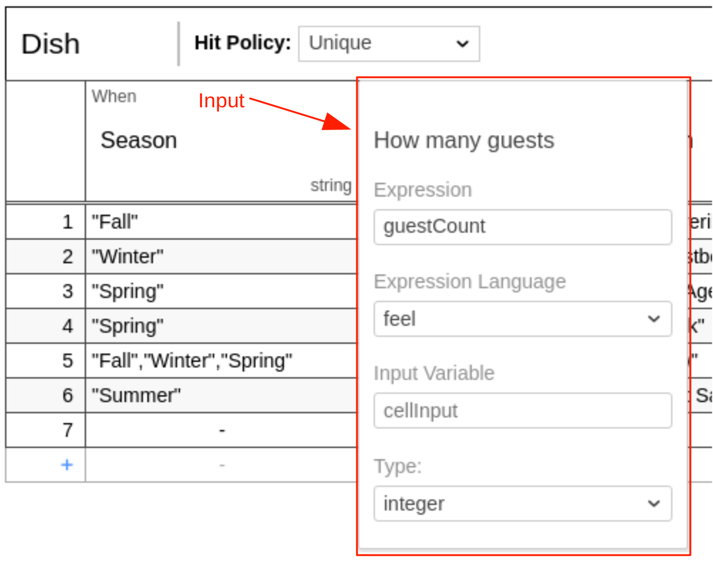
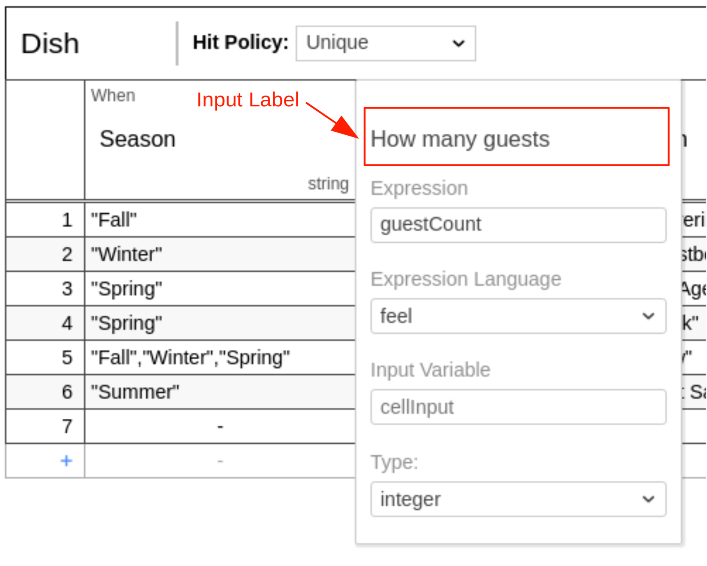
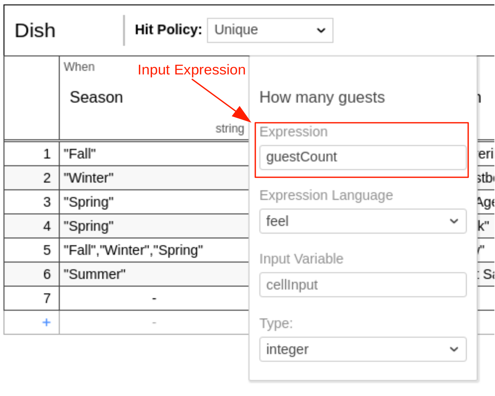
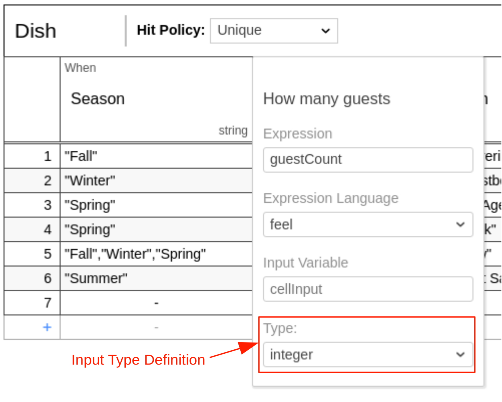

A decision table can have one or more inputs, also called input clauses. An input clause defines the id, label,
expression and type of a decision table input.

An input can be edited by double-clicking on the respective colum header in the decision table.

An input clause is represented by an `input` element inside a `decisionTable`
XML element.

```xml

<definitions xmlns="https://www.omg.org/spec/DMN/20191111/MODEL/" id="definitions" name="definitions"
             namespace="http://camunda.org/schema/1.0/dmn">
    <decision id="dish" name="Dish">
        <decisionTable id="decisionTable">
            <input id="input1" label="Season">
                <inputExpression id="inputExpression1" typeRef="string">
                    <text>season</text>
                </inputExpression>
            </input>
            <!-- ... -->
        </decisionTable>
    </decision>
</definitions>
```

## Input ID

The input ID is a unique identifier of the decision table input. It is used by Camunda to reference the
input clause. Therefore, it is required. It is set as the `id` attribute of the `input` XML element.

```xml

<input id="input1" label="Season">
    <inputExpression id="inputExpression1" typeRef="string">
        <text>season</text>
    </inputExpression>
</input>
```

## Input label



An input label is a short description of the input. It is set on the `input`
XML element in the `label` attribute. Note that the label is not required but recommended, since it helps to understand
the decision.

```xml

<input id="input1" label="Season">
    <inputExpression id="inputExpression1" typeRef="string">
        <text>season</text>
    </inputExpression>
</input>
```

## Input expression



An input expression specifies how the value of the input clause is generated. It is usually simple and references a
variable which is available during the evaluation.

The expression language of the input expression
is [FEEL](/components/modeler/feel/language-guide/feel-expressions-introduction.md).

The expression is set inside a `text` element that is a child of the
`inputExpression` XML element.

```xml

<input id="input1" label="Season">
    <inputExpression id="inputExpression1" typeRef="string">
        <text>season</text>
    </inputExpression>
</input>
```

## Input type definition



The type of the input clause can be specified by the `typeRef` attribute on the
`inputExpression` XML element.

After the input expression is evaluated, it checks if the result converts to the specified type. The type should be one
of the supported [data types](dmn-data-types.md).

```xml

<input id="input1" label="Season">
    <inputExpression id="inputExpression1" typeRef="string">
        <text>season</text>
    </inputExpression>
</input>
```

Note that the type is not required but recommended, since it helps to understand the possible input values and provides
a type safety to be aware of unexpected input values.
