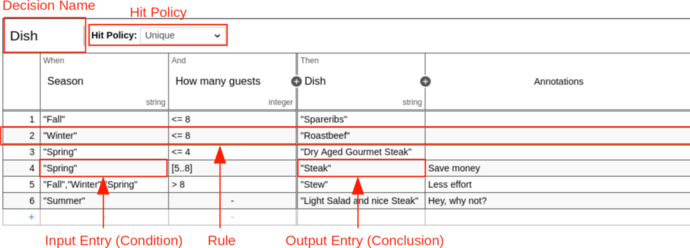
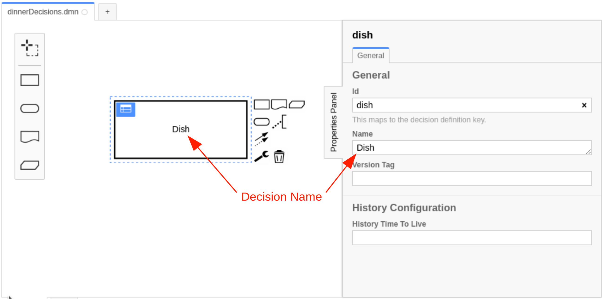
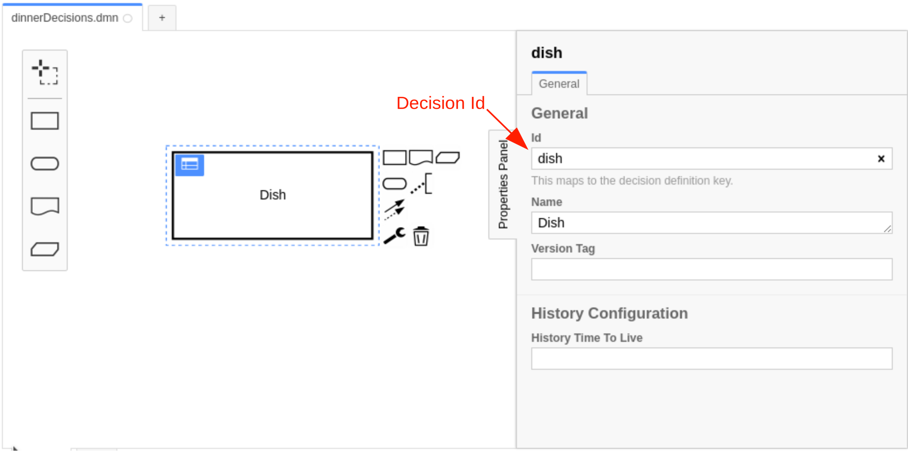

A decision table represents decision logic which can be depicted as a table. It consists
of [inputs](decision-table-input.md), [outputs](decision-table-output.md) and [rules](decision-table-rule.md).

A decision table is represented by a `decisionTable` element inside a
`decision` XML element.

```xml

<definitions xmlns="https://www.omg.org/spec/DMN/20191111/MODEL/" id="definitions" name="definitions"
             namespace="http://camunda.org/schema/1.0/dmn">
    <decision id="dish" name="Dish">
        <decisionTable id="decisionTable">
            <!-- ... -->
        </decisionTable>
    </decision>
</definitions>
```

## Decision name



The name describes the decision for which the decision table provides the decision logic. It is set as the `name`
attribute on the `decision` element. It can be changed via the properties panel on the right side of the screen after selecting the respective
"Decision" in the Decision Requirements Diagram view.

```xml

<decision id="dish" name="Dish">
    <decisionTable id="decisionTable">
        <!-- ... -->
    </decisionTable>
</decision>
```

## Decision ID



The ID is the technical identifier of the decision. It is set in the `id`
attribute on the `decision` element. Just as the `name`, the `id` can be changed via the Properties Panel after
selecting the respective "Decision" in the Decision Requirements Diagram view.

Each decision should have an unique ID when it is deployed to Camunda.

:::caution

The decision ID may not contain any special characters or symbols (e.g. whitespace, dashes, etc.).

The decision ID can be any alphanumeric string including the `_` symbol. For a combination of words, it's recommended to
use the `camelCase` or the `snake_case` format. The `kebab-case` format is not allowed because it contains the
operator `-`.

If the decision ID contains a special character or symbol then the decision result can't be accessed in
a [dependent decision](decision-requirements-graph.md#required-decisions).

:::

```xml

<decision id="dish" name="Dish">
    <decisionTable id="decisionTable">
        <!-- ... -->
    </decisionTable>
</decision>
```
