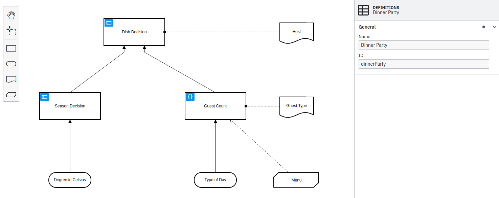
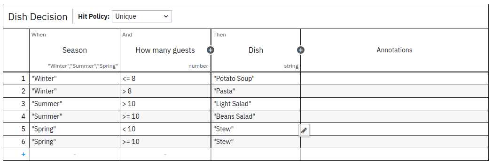
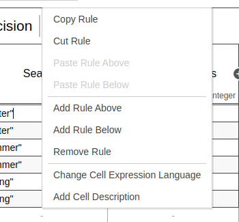
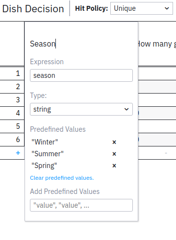
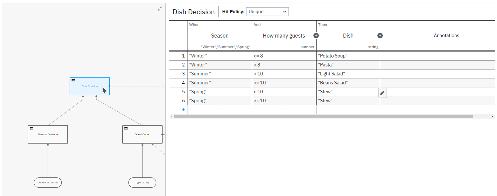
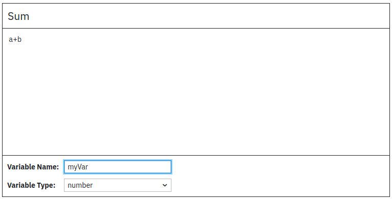

Decision Model and Notation (DMN) is a modeling approach owned by an institution called the Object Management Group ([OMG](https://www.omg.org/)), which also operates worldwide standards for [BPMN](/components/modeler/bpmn/automating-a-process-using-bpmn.md).

In [DMN](/components/modeler/dmn/dmn.md), decisions are modeled and executed using a language both business analysts and developers can understand. Model a set of rules within a table, and this will yield a decision to rapidly execute a process using a decision engine like Camunda.

## Start modeling

Camunda Desktop and Web Modeler both offer the same Modeling experience for DMN 1.3 models: Modeling starts in the Decision Requirements Diagram (DRD) view. From there, you can add DMN elements from the palette on the left side by dragging and dropping them onto the diagram canvas.

Alternatively, you can add new elements by using the context menu that appears when you select an element in the diagram. To change the type of an element, click on the element and select the **Change element** menu icon. Use the properties panel on the right side to change the name or ID of the DMN diagram.

After creating a decision and morphing it into a decision table, you can start editing the table by clicking the overlay on the upper left corner of the decision. Using the overview in the decision table view, you can jump between decision tables.

## DMN coverage

Modeler supports the following DMN elements:

- Decision (tables and literal expressions)
- Input data
- Knowledge source
- Business knowledge model

## Decision tables

By clicking the blue icon on a decision table, you can open the decision table view and start to edit it. Add **Input**, **Output**, and **Rule** elements by clicking the plus signs. Edit a table cell by clicking on it. Alternatively, the tabulator and enter keys can be used to walk through the table cells.

Delete a rule or a column, copy, or insert a new rule by right clicking in the cell:

Adjust the details of an input or output column (e.g., name, expression, and type) by double clicking in the header row:

Jump between decision tables or literal expressions in your decision requirement diagram by opening and using the `Overview` on the left side:

## Literal expressions

You can also edit literal expressions. Just as with decision tables, in the decision requirement diagram view, click the blue icon to _drill-down_ into the literal expression view and start editing.

## Business knowledge models

:::caution
Viewing the result of BKM evaluation is currently not supported in Operate.
:::

A _business knowledge model_ (BKM) is a reusable function containing a piece of decision logic. Typically, a BKM instantiates business logic that is required in multiple decisions, such as a common computation. For example, an amortization formula might be used in different loan application processes.

You can make BKM elements executable using literal expressions written in FEEL, in almost the same way you would create a decision using a literal expression. A BKM literal expression can optionally accept parameters to be used as inputs to the FEEL expression, and it returns a single result whose name is the same as the BKM element name. Once you’ve created a BKM, it appears in autosuggestions when you’re using literal expressions to create decision logic.

Currently, you can only reuse BKMs within the same decision.

To create an executable BKM:

1. Add a BKM element to the canvas.
2. Name the BKM element. This name will be used for the result variable.
3. On the context menu, select **Change type > Literal expression**.
4. Click the blue literal expression icon (**{}**) on the BKM element.
5. Add parameters by hovering over the **()** and clicking the edit button. All changes to the BKM are saved automatically.
6. Enter a FEEL expression in the expression box.
7. Select a type for the result.
