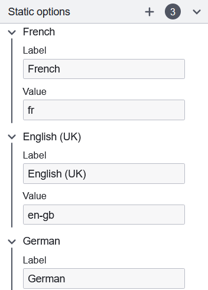

## Configuring form field options sources

Certain form fields work from a set of pre-populated options that your user will want to select from, such as the [Radio](../form-element-library/forms-element-library-radio.md) or [Select](../form-element-library/forms-element-library-select.md) fields. This source can be configured several ways, as described below.

### Static configured on the form schema

The options will be defined directly on your form schema, the only way to modify them in the future will be to change the form definition itself.

The static options group will appear to allow the configuration of the individual options.



For each of these options, a unique `value` corresponding to the form submitted data must be provided, as well as a `label` which will be displayed to the user filling in the form. You may configure as many options as you want by using the add (+) button in the group header.

### Input data driven by process data

The options are mapped from form variables, similarly to how [Form field data binding](./forms-config-data-binding.md) works. Here, the `Input values key` property within the `Dynamic Options` configuration group is used to set which form variable to use as a source.

The expected format for the data is an array of options, each defining its label and value in JSON. The below example provides an equivalent configuration to the above statically defined one:

```json
{
  "languageData": [
    {
      "label": "French",
      "value": "fr"
    },
    {
      "label": "English (UK)",
      "value": "en-gb"
    },
    {
      "label": "German",
      "value": "de"
    }
  ]
}
```

### FEEL expressions

The options are populated from a [FEEL expression](../../feel/language-guide/feel-expressions-introduction.md) that returns an array of options. The resulting array must be formatted as described in the [example JSON above](#input-data-driven-by-process-data).

#### Shorthand definitions

If the value and label are equal, shorthand formats may be used instead:

```json
{
  "languageData": [{ "value": "fr" }, { "value": "en-gb" }, { "value": "de" }]
}
```

```json
{
  "languageData": ["fr", "en-gb", "de"]
}
```

#### Supported types

The `label` parameter should be a `string`.

If a label is provided, the `value` parameter can be any non-null type. Otherwise, it is restricted to types `string`, `number`, and `boolean`.
