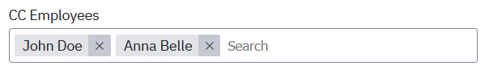

A complex and searchable tag based component providing multi-selection for large datasets.


### Configurable properties

- **Field label**: Label displayed on top of the taglist. Can either be an [expression](../../feel/language-guide/feel-expressions-introduction.md), plain text, or [templating syntax](../configuration/forms-config-templating-syntax.md).
- **Field description**: Description provided below the taglist. Can either be an [expression](../../feel/language-guide/feel-expressions-introduction.md), plain text, or [templating syntax](../configuration/forms-config-templating-syntax.md).
- **Key**: Binds the field to a form variable, refer to [data binding docs](../configuration/forms-config-data-binding.md).
- **Hide if**: [Expression](../../feel/language-guide/feel-expressions-introduction.md) to hide the taglist.
- **Columns**: Space the field will use inside its row. **Auto** means it will automatically adjust to available space in the row. Read more about the underlying grid layout in the [Carbon Grid documentation](https://carbondesignsystem.com/elements/2x-grid/overview/).
- **Validation**: Given that one of the following properties is set, the form will only submit when the respective condition is fulfilled. Otherwise, a validation error will be displayed.
  - **Required**: Taglist must contain a value.
- **Options source**: Taglists can be configured with an options source defining the individual choices your user can make, refer to [options source docs](../configuration/forms-config-options.md).
- **Read only**: Makes the taglist read-only, meaning the user can't change but only read its state. Can be dynamically set using an [expression](../../feel/language-guide/feel-expressions-introduction.md).
- **Disabled**: Disables the taglist, for use during development.

### Datatypes

Taglists can be bound to data of the `any[]` type, although for most practical cases we recommend `string[]` instead. The Taglist component will correlate the bound data with the values of the different options defined for the component.

The data representation of this taglist:



Would look like this:

```
{
  "cc_empl": [
    "john_doe",
    "anna_belle"
  ]
}
```
