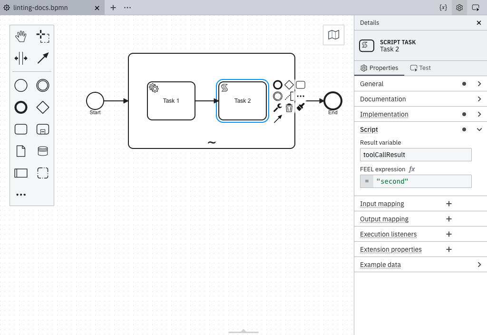

import MarkerGuideline from "@site/src/mdx/MarkerGuideline";
import DeclaringAgenticSubprocess from "./\_declaring-agentic-subprocess.md";

Tools within an [AI Agent sub-process](../../../../agentic-orchestration/agentic-orchestration-overview.md) return their results to the agent through the `toolCallResult` variable. The rule reports one warning per tool in either of the following situations:

1. **Misdirected result**: The tool sets result variables, but none of them is named `toolCallResult`, for example, because of a typo such as `toolCalResult`. The rule reports the warning on the element that set the wrong variable, which can be downstream of the tool's entry element.
2. **No result**: No element in the tool's flow sets a result variable. The rule reports the warning on the tool's entry element, because no single element is at fault. Even a fire-and-forget tool should report its completion, for example, with `= "Email sent."`.

## How a tool can set `toolCallResult`

The result can be set anywhere in the tool's flow through several channels:

- **Output mapping**: Target `toolCallResult` or one of its fields, such as `toolCallResult.statusCode`.
- **Connectors**: Use the **Result variable** or **Result expression** field, for example, `= { toolCallResult: response.body }`. This is the only available channel because connectors cannot read process variables.
- **Script tasks and business rule tasks**: Set the **Result variable** to `toolCallResult`.

### Avoid overwrites when several elements contribute

Assigning a value to `toolCallResult` twice overwrites the first value:



To add a field without overwriting the existing value, use `context put()` in an output mapping:

```feel
= context put(toolCallResult, "confirmation", sendResult)
```

This works only for elements that run in the workflow engine. Connector result expressions cannot read the current value of `toolCallResult`, so a connector tool must build its complete result in a single expression.

### What the rule cannot see

Results written by arbitrary FEEL expressions elsewhere, such as a variable set by a called process, cannot be detected statically. Ignore the warning or make the result wiring explicit with an output mapping.

Overwrite detection is also skipped for any tool flow that branches, for example a gateway split, a join, or a boundary event, even when the branches are guaranteed to converge before the next write. Review these flows manually for overwrites.

### The result variable name

This rule always checks for `toolCallResult`, the default used by the AI Agent connector. An AI Agent Task's multi-instance ad-hoc sub-process can rename this variable by changing the multi-instance **Output element** value. If you rename it, ignore the warning for that tool.

## <MarkerGuideline.Invalid /> Result never reaches the agent

The tool maps its output to `result` instead of `toolCallResult`, or no element in its flow sets a result at all.

## <MarkerGuideline.Valid /> `toolCallResult` set on an element in the tool flow

An output mapping targets `toolCallResult` or one of its fields, such as `toolCallResult.statusCode`; a connector result expression contains a `toolCallResult` key; or a script task's result variable is `toolCallResult`.

<DeclaringAgenticSubprocess />

## See also

- [AI Agent tool definitions](../../../../connectors/out-of-the-box-connectors/agentic-ai-aiagent-tool-definitions.md)
- [Rule source](https://github.com/camunda/bpmnlint-plugin-camunda-compat/blob/main/rules/camunda-cloud/agent-tool-output-key.js)
