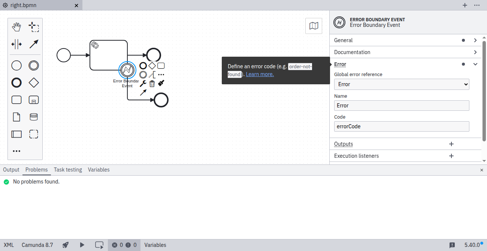

import MarkerGuideline from "@site/src/mdx/MarkerGuideline";

An [error event](../../../../bpmn/error-events/) must reference an error defined in the process. The referenced error must have a defined error code. To fix this problem, open the **Error** group in the properties panel on the right side of the screen, select or create an error, and specify its error code.

Camunda 8.2 and later support catch-all events and do not require an error reference.

## <MarkerGuideline.Invalid /> No error selected

## <MarkerGuideline.Invalid /> No error code specified

## <MarkerGuideline.Valid /> Error selected and error code specified

## References

- [Error events](../../../../bpmn/error-events/)
- [Rule source](https://github.com/camunda/bpmnlint-plugin-camunda-compat/blob/main/rules/camunda-cloud/error-reference.js)
