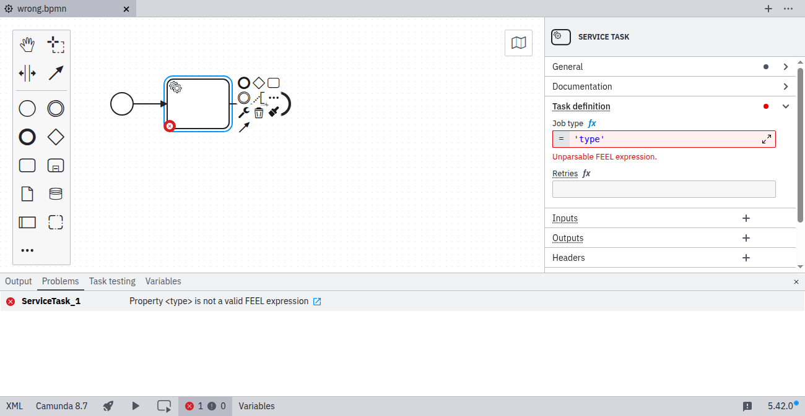
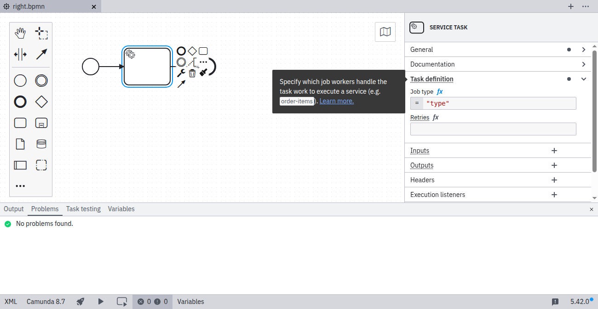

import MarkerGuideline from "@site/src/mdx/MarkerGuideline";

When using the [FEEL expression language](../../../../feel/what-is-feel/), you must specify a valid expression.

## <MarkerGuideline.Invalid /> Invalid FEEL expression

## <MarkerGuideline.Valid /> Valid FEEL expression

## References

- [FEEL expressions](../../../../feel/what-is-feel/)
- [Rule source](https://github.com/camunda/bpmnlint-plugin-camunda-compat/blob/main/rules/camunda-cloud/feel.js)
