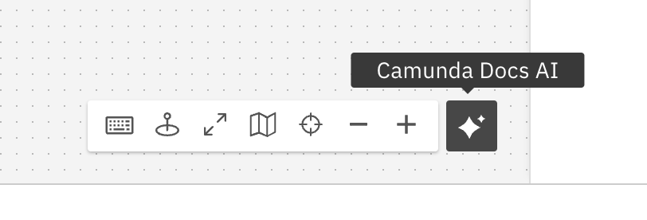

Camunda 8 only
Alpha

:::note
Camunda Docs AI is an alpha feature. To use this feature, enable the [AI-powered features](https://camunda.com/blog/2024/02/camunda-docs-ai-developer-experience-new-level/) through the [alpha features](/components/console/manage-organization/enable-alpha-features.md) menu. Learn more about [alpha features](/components/early-access/alpha/alpha-features.md) and [general availability](/reference/announcements-release-notes/release-policy.md#general-availability-ga).
:::

Camunda Docs AI provides a smart AI-powered chatbot that helps you find answers to your technical and non-technical questions about Camunda within Web Modeler, rather than navigating and searching across multiple sources of information like documentation, forums, blog posts, etc.

Click the **Camunda Docs AI** widget in the bottom right corner of a BPMN/DMN canvas to open the chatbot:

Here, you can ask questions like _How do I design a process?_, _What is BPMN?_, and more.
