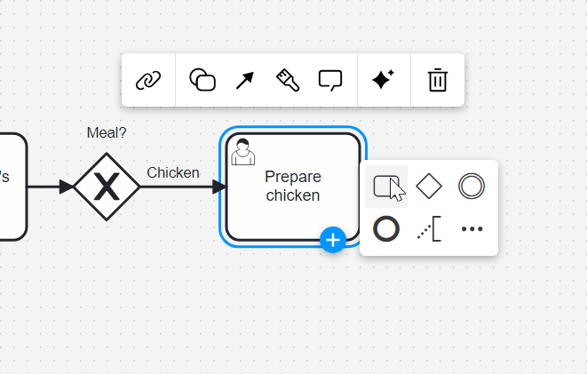
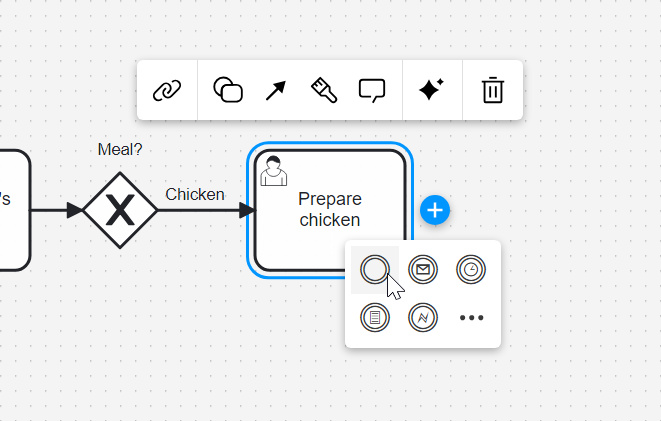
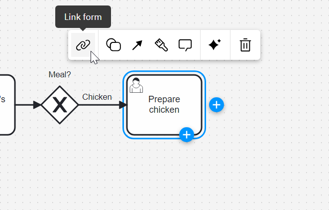
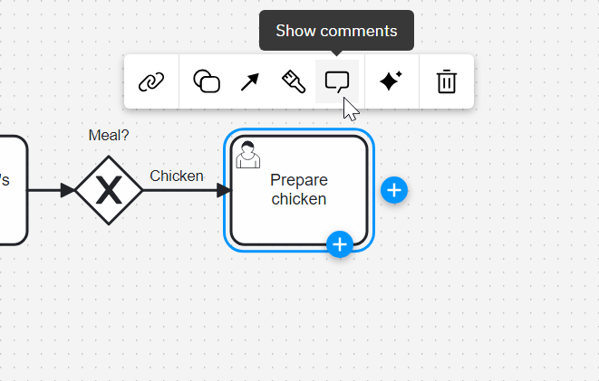

The context pad is one of the main ways to interact with the diagram. Actions that change the selected element can be found in the context pad above the selected elements while actions that append or attach new elements are accessible through the plus icons.

The **append feature** is separated from the context pad and allows you to append any element directly without having to change the type of the element you just appended:

The **attach feature** lets you attach boundary events with one click:

**Linking resources** like BPMN elements, DMN elements, and forms can also be done through the context pad:

Finally, **comments** can be toggled through the context pad:

