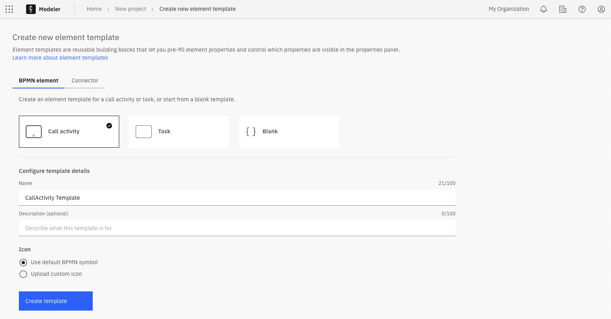
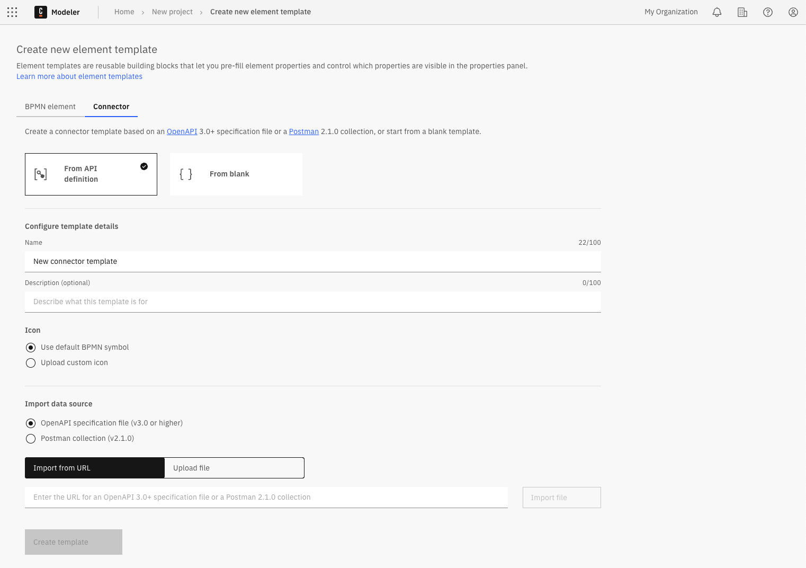
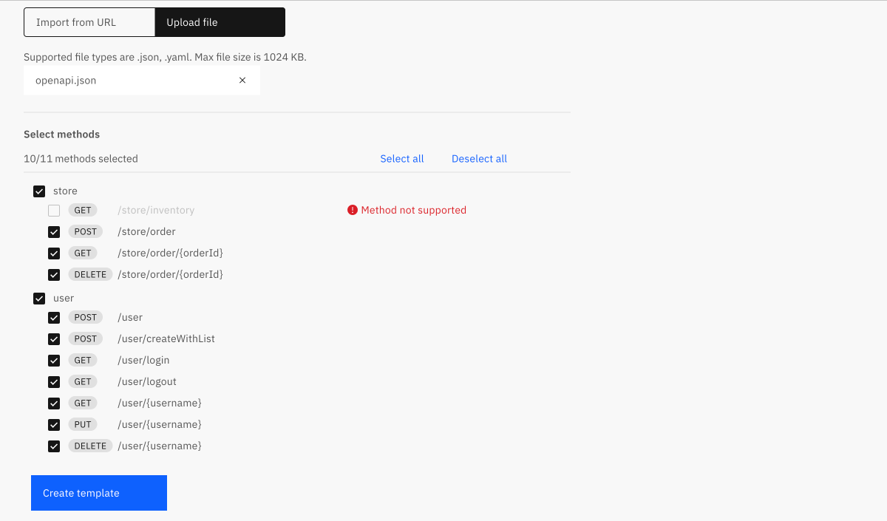

You can configure and automatically generate a custom element template in Web Modeler.

### Best practices

When creating custom-built element templates, consider the best practices outlined in [Best practices for custom-built element templates](best-practices.md) to ensure they are effective, user-friendly, and maintainable.

## Generate a BPMN element template

1. Select the Web Modeler project where you want to create the template. Camunda recommends storing element templates in root project folders, not process applications, to simplify template management and avoid unnecessary versioning overhead.
2. Click **Create new**, then select **Element template** to open the **Create new element template** screen.  
   

3. Select the template starting point:
   - **Call activity**: Start from a Call activity template.
   - **Task**: Start from a Task template.  
     You can choose from predefined Task templates, such as User task, Service task, Script task, and more.
   - **Blank**: Start from a blank template.
     A blank template includes only the basic properties shared by all BPMN elements and allows you to customize the template from scratch.

Continue with [**Step 4**](#configure-the-template-details) in the Configure the template details section below.

## Generate a connector template

You can start from a blank template or import an existing API definition such as an [OpenAPI specification](https://swagger.io/resources/open-api/), [Swagger specification](https://swagger.io/resources/open-api/), or a [Postman collection](https://www.postman.com/collection/). For example, download a Postman collection as a YAML file, import it into the generator, and choose which methods to include in the generated template.

To generate a connector template:

1. Select the Web Modeler project where you want to create the template. Camunda recommends storing element templates in root project folders, not process applications, to simplify template management and avoid unnecessary versioning overhead.
2. Click **Create new**, select **Element template**, and then choose the **Connector** tab.  
   

3. Select the template starting point:
   - **From API definition**: Import an existing API definition file as a starting point. The **Import data source** section will appear below the template details.
   - **From blank**: Start from a blank template.

Continue with [**Step 4**](#configure-the-template-details) in the Configure the template details section below.

## Configure the template details

4. In the **Configure template details** section, provide the following information:
   - **Name:** Enter a clear and descriptive name for the template. For example, include the brand name if the template connects to a service, or indicate its main feature.
   - **Description:** Describe the template’s main features and benefits.
   - **Icon:** Use a default BPMN symbol or upload a custom icon. Supported formats: SVG, PNG, JPEG. Maximum file size: 8 KB. Minimum dimensions: 512 × 512 pixels.
     - **Import from URL:** Enter the URL of the image and click **Import icon**.
     - **Upload file:** Drag and drop a file into the upload area, or click the link to select a file.

   :::note
   If you do not configure template details at this stage, a default name and BPMN symbol are assigned. You can edit them later.
   :::

#### Only for connector templates: Import an API definition

5. If you selected **From API definition**, the **Import data source** section appears.
   1. Select the format to import (OpenAPI or Postman) and click **Import file**.
   2. Import the API definition:
      - **Import file from URL:** Enter the API definition URL and click **Import icon**.
      - **Upload file:** Drag and drop a file into the upload area, or click the link to select a file.

   3. After importing, select which actions to include from the generated list of supported methods.  
      

   :::info
   For more information on working with and configuring connector templates, see [Connector templates](/components/connectors/custom-built-connectors/connector-templates.md).
   :::

6. Click **Create template** to generate the new template and open it in the [element template editor](/components/connectors/manage-connector-templates.md).
