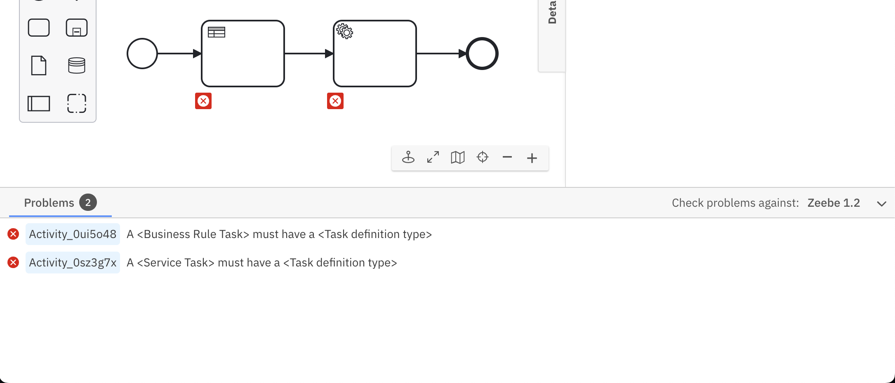
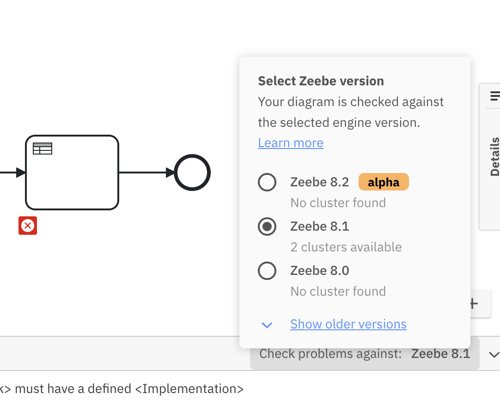
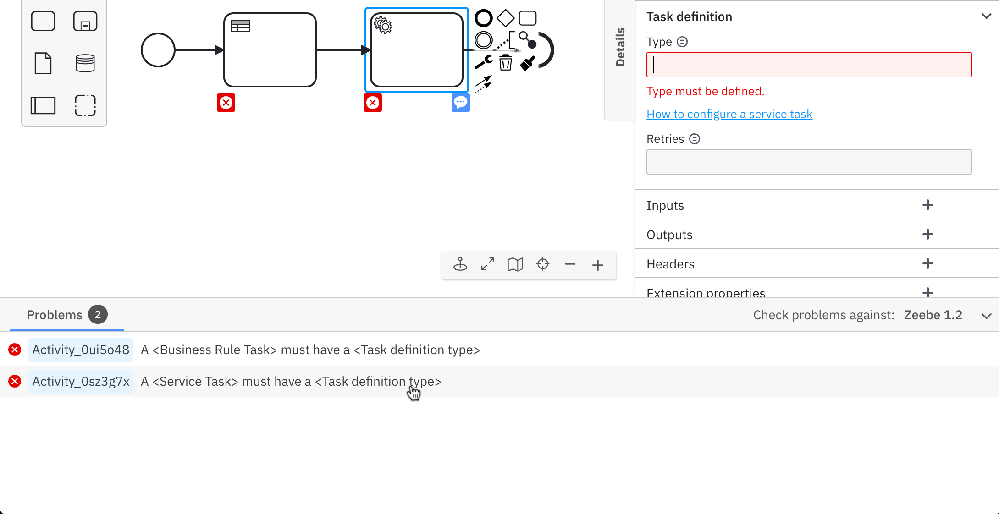
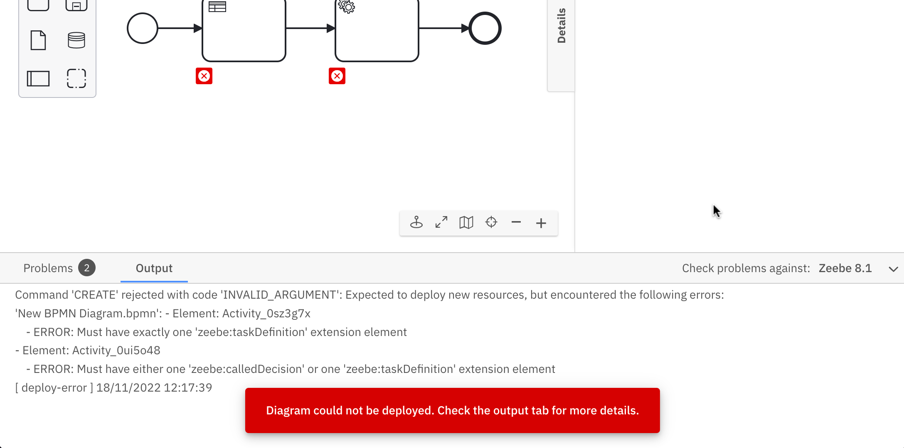

### Design time errors

Based on a set of lint rules, Web Modeler continuously validates implementation properties for a process diagram while the user is modeling. The validation errors are added to the panel at the bottom of Web Modeler. Expand the panel to view the errors by clicking the **Problems** header. The panel is collapsed by default and the latest state (expanded or collapsed) is remembered for the next time you open Web Modeler.

:::note
An error is shown if any process ID, decision ID, or form ID is more than 255 characters in length. To resolve this error, check and shorten any IDs that exceed this character limit.
:::

### Engine version selection

The version selector at the top right in the problems panel can be used to choose the Zeebe version the diagram is validated against. The version chosen should match the Zeebe version of the cluster the diagram is going to be deployed in to get the correct set of errors (if you do not know the version, it is shown alongside the cluster name in the deployment dialog which can be opened by clicking the **Deploy diagram** button.)

The version selector also provides information about the number of clusters available for each Zeebe version within the current organization.

### Interactivity

The errors are interactive. Clicking on the row highlights the corresponding element in the canvas and points to the specific property in the properties panel where you can resolve the issue.

### Deploy time errors

If all the design time errors are fixed and further errors are thrown by the engine when deploying the diagram, a separate output tab will open up where you can observe the error thrown by the engine.

