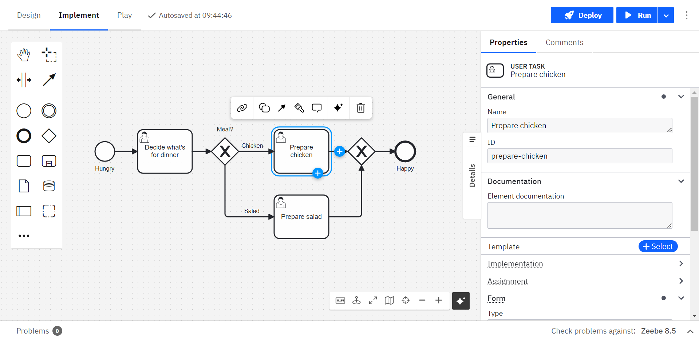

import DocCardList from '@theme/DocCardList';

Camunda 8 only

Web Modeler is a browser-based application for modeling BPMN, DMN, Camunda Forms, and element templates.  
It enables teams to collaboratively design executable processes as the foundation for scalable IT and business automation.

## Key features

| Feature                                                                       | Description                                                                                     |
| ----------------------------------------------------------------------------- | ----------------------------------------------------------------------------------------------- |
| [BPMN, DMN, and Forms modeling](../bpmn/bpmn.md)                              | Create and edit BPMN diagrams, DMN decision tables, and Camunda Forms directly in your browser. |
| [Element templates](./element-templates/using-templates.md)                   | Reuse building blocks to standardize modeling across teams and projects.                        |
| [Collaboration](./collaboration/collaboration.md)                             | Work with team members to speed up the process development cycle.                               |
| [Play mode](./collaboration/play-your-process.md)                             | Test and validate processes during development.                                                 |
| [Camunda Marketplace](./camunda-marketplace.md)                               | Extend Web Modeler with prebuilt blueprints and connectors.                                     |
| [Process applications](./process-applications/process-applications.md)        | Work with sets of files and deploy them in a single bundle.                                     |
| [Git synchronization](./git-sync.md)                                          | Connect process applications to Git repositories for version control.                           |
| [Process landscape visualization](./process-landscape-visualization.md)       | View dependencies and interactions between processes at a glance.                               |
| [Intelligent Document Processing (IDP)](./intelligent-document-processing.md) | Extract and process data from documents to accelerate process automation.                       |
| [AI-powered assistance](./advanced-modeling/camunda-docs-ai.md)               | Get intelligent modeling suggestions and automation support.                                    |

## Access Web Modeler

Access Web Modeler through the [Camunda 8 Console](../../console/introduction-to-console.md) or [launch it directly](./launch-web-modeler.md). No installation is required.

## Get started

<DocCardList items={[{type:"link", href:"/docs/components/modeler/web-modeler/model-your-first-diagram/", label: "Model your first diagram", docId:"components/modeler/web-modeler/model-your-first-diagram"},
{
type:"link", href:"/docs/components/modeler/web-modeler/collaboration/", label: "Collaborate with your team", docId:"components/modeler/web-modeler/collaboration/collaboration",
},
{
type:"link", href:"/docs/components/modeler/web-modeler/run-or-publish-your-process/", label: "Run or publish your processes", docId:"components/modeler/web-modeler/run-or-publish-your-process"
},
{
type:"link", href:"/docs/guides/orchestrate-human-tasks/", label: "Orchestrate human tasks", docId:"guides/orchestrate-human-tasks"
}
]}/>

## Additional resources

- [Self-Managed configuration & troubleshooting](../../../self-managed/components/modeler/web-modeler/overview.md)
