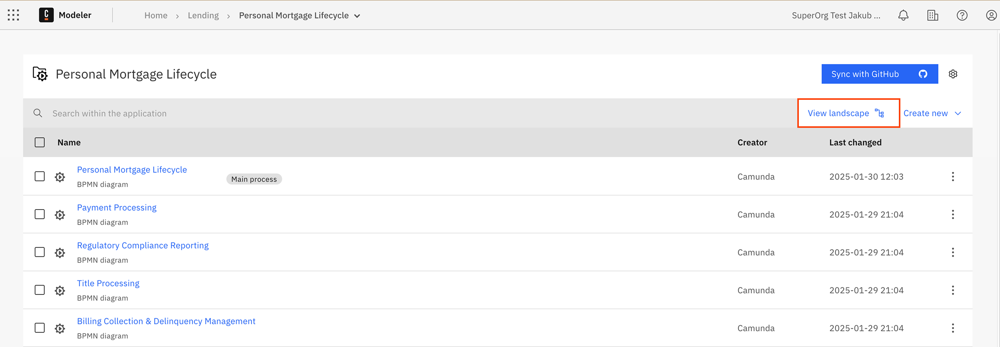
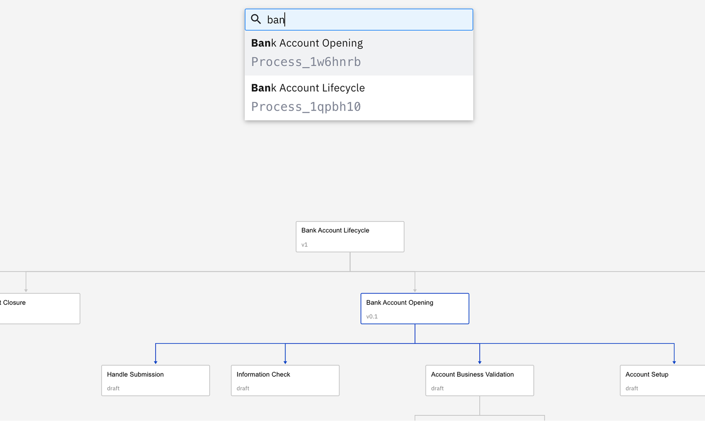
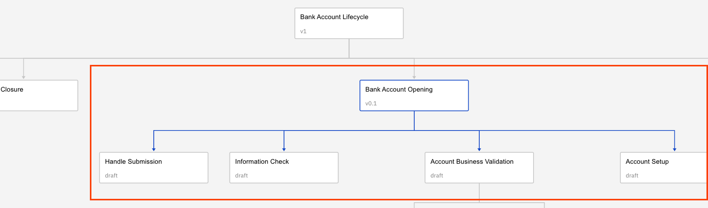

import ProcessLandscapeVisualization from './img/process-landscape-visualization.png';

Camunda 8 only

Process landscape view provides a visual map of BPMN files in a project and interfile [call activities](/components/modeler/bpmn/call-activities/call-activities.md) connections between them.

- Quickly understand process dependencies, flow relationships, and overall project structure in a single interactive canvas.
- The view is automatically generated from all BPMN diagrams within a project, offering insights without the need for manual maintenance or updates.

## Open process landscape view

To open the process landscape view, click **View landscape** from any of the following views:

- Project view
- Folder view
- [Process application](/docs/components/modeler/web-modeler/process-applications.md) view

## Landscape view interaction

You can interact with the process landscape view in a number of ways.

### View BPMN file information

Click on any node to view the information for the selected BPMN file, including the latest version of the process on the sidebar.

:::note
For process applications, version tags represent a unified "versioned" snapshot of all process application files rather than separate versions for each file (as with simple BPMN files).
:::

### Search

You can search the process landscape for a specific BPMN file.

1. Press `Ctrl+F` or `⌘+F` combination to initialize search.
1. Enter the name or identifier of the BPMN file you want to search for and highlight.

### Highlight paths

Click on a node or connection to highlight the entire hierarchy of related connections.

