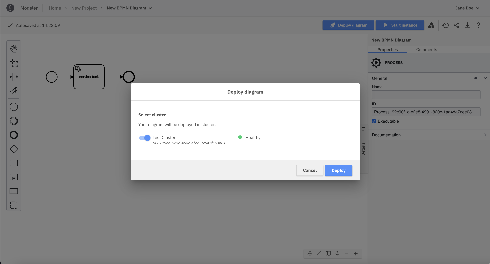

Camunda 8 only

Web Modeler will autosave all your changes on a diagram. The changes will also be visible in real-time to any collaborators opening the same diagram.

If you change a diagram and it is autosaved, this has no effect on your cluster(s).

If you deploy the diagram, it becomes available on the selected cluster and new instances can start.

To deploy, click **Deploy diagram**:

