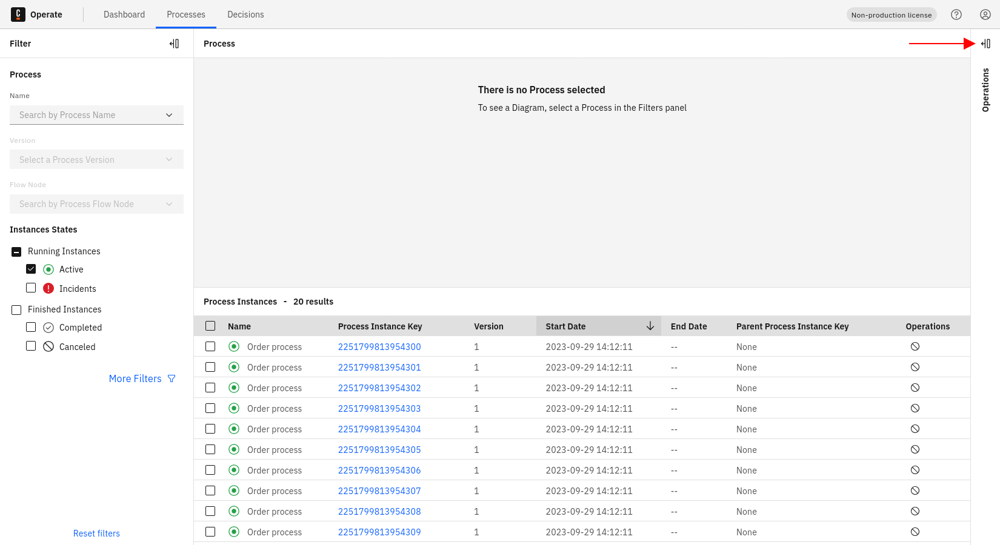
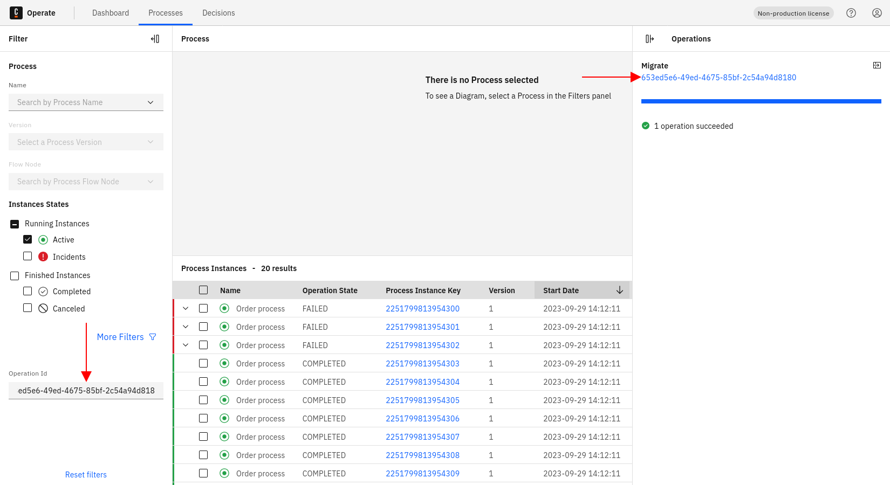
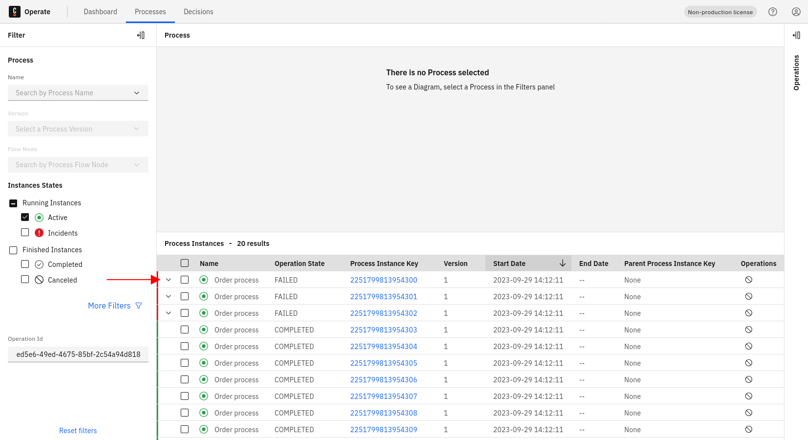
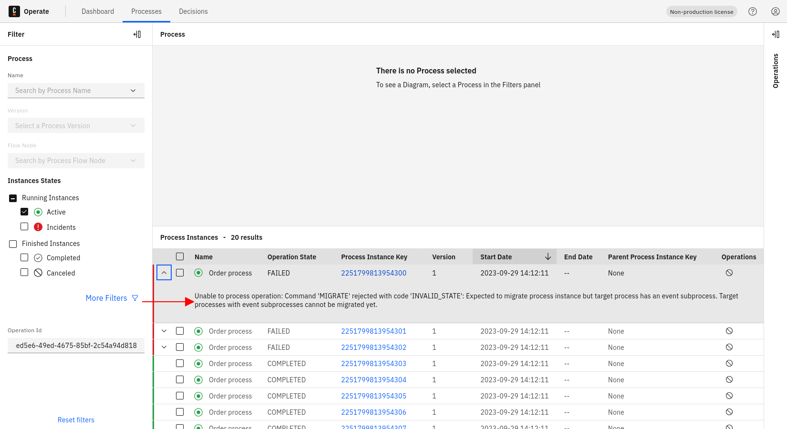

Operate offers a powerful way to monitor and investigate the status of any operation you start. This includes canceling and retrying process instances, process instance migration, and modification.

First, go to the processes view in Operate by clicking **Processes** in the top navigation and expand the operations panel by clicking the **Expand Operations** icon:

:::note
If you don't have any operations, the operations panel will show "No operations have been created yet."
:::

Select an operation from the list by clicking on the operation ID. Notice that the operation is set as a filter:

A new column named **Operation State** is now added to the processes instances list, indicating the current state of the operation:

If an operation fails, the related process instance row is marked red, and you are able to expand the row:

Each expanded row shows the error message related to the operation you selected earlier:

