You may need to modify an active process instance to allow execution to continue. The execution may be stuck, and you may want to continue the execution on a different activity (i.e. skip or repeat activities).

:::note
If an issue in process execution caused you to enter the wrong process branch instead of moving each process instance individually, use [process instance batch modification](./process-instance-batch-modification.md) instead to select multiple process instances and move them to the correct flow node in the process in a single operation.
:::

## Modification mode

To enter modification mode, click the modify icon on the process instance header.

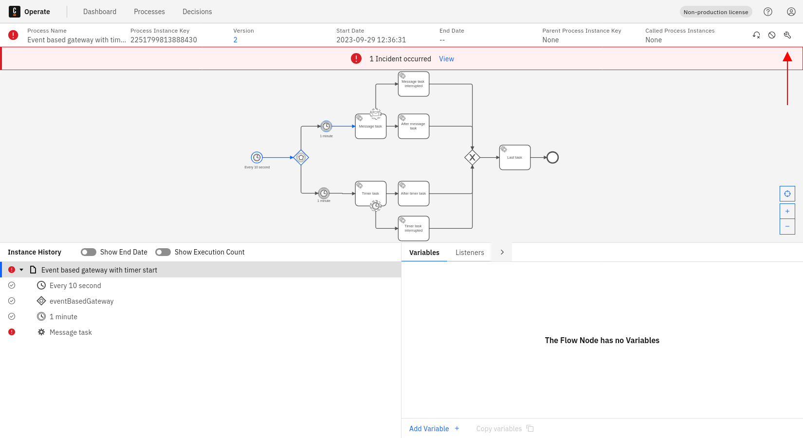

The UI will change when you enter modification mode, including a blue banner at the top and two buttons for applying or discarding modifications at the bottom.

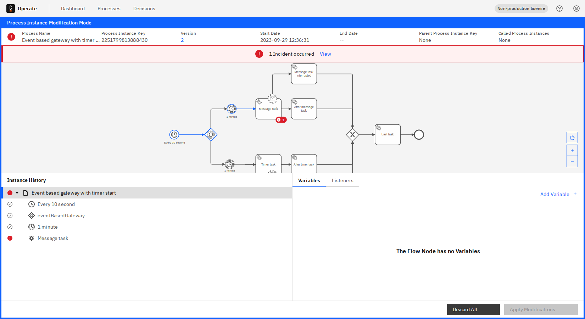

## Cancel all running tokens on a flow node

To cancel all running tokens on a flow node, take the following steps:

1. Select the flow node you want to cancel all the running tokens on.

2. Click **Cancel instance** from the dropdown.

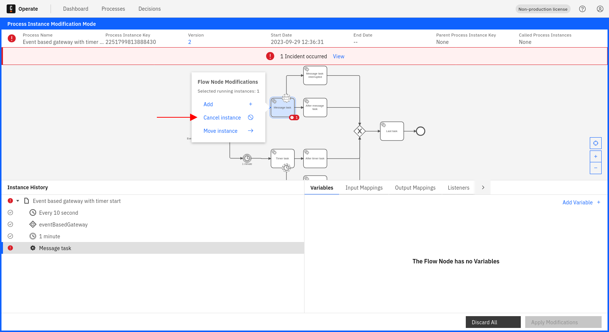

View the pending modification reflected in the instance history.

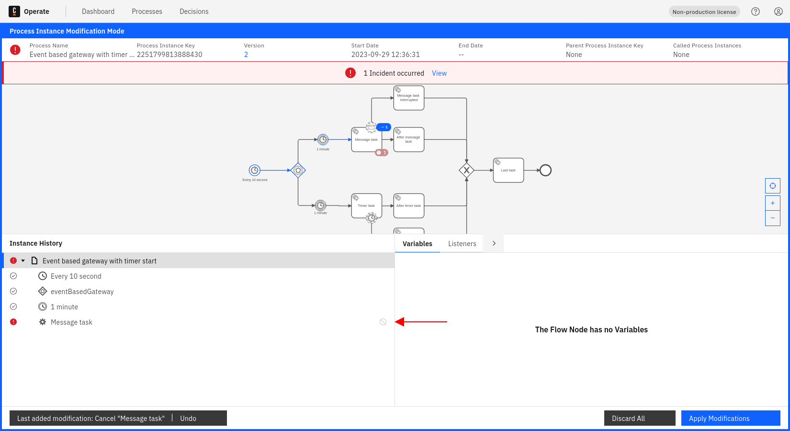

## Add a new token to a flow node

To add a new token to a flow node, take the following steps:

1. Select the flow node you want to add the new token to.

2. Click **Add** from the dropdown.

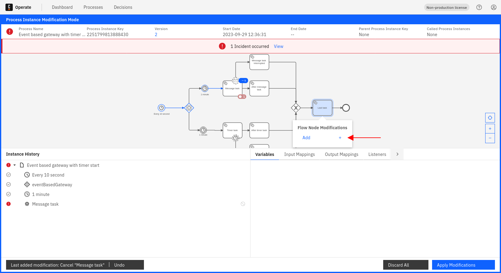

View the pending modification reflected in the instance history.

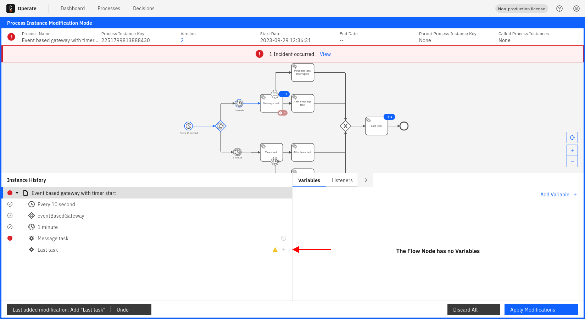

## Move all running tokens from one flow node to another

The move operation is equivalent to the combination of **Cancel** and **Add** modifications. The modifications described previously can also be achieved with one single move modification.

1. Select the flow node you want to move the running tokens from.

2. Click **Move instance** from the dropdown.

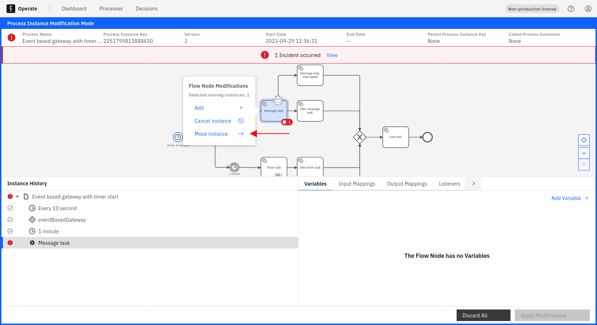

3. Select the flow node you want to move the running tokens to.

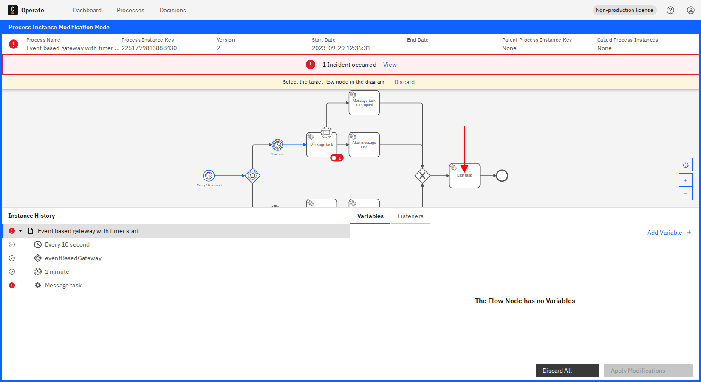

View the pending modification reflected in the instance history.

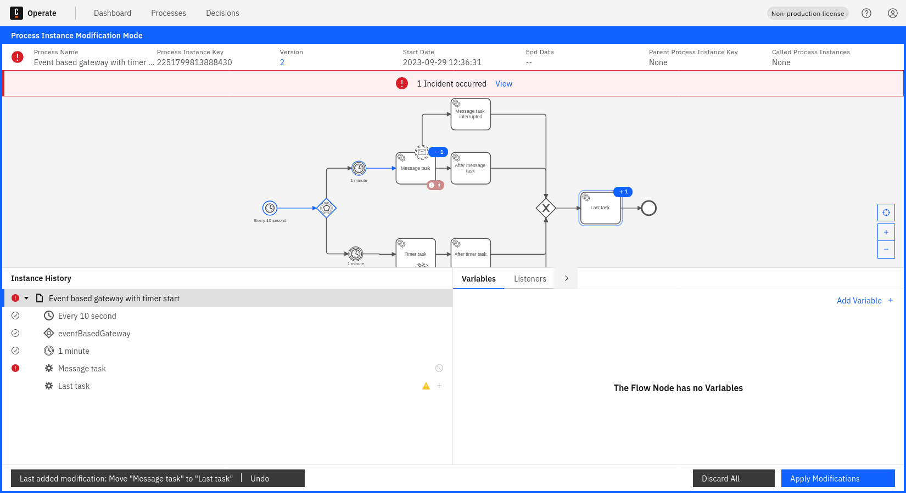

## Add variable to new scopes

During the modification mode, if there are new scopes generated it will be possible to add variables to these new scopes by following these steps:

1. Select the new scope from the instance history you want to add a variable to.

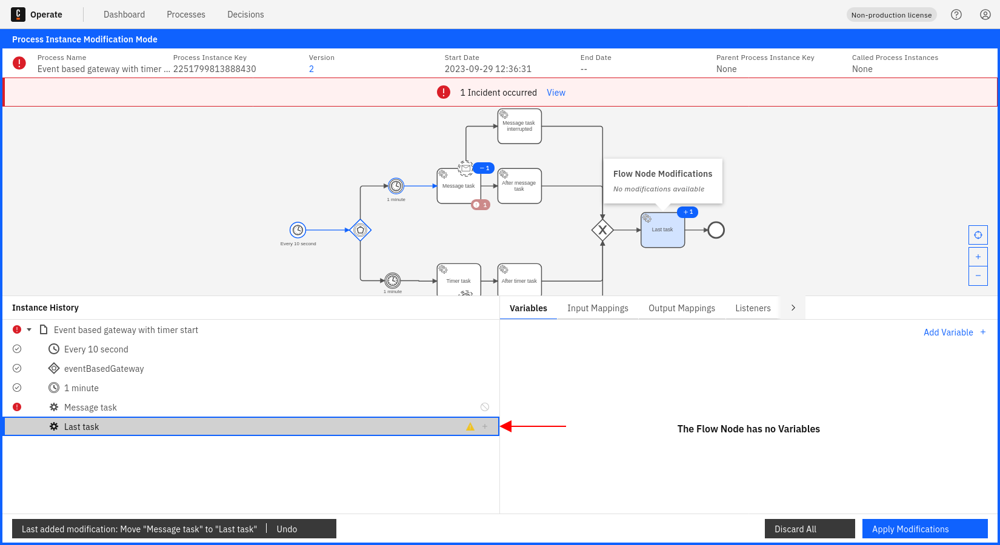

2. Click **Add Variable** from the variables panel.

3. Fill out the **Name** and **Value** fields for the variable you want to add.

4. Once you blur out of the field (click anywhere on the screen other than the last edited variable field), assuming the fields have the valid values, the new variable will be added to the pending modifications.

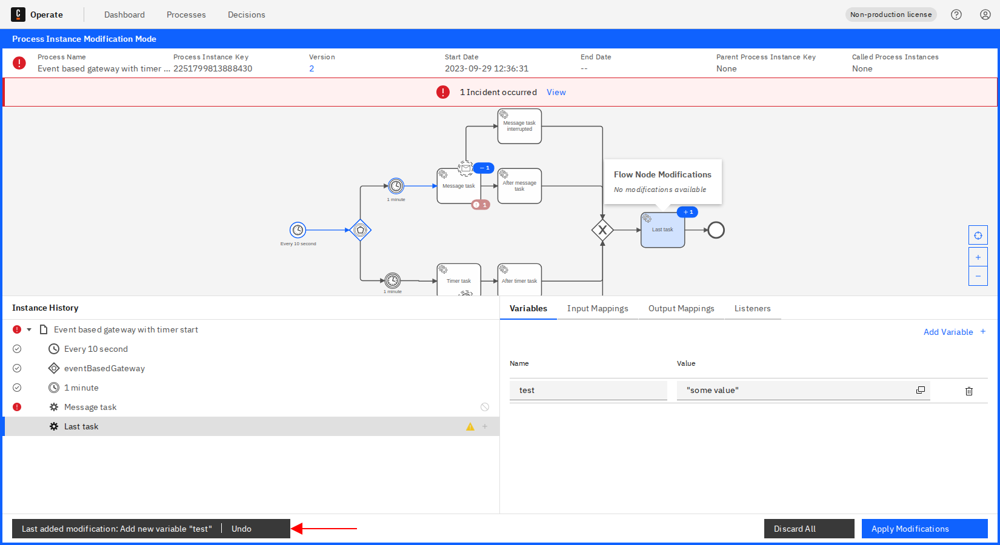

## Edit variable on existing scopes

During modification mode it is possible to edit existing variables in existing scopes by following these steps:

1. Select the existing scope from the instance history you want to edit variables on.

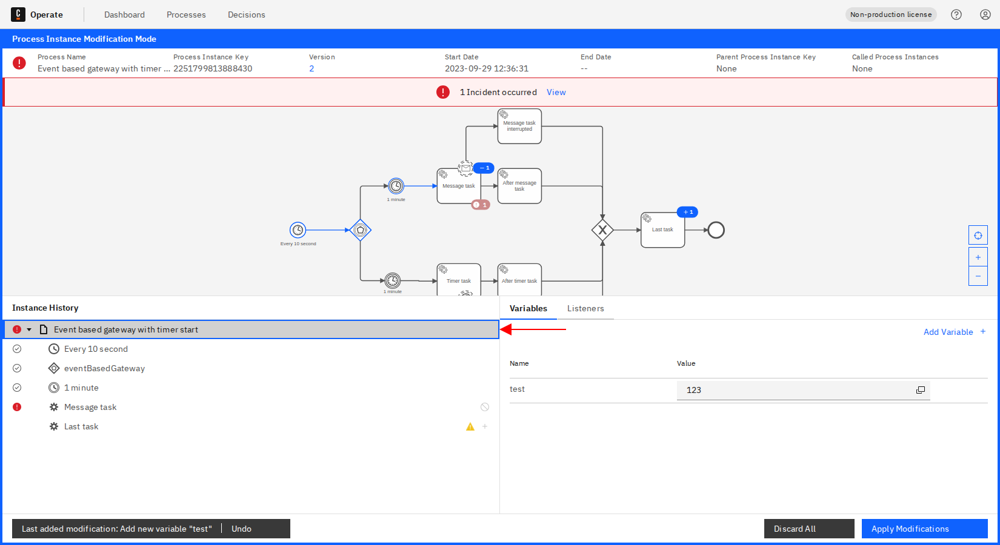

2. Edit the variable value from the variables panel.

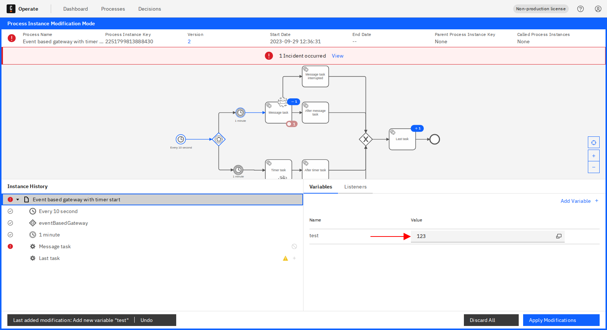

3. Once you blur out of the field (click anywhere in the screen other than the last edited variable field), assuming the new value is valid, the **Edit Variable** modification will be added to the pending modifications.

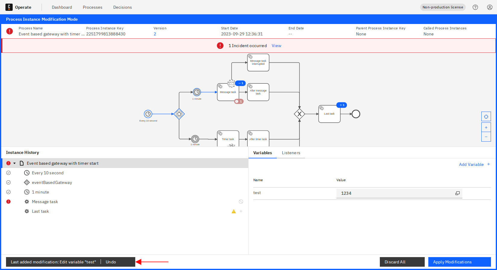

## View summary of pending modifications

To display the pending modifications, click **Apply Modifications** in the footer.

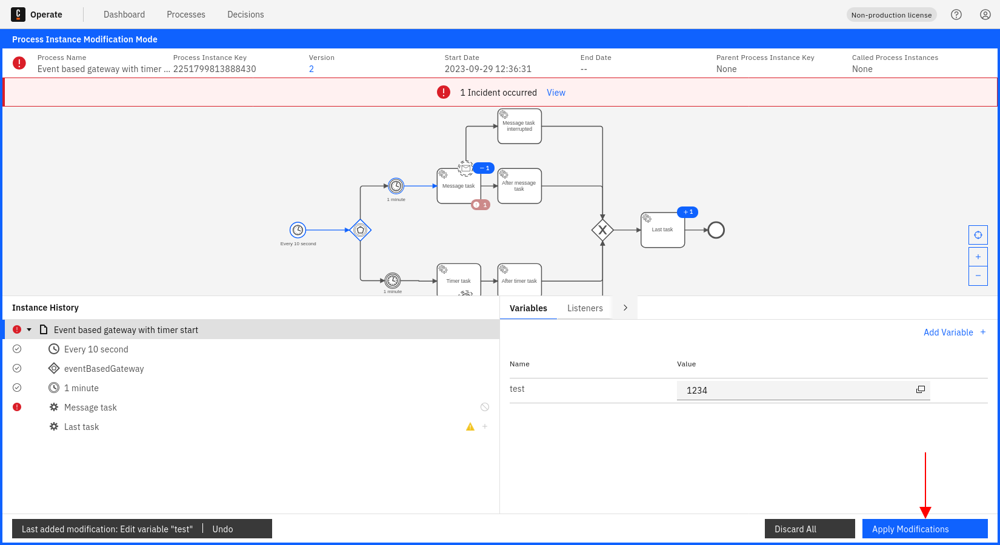

A modal will be displayed where all modifications can be seen.

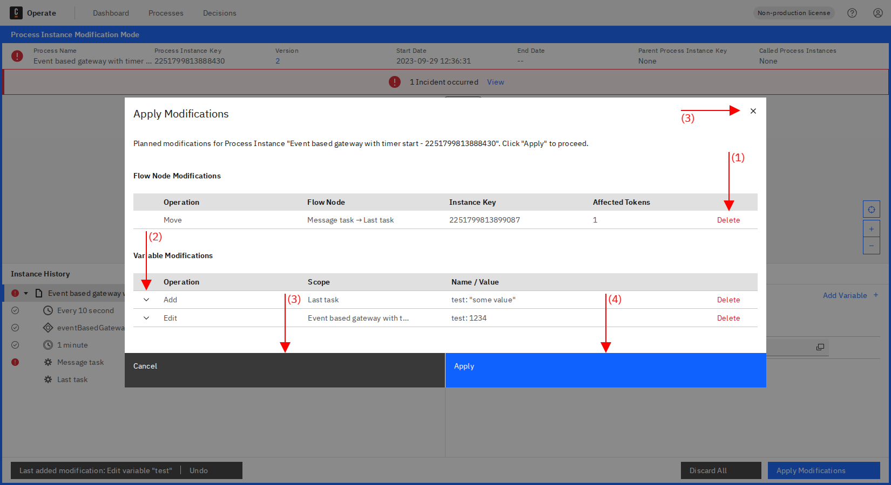

Within this modal, you can take the following actions:

- (1) Delete any modification by clicking the **Delete Icon**.
- (2) View an added/edited variable in a JSON/Diff Viewer.
- (3) Cancel/close the modal and continue with modification mode.
- (4) Apply the modifications and exit modification mode.

## Undo modification

Clicking **Undo** from the modification footer will undo the latest modification.

## Apply modifications

If you click the **Apply** button from the summary modal as described [here](#view-summary-of-pending-modifications), and modification operation is created successfully, you will observe a success notification and changes will be reflected in a short time.

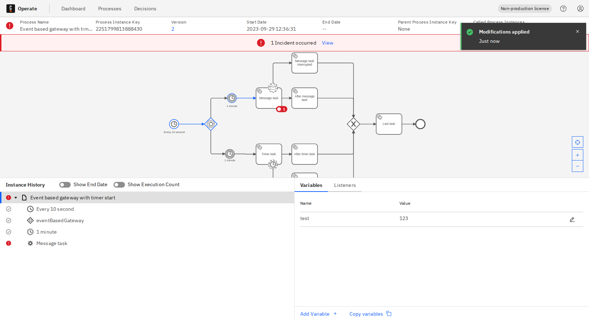

## Non-supported modifications

Some elements do not support specific modifications:

- **Add token**/**Move tokens to** modifications are not possible for the following type of elements:
  - Start events
  - Boundary events
  - Events attached to event-based gateways
- **Move tokens from** modification is not possible for a subprocess itself.
- **Add token**/**Move tokens to** modifications are currently not possible for elements with multiple running scopes.

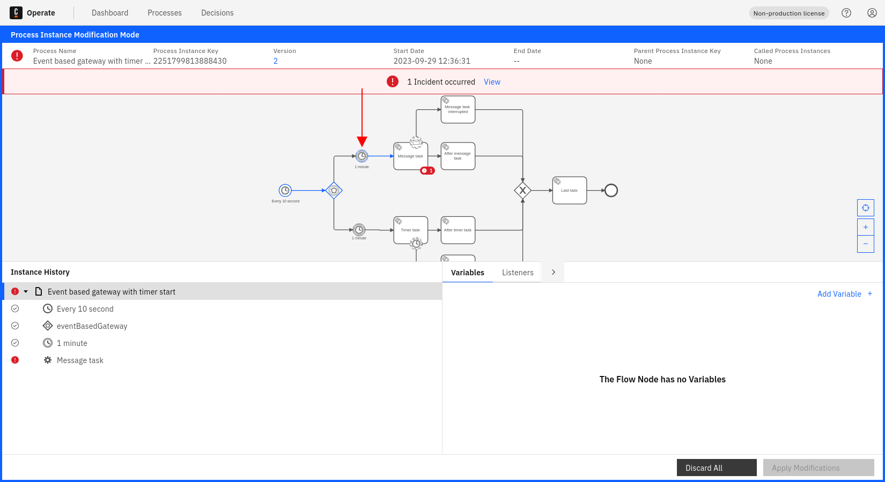

## Monitor the modification operation status

Review the [monitor operation status documentation](../monitor-operation-status) to learn how to monitor the status of an operation.
