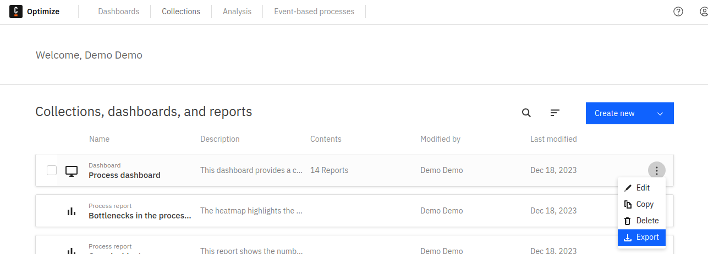
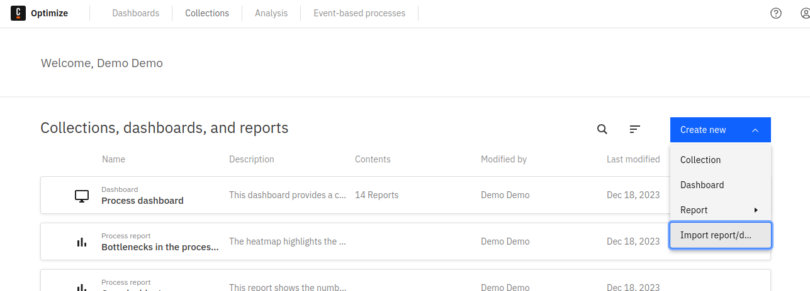
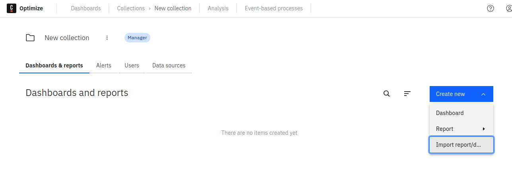

## Exporting entities

Users can export entities by accessing the **Export** option in the entity menu. This downloads a JSON file which
includes all relevant information that defines the selected entity. This file can later be used to import the exported entity into
a different Optimize installation.

## Importing entities

### Prerequisites

Exported entities can be imported both as private entities and into a selected collection, provided the following prerequisites are met:

- All definitions the entity requires exist in the target Optimize.
- When importing into a collection, the collection data sources must include all relevant definitions for the entity.
- The importing user is authorized to access the relevant definitions.
- The entity data structures match. To ensure matching data structures, confirm the Optimize version of the source is the same as the version of the target Optimize.

If any of the above conditions are not met, the import will fail. Optimize will display an error message explaining why the import was not successful to enable you to fix the issue and retry.

### Importing private entities

To import an entity as a private entity, use the **Import Report/Dashboard** option from the **Create New** menu on the welcome page. The entity will appear in the entity list once the import is finished and can be interacted with as usual.

### Importing entities into a collection

To add the entity to an existing collection, use the same **Import Report/Dashboard** option from the **Create New** menu from within the selected collection. This will import the entity into the collection. Any user that has access to this collection can now also access the imported entity.

:::note
The collection must have all data sources required by the imported entity or the import will fail.
:::

