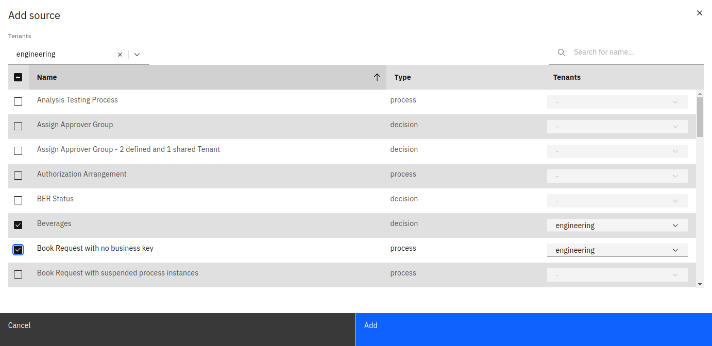

If you create a collection, you can add data sources that can be used to create reports. To see the existing data sources or add additional ones, go to the **Data Sources** tab of the collection.

Using the **Add** button, a manager can add one or more sources to the collection by selecting the definitions that need to be added.

The added sources will appear in the process/decision selection list inside the report builder where they can be used to create reports.
