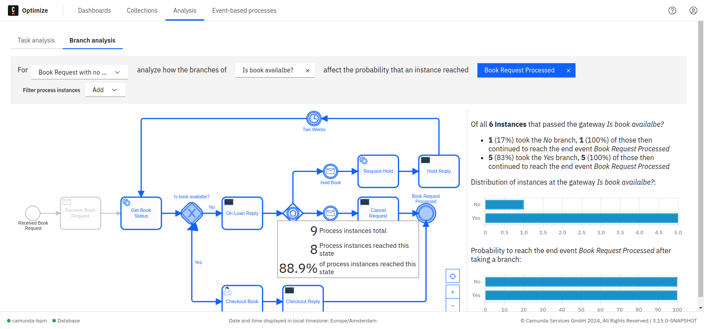

## Overview

If a process contains more than one end event, it is useful to know which path tokens took to reach a specific end event. Optimize provides you with a statistical analysis for a given end event and a gateway. This analysis includes how tokens were split at the gateway in question, and how many of the tokens of each branch reached the end event.

## Branch analysis in Optimize

Select a process definition using the **Select Process** option in the top left of the page. After selecting a process definition and version, the diagram of the process is displayed on the page.

By default, all process instances for the selected process definition are included in the analysis. You can reduce this set of process instances by applying filters.

To perform a statistical analysis on the selected process, specify a gateway and an end event. Moving your mouse cursor over the end event and gateway inputs at the top of the screen highlights available elements in the diagram. Likewise, mouse over an element to see whether it is an end event or gateway.

Additionally, if you move your mouse over an end event, you see detailed information about this end event, like how many instances reached this end event. Click on an element to select or deselect it. You can also clear the selection using the **x** button in the control panel on top. Changing the process definition also clears the selection.

After selecting an end event and gateway, a statistical analysis is shown next to the diagram. The analysis consists of two bar charts and a statistical summary. Both charts contain a bar for every sequence flow leaving the selected gateway.

The first chart shows the distribution of process instances over the various sequence flows, showing how often each sequence flow has been executed, independently of whether the process instance then reached the selected end event.

The second chart displays the relative amount of process instances that reached the selected end event after taking the respective outgoing sequence flow.

Process instances which have taken more than one path (e.g. by looping back to a flow node before the gateway and then taking a different sequence flow) are not considered in the statistical analysis.
