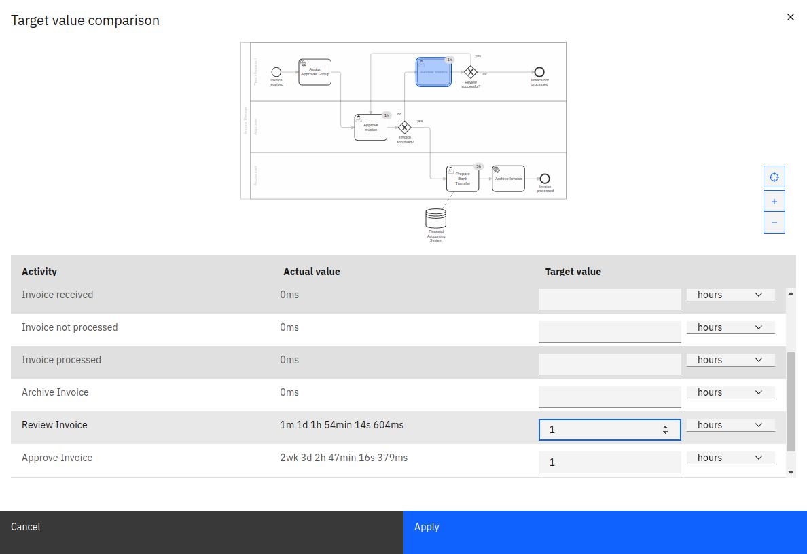
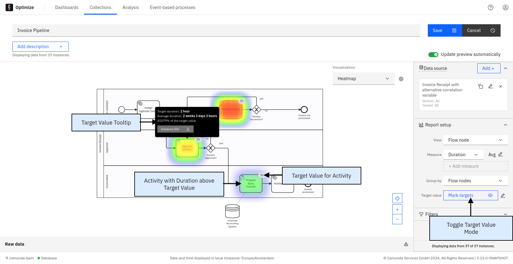

Based on flow node duration heatmaps, Optimize allows you to specify a target value for every task. For example, if a user task has to be completed within one day, you can set the target value to one day. If the time it takes to complete the user task exceeds this target value, the task is highlighted in the heatmap.

To set target values and create a target value comparison heatmap, you need to be in the edit mode of a report which has the following configuration:

| View         | Flow node duration/user task duration |
| ------------ | ------------------------------------- |
| Group by     | Flow nodes/user tasks                 |
| Visualize as | Heatmap                               |

If your report has this configuration, a target value button is visible. Clicking on the **Target Value** button for the first time opens an overlay containing the process diagram and a table with all flow nodes. You can also see the actual duration value for every flow node.

To set a target value for a flow node, use the number and unit fields in the last column. If the target value number field for a flow node is empty, this flow node has no target value set (the selected time unit is ignored in that case).

If you set a target value for a flow node, this target value is represented as a badge on the flow node in the diagram in the upper part of the overlay. You can click on any flow node in the diagram to jump to the target value input field in the table.

If you have a user task report, you can only select user tasks here, as only those are included in the report result. When selecting a target value input field in the table, the corresponding diagram element is highlighted. To save the target value configuration, click **Apply**.

After you save the target values, the normal duration heatmap is replaced with a target value visualization. In this new visualization, flow nodes with an average duration larger than the specified target value are highlighted in red.

If you mouse over one of the nodes, the tooltip shows the following:

- The target duration value
- The actual duration
- The relative percentage the actual value is of the target value
- A button to download a list of process instance IDs that exceed the target value

You can also see the target value as a badge on the diagram.

After the initial target values for a report are set, you can use the target value button to toggle between the target value and the regular duration view mode. If you want to change target values, use the gear button to open the overlay again.

As with any change to a report configuration, to persist target values and show them in the report view mode and on dashboards, you need to save the report using the **Save** button in the upper right corner.
