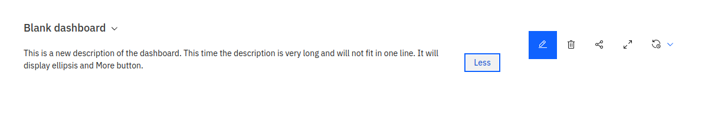
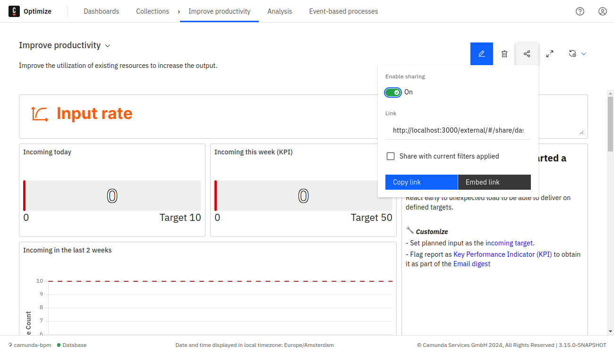
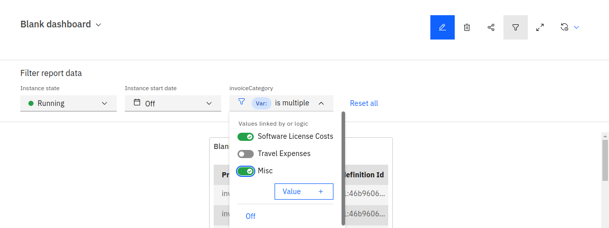

Once you've defined the layout of your dashboard, the view mode provides essential features for monitoring your processes:

**Full-screen**: Display the dashboard in full-screen mode to focus solely on the reports, hiding the header, control panel, and footer. While in full-screen mode, toggle between the default light theme and a dark theme using the Toggle Theme button.

**Auto-refresh**: Periodically updates the dashboard with the latest data. You can customize the update frequency from 1 to 60 minutes. An animation indicates the timing of the next update. You can disable this feature if you no longer wish to use it.

:::note
The refresh rate will not be saved unless it is selected in the [edit mode](./edit-mode.md) of the dashboard.
If it was selected in the view mode, the refresh rate will not be saved when refreshing the dashboard page manually or switching to another page in between.
:::

- **Alerts**: For dashboards within a collection, create and manage alerts for reports inside the dashboard.

- **Description**: Displayed beneath the dashboard name, the description can be expanded or collapsed using the **More/Less** button for longer texts.

- **Sharing**: To share or embed the dashboard, use the **Share** button. After turning the **Enable sharing** switch on, a link is generated for those without Optimize access. Include applied filters in the shared version by enabling the **Share with current filters applied** checkbox. If the checkbox is not checked, the shared dashboard will include the default filters if any have been set.

- **Embedding**: Click the **Embed Link** button to copy a code to paste into your webpage. Everyone that views the webpage can then see the content of the dashboard. The shared versions of the dashboard allow only to view the dashboard itself. There is no possibility to alter it or interact with any other features of Optimize. Revoke the sharing anytime by disabling the share switch.

To hide the header of the shared dashboard or specific part of it, add the following parameter to the share URL:

`header : titleOnly / linkOnly / hidden`

For example, to completely hide the header from the shared dashboard, add `header=hidden` as shown:

`http://<dashboard share url>?header=hidden`

## Interacting with reports

To see more details about the report on the dashboard, interact with the reports. The kind of interaction always depends on the report itself.

If the interactions do not suffice to get the desired information, or you want to edit the report, directly access the report by clicking on its title.

## Adding filters in view mode

In the dashboard view mode, there is a **Filters** button which opens a panel that shows all filters available for this dashboard. More filters can be made available in the dashboard edit mode. If the dashboard editor checked the **Allow viewer to add filter values** box for assignee, candidate group, or variable filters, dashboard viewers can add their own values to filter by.

Filters apply to all process reports on the dashboard. If a report already has filters set, they will be combined with the dashboard filter. For example, if a report has a filter to only show running instances and a dashboard filter for suspended instances is set, the report will only show instances that are both running and suspended. Dashboard filters are not applied to decision reports, external websites, or text tiles.

Variable filters are only applied to reports whose process definition includes the variable. Otherwise, the filter is ignored for that report. Other dashboard filters and filters defined directly on the report are still applied.
