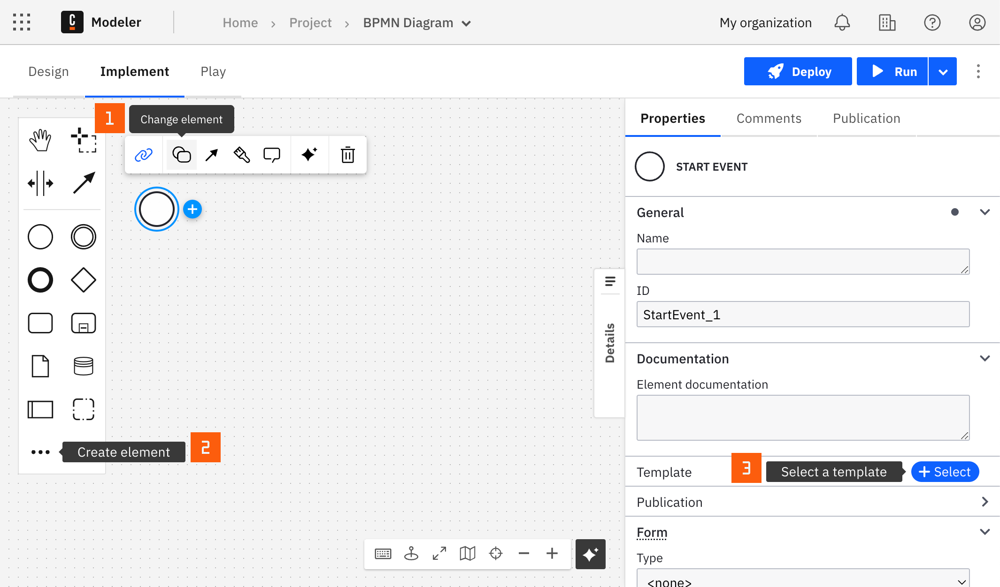

---
---

You can apply a Connector to a task or event via the append menu. For example:

- **From the canvas**: Select an element and click the **Change element** icon to change an existing element, or use the append feature to add a new element to the diagram.
- **From the properties panel**: Navigate to the **Template** section and click **Select**.
- **From the side palette**: Click the **Create element** icon.

After you have applied a Connector to your element, follow the configuration steps or see [using Connectors](/components/connectors/use-connectors/index.md) to learn more.
