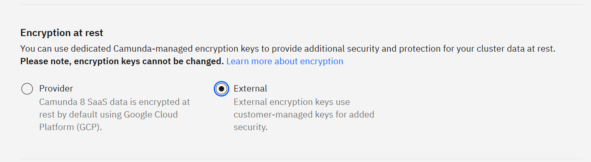
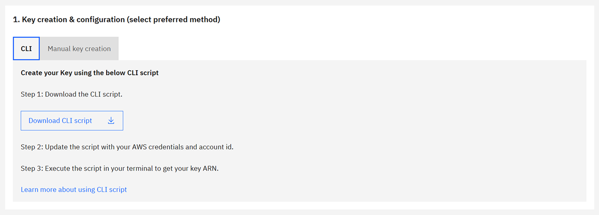
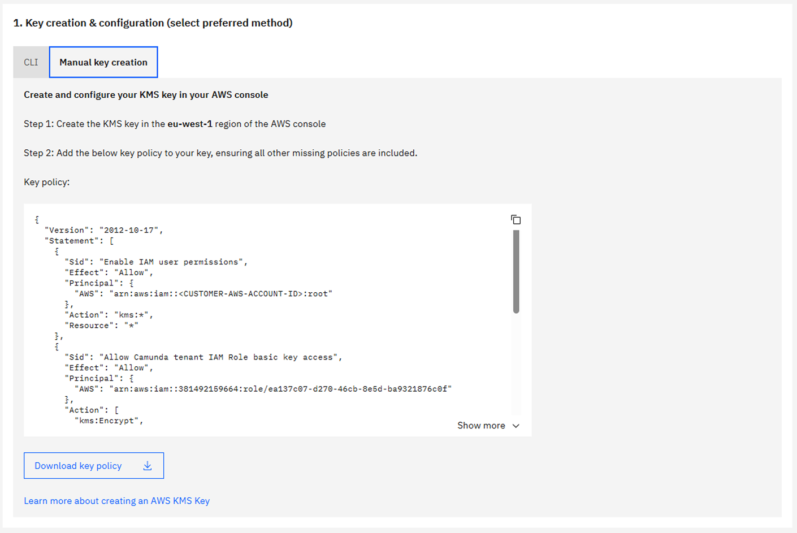
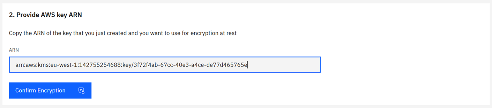
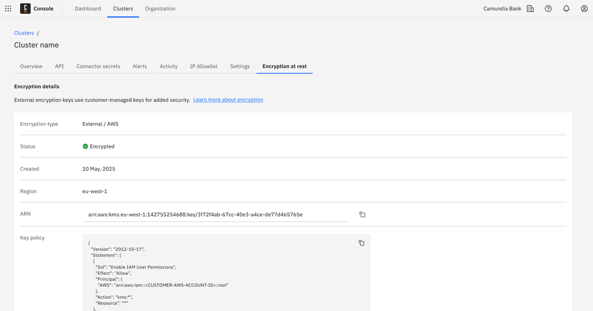

Learn how to configure encryption at rest for your Camunda 8 SaaS Orchestration cluster using AWS KMS.

## Prerequisites

| Requirement           | Description                                                                 |
| --------------------- | --------------------------------------------------------------------------- |
| AWS account           | Access to an AWS account with AWS KMS permissions.                          |
| AWS KMS permissions   | Ability to create and manage AWS KMS keys and attach key policies.          |
| Cluster region        | The AWS KMS key must reside in the same AWS Region as your Camunda cluster. |
| Technical familiarity | Some experience with the AWS Management Console, IAM roles, and AWS KMS.    |

:::warning Important

- Deleting or disabling your AWS KMS key will make your cluster and data inaccessible.
- Key management is fully customer-side in AWS KMS. Camunda cannot rotate keys.
  :::

## Step 1: Create a Camunda 8 SaaS Orchestration cluster

1. Sign in to the [Camunda Console](https://console.camunda.io/).
2. Navigate to the **Cluster** section and click **Create new cluster**.
3. Select an AWS Region for your cluster.
4. Choose **Single region** or **Dual region backup**.
   - Dual region requires one key per region; keys can be separate.
5. Under **Encryption at rest**, choose **External**.  
   
6. Click **Create cluster**.

After creation, note the **AWS Role ARN** displayed in the Console for your cluster.

## Step 2: Create and configure an AWS KMS key

You can create the key either via AWS CLI or manually in the AWS Management Console.

### Option A: Create the key using AWS CLI



We provide automated scripts to create the necessary AWS KMS key(s) with the correct policy and permissions. Choose the option that matches your backup configuration.

#### Single-region backup

Use this script to create a single AWS KMS key in the same Region as the cluster.

**What the script does:**

- Creates an AWS KMS key with the required policy for Camunda access.
- Sets up an alias for easier key management.
- Outputs the key ARN to provide to Camunda.

**Instructions:**

1. Download [create-byok-kms-key-single-region.sh](https://raw.githubusercontent.com/camunda/camunda-docs/refs/heads/main/versioned_docs/version-8.8/components/saas/byok/downloads/create-byok-kms-key-single-region.sh).
2. Modify the following values at the top of the script:
   - `AWS_ACCESS_KEY_ID`
   - `AWS_SECRET_ACCESS_KEY`
   - `AWS_SESSION_TOKEN` (if using temporary credentials)
   - `YOUR_ACCOUNT_ID`
   - `ALIAS_NAME` (optional)
3. Make the script executable and run it.
4. Copy the outputted key ARN and provide it to Camunda.

#### Dual-region backup

Use this script to create a multi-Region primary key in the cluster’s Region and a replica key in the backup Region.

**What the script does:**

- Creates a multi-Region primary key and replica key.
- Applies the correct policies to both keys.
- Outputs both key ARNs to provide to Camunda.

**Instructions:**

1. Download [create-byok-kms-key-multi-region.sh](https://raw.githubusercontent.com/camunda/camunda-docs/refs/heads/main/versioned_docs/version-8.8/components/saas/byok/downloads/create-byok-kms-key-multi-region.sh).
2. Modify the same variables as above.
3. Make the script executable and run it.
4. Copy the two outputted key ARNs and provide them to Camunda.

:::note Alternative
For dual-region setups, you can also run the single-region script twice—once in the cluster’s Region and once in the backup Region. Make sure to modify the `REGION` variable before creating the second key.
:::

### Option B: Manual key creation in AWS Console



#### Single-region backup

1. **Sign in to the AWS Management Console**
   - Navigate to the AWS KMS service and select the correct Region.
2. **Create a customer managed key**
   - Click **Create key**.
   - Choose **Symmetric** and **Encrypt and decrypt** usage.
3. **Add labels**
   - Add an alias (for example, `camunda-saas-byok`).
   - Add a description (for example, `AWS KMS key for Camunda SaaS BYOK`).
4. **Define key administrators**
   - Select IAM users or roles that will administer the key.
5. **Define key usage permissions**
   - Skip this step; permissions are configured in the next step.
6. **Edit key policy**
   - Switch to policy view and replace the existing policy with the [provided key policy](https://raw.githubusercontent.com/camunda/camunda-docs/refs/heads/main/versioned_docs/version-8.8/components/saas/byok/downloads/aws-kms-key-policy.json).
   - Replace `<YOUR_AWS_ACCOUNT_ID>` and `<TENANT_ROLE_ARN>` with your values.
7. **Finish and copy the ARN**
   - Click **Finish** and copy the key ARN to use in the Camunda Console.

#### Dual-region backup

You can either create a multi-Region key and replica or create two single-Region keys.

##### Method A: Multi-Region key (recommended)

1. Follow the single-region steps, selecting **Multi-Region key** under **Advanced options**.
2. After creating the primary key in the cluster’s Region, go to **Regional replicas** and click **Create replica key**.
3. Select the Region for the replica and confirm. The Region should be the same as the backup Region.
4. Copy both key ARNs and provide them to Camunda.

##### Method B: Two single-Region keys

1. Create a key in the cluster’s Region using the single-region steps.
2. Repeat the process in the backup Region using a different alias (for example, `camunda-saas-byok-replica`).
3. Provide both key ARNs to Camunda.

### Sample key policy

Replace `<tenant-role-arn>` with the **AWS Role ARN** from Step 1, and `<customer-aws-account>` with your AWS account ID.

<details>
<summary>View sample key policy JSON</summary>

```json
{
  "Version": "2012-10-17",
  "Statement": [
    {
      "Sid": "Enable IAM user permissions",
      "Effect": "Allow",
      "Principal": {
        "AWS": "arn:aws:iam::<customer-aws-account>:root"
      },
      "Action": "kms:*",
      "Resource": "*"
    },
    {
      "Sid": "Allow Camunda tenant IAM role basic key access",
      "Effect": "Allow",
      "Principal": {
        "AWS": "<tenant-role-arn>"
      },
      "Action": [
        "kms:Encrypt",
        "kms:Decrypt",
        "kms:ReEncrypt*",
        "kms:DescribeKey",
        "kms:GenerateDataKey*"
      ],
      "Resource": "*"
    },
    {
      "Sid": "Allow Camunda tenant IAM role to create grants for provisioning encrypted EBS volumes",
      "Effect": "Allow",
      "Principal": {
        "AWS": "<tenant-role-arn>"
      },
      "Action": ["kms:CreateGrant", "kms:ListGrants", "kms:RevokeGrant"],
      "Resource": "*"
    }
  ]
}
```

</details>

:::warning Key policy guidance

- Don’t restrict the Camunda cluster **role** from required AWS KMS actions.
- Key rotation is managed in AWS KMS; Camunda cannot rotate keys.
- Revoking access immediately breaks the cluster.
  :::

## Step 3: Associate the AWS KMS key with your Camunda cluster

1. Return to the **Camunda Console** and locate the **AWS KMS key ARN** input field.  
   
   - For dual region, two fields will be available—enter the correct key for each Region.
2. Paste your AWS KMS key ARN(s) from Step 2.
3. Confirm and apply. Camunda provisions storage using your key for:
   - Document handling storage
   - Backup storage
   - Orchestration cluster persistent disks
   - Elasticsearch persistent disks

:::note
Once a key is applied, it cannot be edited or replaced. To change keys, you must create a new cluster.
:::

## Step 4: Verify encryption and logging

- In the **Camunda Console**, check the cluster details **Encryption at rest** tab to confirm the **AWS KMS key ARN** is applied correctly.  
  
- In AWS, verify key usage:
  1. Navigate to **Customer managed keys**.
  2. Select your key and view **Key policy** and **Key usage** tabs.
  3. Review **Recent activity** to confirm operations (Encrypt, Decrypt, GenerateDataKey).

### Monitor AWS KMS usage

- **AWS CloudTrail** logs all AWS KMS operations.
- **Amazon CloudWatch** can trigger alarms for:
  - Key deletion or disabling
  - Unauthorized access attempts
  - Policy or grant modifications
- Regularly review logs to detect unauthorized activity.
- Optionally, integrate with **Amazon EventBridge** for event-based monitoring and automation.

:::warning Monitoring reminder
You are responsible for monitoring key usage and access logs within your AWS account. Use AWS CloudTrail, Amazon CloudWatch, and Amazon EventBridge to detect misconfigurations or unauthorized access.
:::

## Additional considerations

- **Key rotation**: Enable [automatic rotation](https://docs.aws.amazon.com/kms/latest/developerguide/rotate-keys.html) or rotate manually in AWS KMS.
- **Cost**: Using AWS KMS keys incurs storage and management charges in your AWS account. See the [BYOK cost implications](/components/saas/byok/index.md#cost-implications).
- **Failure scenarios**: Deleting keys or revoking permissions makes cluster data inaccessible. See [troubleshooting steps](/components/saas/byok/faq-and-troubleshooting.md#troubleshooting-external-encryption-keys).

:::note Reference
For more information, see the [AWS KMS documentation](https://docs.aws.amazon.com/kms/latest/developerguide/overview.html).
:::
