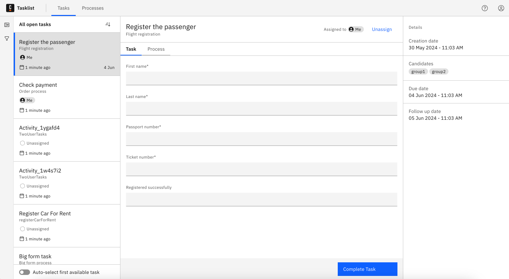
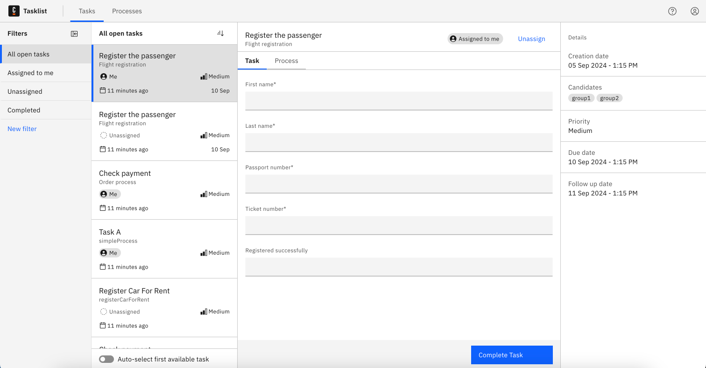
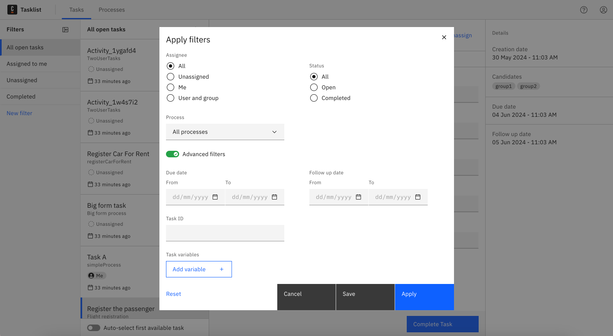
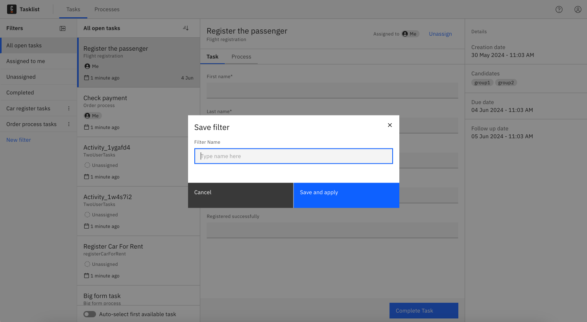
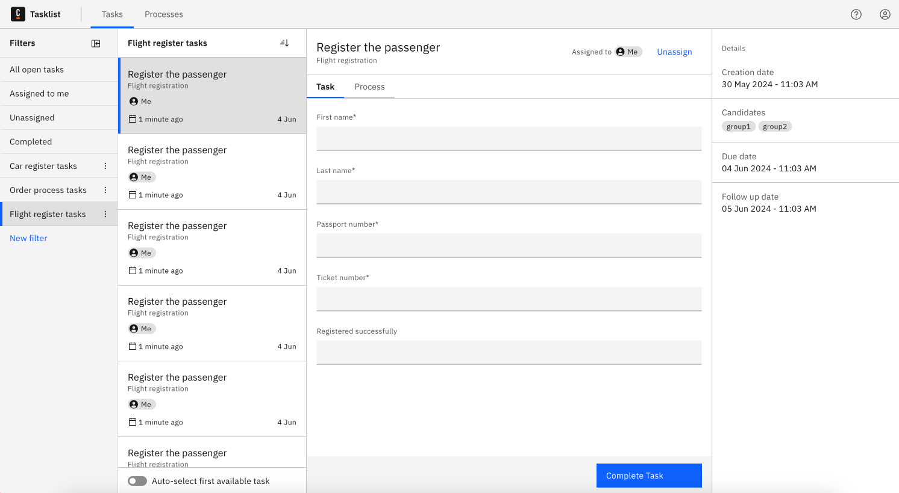
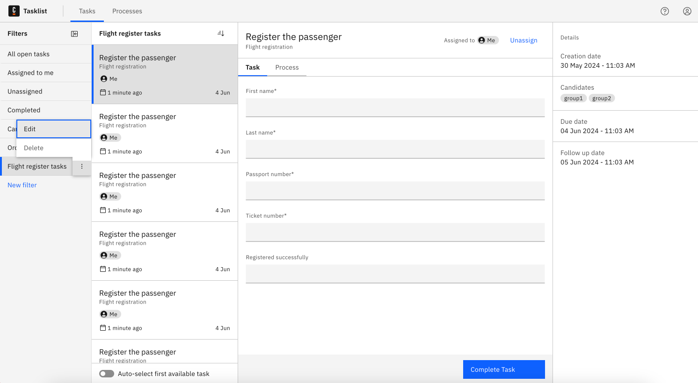
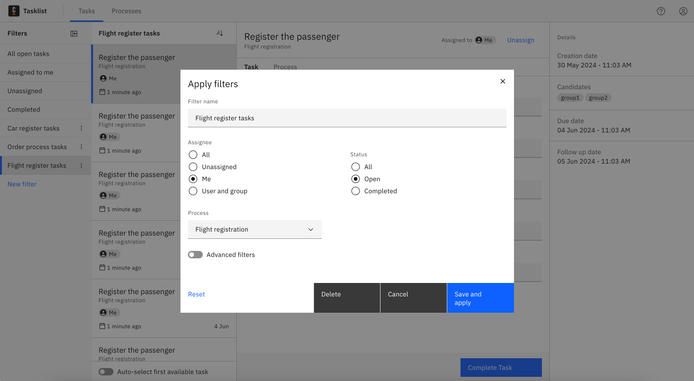
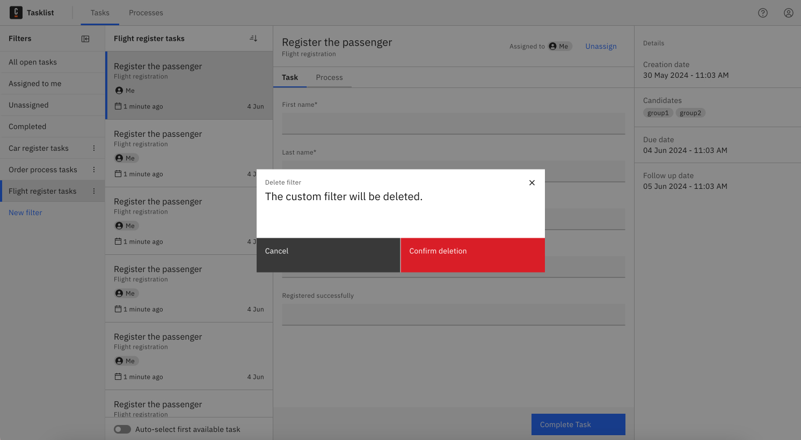

When you open the **Tasks** page, you will see the list of all tasks. This is a starting point for managing your workload.

## Apply a filter

As you browse through the list, you can utilize filters to locate specific tasks and organize your workload.

### Select a filter

You can select one of the default filters or [create a new filter](#create-new-filter).

Default filters:

- All open tasks
- Assigned to me
- Unassigned
- Completed tasks

## Create new filter

To create a new filter, click to apply a new filter. This action will open a filter dialog.
In the dialog, you can define various rules based on task attributes. The supported attributes are:

- Assignees and candidate groups
- Status
- Processes tasks belong to
- Dates (due date and follow up date)
- Task ID
- Task variables

After defining the rules, click **Apply** to apply the filter. The system will then filter the tasks according to your criteria, displaying only the relevant tasks.

## Save filter for future use

If you need to use the filter again, you can save it:

1. Click **Save**.
2. You will be prompted to enter a name for the filter. Choose a descriptive name that will help you recognize it later.
3. Click **Save and apply**.

The next time you need this filter, select it from your saved filters.

:::note
Filters you create are saved locally to your device. Therefore, while you can access and reuse them on the same device, these filters will not be available if you switch to a different device.
:::

## Update saved filter

You can edit or [delete](#delete-a-filter) filters that you saved.

To change the criteria of an existing filter, take the following steps:

1. Choose the filter you want to update from your list of saved filters, and click the three vertical dots next to its name.
2. Click **Edit**. This action will open the filter dialog with the current settings of the filter.
3. Update the filter criteria as needed.
4. Confirm the changes by clicking **Save and apply**.

## Delete a filter

To delete a filter, take the following steps:

1. Choose the filter you want to delete from your saved filters, and click the three vertical dots next to its name.
2. Click **Delete**.
3. Click **Confirm deletion** in the dialog.

After deletion, the default filter will be applied, showing the full list of tasks again.
