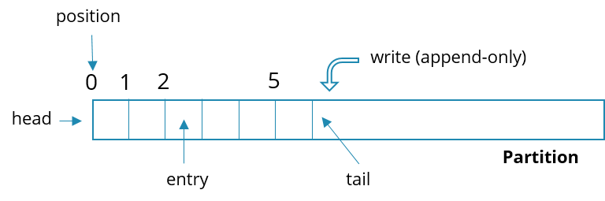

In Zeebe, all data is organized into **partitions**. A **partition** is a persistent stream of process-related events.

In a cluster of brokers, partitions are distributed among the nodes so it can be thought of as a **shard**. When you bootstrap a Zeebe cluster, you can configure how many partitions you need.

:::note
If you've worked with the [Apache Kafka System](https://kafka.apache.org/) before, the concepts presented on this page will sound very familiar to you.
:::

## Usage examples

Whenever you deploy a process, you deploy it to the first partition. The process is then distributed to all partitions. On all partitions, this process receives the same key and version such that it can be consistently identified.

:::note
To learn more about aligning partitions with the same version of deployment and why it is built this way, visit our [Zeebe Chaos blog](https://camunda.github.io/zeebe-chaos/2021/01/26/deployments/#deployments).
:::

When you start an instance of a process, the client library then routes the request to one partition in which the process instance is published. All subsequent processing of the process instance happens in that partition.

## Distribution over partitions

When a process instance is created in a partition, its state is stored and managed by the same partition until its execution is terminated. The partition in which it is created is determined by various factors.

- When a client sends a command `CreateProcessInstance` or `CreateProcessInstanceWithResult`, the gateway chooses a partition in a round-robin manner and forwards the requests to that partition. The process instance is created in that partition.
- When a client publishes a message to trigger a **message start event**, the message is forwarded to a partition based on the correlation key of the message. The process instance is created on the same partition where the message is published.
- Process instances created by **timer start events** are always created on partition 1.

## Scalability

Use partitions to scale your process processing. Partitions are dynamically distributed in a Zeebe cluster and for each partition there is one leading broker at a time. This **leader** accepts requests and performs event processing for the partition. Let's assume you want to distribute process processing load over five machines; you can achieve that by bootstraping five or more partitions.

:::note
While each partition has one leading broker, _not all brokers are guaranteed to lead a partition_. A broker can lead more than one partition, and, at times, a broker in a cluster may act only as a replication back-up for partitions. This broker will not be doing any active work on processes until a partition fail-over happens and the broker gets elected as the new leader for that partition.
:::

## Partition data layout

A partition is a persistent append-only event stream. Initially, a partition is empty. As the first entry is inserted, it takes the place of the first entry. As the second entry comes in and is inserted, it takes the place as the second entry, and so on and so forth. Each entry has a position in the partition which uniquely identifies it.

## Replication

For fault tolerance, data in a partition is replicated from the **leader** of the partition to its **followers**. Followers are other Zeebe broker nodes that maintain a copy of the partition without performing event processing.

We recommend an **odd replication factor**, as it ensures high fault-tolerance and availability. **Even replication factors** have no benefit over the previous odd value and are weaker than the next.

For example, a replication factor of four has no benefit over a replication factor of three. A replication factor for four would be weaker than a replication factor of five.

## Partition distribution

If no other configuration is specified, partitions are distributed in a guaranteed round-robin fashion across all brokers in the cluster, considering the number of nodes, number of partitions, and the replication factor. For example, the first partition will always be hosted by the first node, plus the following nodes based on the replication factor. The second partition will be hosted on the second node and the following to fulfill the replication factor.

As an example, the following partition schemes are guaranteed:

### Example 1

#### Context

- Number of nodes: 4
- Number of partitions: 7
- Replication factor: 3

#### Partition layout

|             | Node 1 | Node 2 | Node 3 | Node 4 |
| ----------: | :----: | :----: | :----: | :----: |
| Partition 1 |   X    |   X    |   X    |        |
| Partition 2 |        |   X    |   X    |   X    |
| Partition 3 |   X    |        |   X    |   X    |
| Partition 4 |   X    |   X    |        |   X    |
| Partition 5 |   X    |   X    |   X    |        |
| Partition 6 |        |   X    |   X    |   X    |
| Partition 7 |   X    |        |   X    |   X    |

### Example 2

#### Context

- Number of nodes: 5
- Number of partitions: 3
- Replication factor: 3

#### Partition layout

|             | Node 1 | Node 2 | Node 3 | Node 4 | Node 5 |
| ----------: | :----: | :----: | :----: | :----: | :----: |
| Partition 1 |   X    |   X    |   X    |        |        |
| Partition 2 |        |   X    |   X    |   X    |        |
| Partition 3 |        |        |   X    |   X    |   X    |

## Recommendations

Choosing the number of partitions depends on the use case, workload, and cluster setup. Here are some rules of thumb:

- For testing and early development, start with a single partition. Note that Zeebe's process processing is highly optimized for efficiency, so a single partition can already handle high event loads.
- With a single Zeebe broker, a single partition is usually enough. However, if the node has many cores and the broker is configured to use them, more partitions can increase the total throughput (around two threads per partition).
- Base your decisions on data. Simulate the expected workload, measure, and compare the performance of different partition setups.
