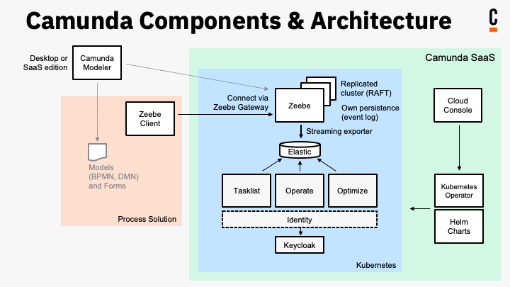

import DocCardList from '@theme/DocCardList';

:::note Interested in migrating from Camunda 7 to Camunda 8?
Interested in migrating process solutions developed for Camunda 7 to run them on Camunda 8? Visit our guide on [migrating from Camunda 7](/guides/migrating-from-camunda-7/index.md).
:::

[Camunda 8](https://camunda.io) delivers scalable, on-demand process automation as-a-service. Camunda 8 is combined with powerful execution engines for BPMN processes and DMN decisions, and paired with tools for collaborative modeling, operations, and analytics.

Camunda 8 consists of six [components](/components/components-overview.md). Together, these components form the complete Camunda 8 experience to design, automate, and improve your business processes.

In the architecture diagram below, take a closer look at how these components work together. Don't worry if you're not sure about all the terminology yet, as this is merely a visual overview of how the components form a unified experience. Step through the [getting started section](#getting-started) below to get started with Camunda for the first time, or find additional details in [What is Camunda 8](components/concepts/what-is-camunda-8.md), and an on-demand demonstration of the product in [Camunda Academy](https://bit.ly/3CvooTX).

:::note Looking for deployment guides?

Deployment guides for Camunda 8 components are available in the [Self-Managed section](/self-managed/about-self-managed.md), a self-hosted alternative to using Camunda 8 SaaS.

:::

## Getting started

Below are two excellent starting points if you're new to Camunda: modeling a process, and getting started with Spring:

<DocCardList items={[{type:"link", href:"/docs/next/components/modeler/about-modeler/", label: "Model your first process", docId:"components/modeler/about-modeler"},
{
type:"link", href:"/docs/next/guides/getting-started-java-spring/", label: "Get started with Spring", docId:"guides/getting-started-java-spring",
}
]}/>

With these guides, start working with [Web Modeler](/components/modeler/about-modeler.md) to get familiar with BPMN and model a business process, or as a Java developer, step through using Spring Boot and the Spring Zeebe SDK with Desktop Modeler to interact with a local Self-Managed Camunda 8 installation.

### Use cases

As you're getting started with Camunda, you can also learn more about some of our use cases:

- [**Get started with human task orchestration**](/guides/getting-started-orchestrate-human-tasks.md): Utilizing user tasks, you can create and assign tasks to users. Then, users can perform their work and enter the necessary data to drive the business process.
- [**Get started with API orchestration**](/guides/getting-started-orchestrate-apis.md): Step through making a request to a REST API and using the response in the next steps of your process.
- [**Get started with microservice orchestration**](/guides/getting-started-orchestrate-microservices.md): Orchestrate the microservices necessary to achieve your end-to-end automated business process.

## Design, automate, and improve

After getting started with Camunda, get to know the platform through the following sections:

- **Design**: Have a closer look at [designing with BPMN](/guides/automating-a-process-using-bpmn.md), or [creating decision tables using DMN](/guides/create-decision-tables-using-dmn.md).
- **Automate**: [Get to know Connectors](/guides/configuring-out-of-the-box-connector.md), reusable building blocks that integrate with external systems. Or, [set up client connection credentials](/guides/setup-client-connection-credentials.md) to create, name, and connect your client.
- **Improve**: [Get Optimize involved in your processes](/guides/improve-processes-with-optimize.md). By leveraging data collected during process execution, you can access reports, share process intelligence, analyze bottlenecks, and examine areas in business processes for improvement. Alternatively, [apply continuous integration and continuous deployment (CI/CD) pipelines](/guides/devops-lifecycle/integrate-web-modeler-in-ci-cd.md) for automated production deployments.

Additionally, Camunda hosts a section of [Best Practices](/components/best-practices/best-practices-overview.md). A mix of conceptual and practical implementation information, this section hosts our condensed experience using BPMN and DMN on the Camunda tool stack collected by consulting engagement with our customers and feedback from the community.
