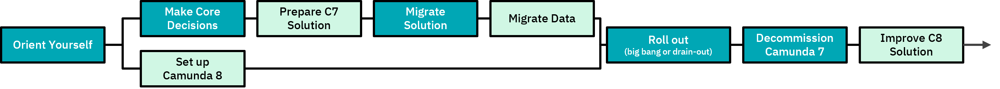
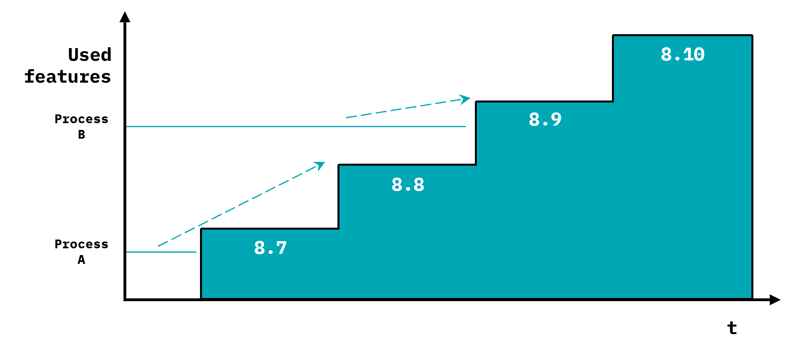
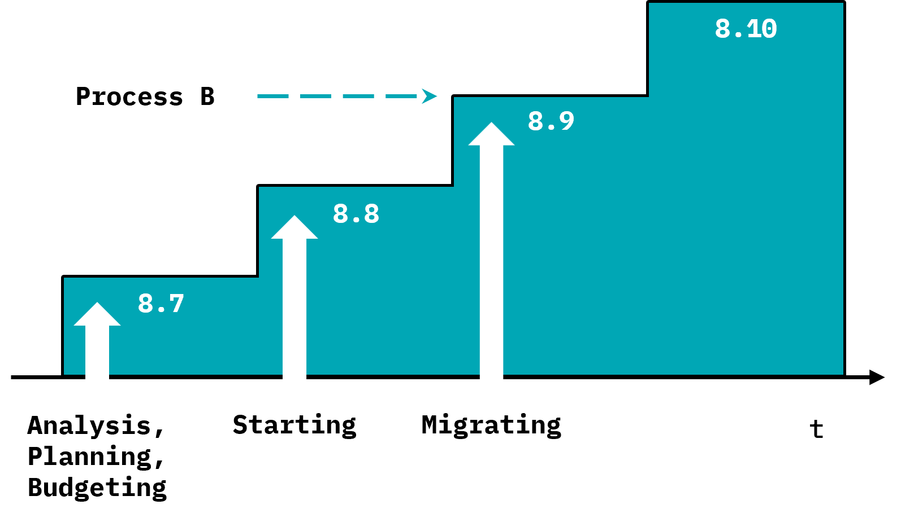
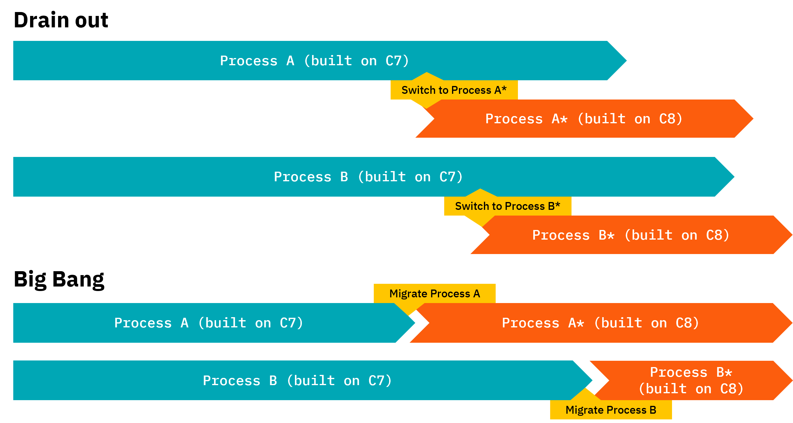
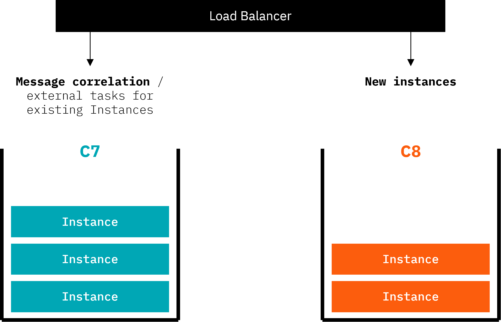
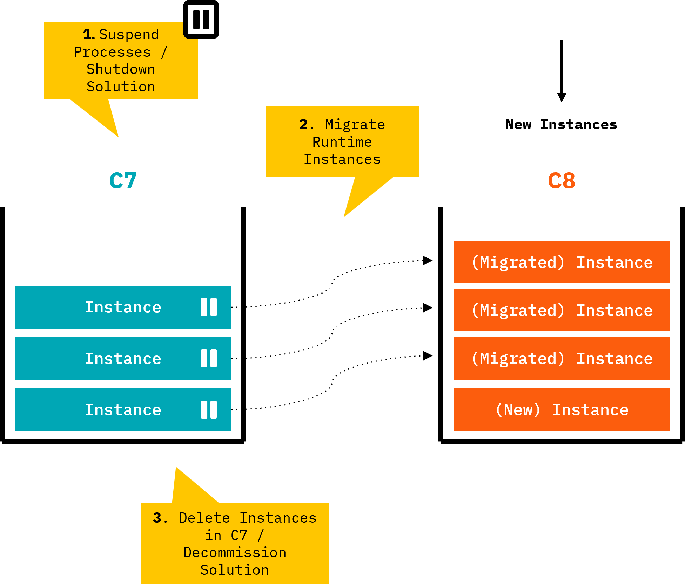
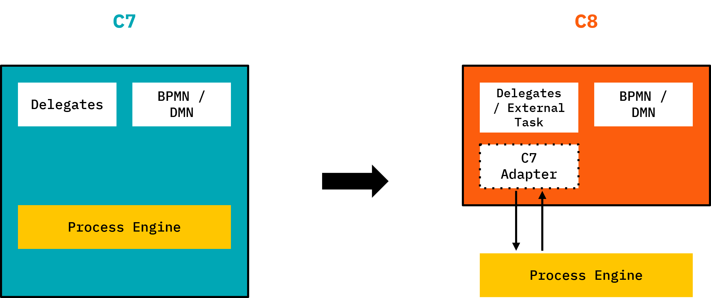
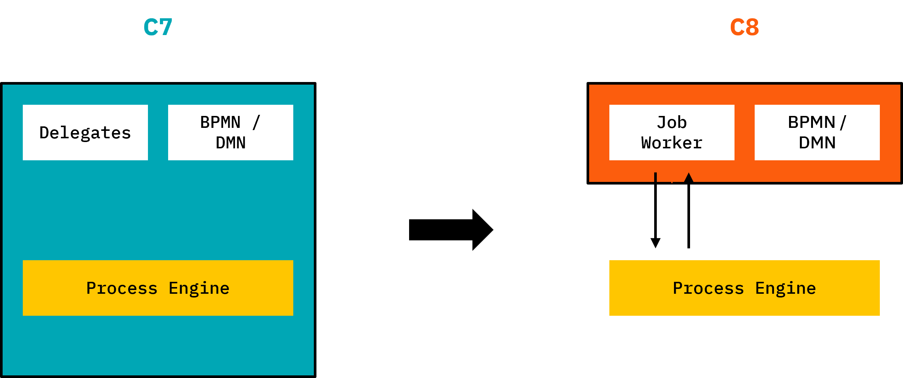

Although migration projects differ in complexity, there is a common theme in how to approach the migration journey.

## Migration journeys

The complexity of Camunda-7-based solutions varies significantly. Solutions range from small implementations with [clean delegates](./migration-tooling/code-conversion.md) to large solutions with hundreds of processes using internal API hacks.

This guide covers two typical journeys - a simplified migration journey and an advanced migration journey.

### Simplified migration journey

Suitable for solutions that are easy to migrate. If your solution fits into this category, migrating to Camunda 8 is straightforward.

### Advanced migration journey

For more complex solutions that require tackling additional complexities.

Maybe the truth will be somewhere in the middle for you. As a rule of thumb, Camunda advises keeping things as simple as possible (but of course not simpler).

Let's explore the various steps in more detail. You might skip some steps if a simplified journey is sufficient.

## 1Orient yourself

First, understand what needs to be done to migrate and what effort to expect. This allows you to plan and budget a migration project properly. Important steps include:

- Understand [conceptual differences between Camunda 7 and Camunda 8](./conceptual-differences.md).
- [Analyze your solution](#analyze-your-solution) to understand required changes based on your models.
- Explore [code conversion patterns](./migration-tooling/code-conversion.md).
- [Estimate migration effort](#estimate-migration-effort-and-budget-project) and budget the project.
- [Define your target Camunda version](#define-your-target-camunda-version-for-migration) and derive a migration timeline.
- [Leverage advisory services](#leverage-guidance-advisory-and-tooling) from Camunda consulting or certified partners.

After orientation, you can plan your migration project and start two independent work streams:

- [Set up Camunda 8](#2set-up-camunda-8).
- [Migrate your solution(s)](#4migrate-solutions).

But first, let's understand orientation in more detail.

### Analyze your solution

Use the [**Migration Analyzer**](./migration-tooling/index.md#migration-analyzer) to understand migration tasks.

To add some real-world flavor: In a customer scenario, our consultants ran 400 BPMN files through the tool, resulting in roughly 12,000 lines of findings. Analyzing those lines using the spreadsheet reduced that number to roughly 30 different types of tasks, making the migration project manageable.

This analysis will help you understand what needs to be done to migrate.

### Estimate migration effort and budget project

This analysis is the basis for estimating migration efforts. Our consultants use rule-of-thumb numbers on how much effort typical tasks require. For example, converting a Camunda 7 Java Delegate to a Camunda 8 Job Worker might take one hour if it just involves refactoring the JavaDelegate. It might take more effort if internal Camunda API is used in the delegate. Looking at [code conversion patterns](./migration-tooling/code-conversion.md) allows you to come up with your own estimate, which you can multiply by the number of tasks from the analyzer.

In past migration projects, this gave us a good ballpark estimation to plan and budget the project.

### When to migrate?

Any new projects should already be started using Camunda 8.

For Camunda 7 solutions, understand the support timeline for the Camunda 7 product:

- **Camunda 7 CE** (Community Edition) will EOL (end of life) in **October 2025** with a final release (v7.24) on Oct 14, 2025.
- There will be no more Camunda 7 CE releases after that date, and the GitHub repo will be archived. The code will still be available, but issues and pull requests will be closed, and the README will reflect the EOL status.
- **Camunda 7 EE** (Enterprise Edition) customers will continue to get **patch releases** (security patches & bug fixes) on a rolling basis **till at least 2030**.
- Camunda 7 CE users could switch to Camunda 7 EE to benefit from this long-term support to have enough time for migration.

While there is some urgency to start migration efforts, you are not yet under hard pressure.

Migrating to Camunda 8 gives you additional advantages, which might raise priority for your solution if:

- You want to leverage a SaaS offering (for example, to reduce the effort for hardware or infrastructure setup and maintenance).
- You need performance at scale and/or improved resilience.
- You need certain features that can only be found in Camunda 8 (for example, BPMN message buffering, improved multi-instance handling, the new connectors framework, RPA, IDP, or the improved collaboration features in Web Modeler).

<!-- TODO Link to conceptual differences -->

### When not to migrate?

You might wonder if there are cases where migration doesn't make sense? Camunda basically sees two scenarios here:

- Your solution is in legacy mode and will approach its own end of life before Camunda ends support.
- Your solution relies on an architecture that is not possible with Camunda 8. For example, software vendors that embedded Camunda 7 as a Java library into their own build, relying on shipping exactly one self-contained Java application. Refer to [conceptual differences](./conceptual-differences.md) for technical details. Most often, you could still migrate those scenarios if you rearchitect the solution.

### Define your target Camunda version for migration

Because of the improved core architecture of Camunda 8, features need to be re-added to Camunda 8 step-by-step. That means the current Camunda 8 version might not yet have sufficient feature parity for your scenario to migrate. Prominent examples are [task listeners](https://roadmap.camunda.com/c/147-user-task-listeners-for-assigning-and-completing-events), which will be introduced with 8.8.

<!-- TODO link to specific product board features -->

If your solution requires this feature, it might make sense to wait for the Camunda 8 version that will provide it. You can **[check the public feature roadmap](https://roadmap.camunda.com/) to understand timelines**.

The Camunda version to target might differ per process solution. For example, Process A might not need additional features and can migrate right away, but Process B might use the task listener planned for 8.8. That means you wait for rolling out migration for Process B till that version. As Camunda is currently running [an architecture streamlining initiative](https://camunda.com/blog/2024/04/simplified-deployment-options-accelerated-getting-started-experience/) to improve the core architecture, which [will be released with Camunda 8.8](https://camunda.com/blog/2025/01/camunda-87-88-release-update/). Unless you have time pressure or momentum to lose, Camunda generally recommends waiting for this to happen and targeting a Camunda version \>= 8.8 for migration.

For example, targeting the 8.9 release doesn't mean you wait for it to happen before thinking about migration. Typically, you can already perform analysis (which you might need to do anyway to understand the right target version), which is also important to plan your project and apply for the required budget on time. Doing the migration tasks can also happen before the actual release, either independently or based on early alpha versions.

<!-- TODO highlight the paragraph -->

### Leverage guidance, advisory, and tooling

This guide is the main resource walking you through migration.

As part of your migration journey, you might also want to consider engaging professional services to help you. The main starting points are:

- [Migration evaluation workshop (Camunda)](https://camunda.com/wp-content/uploads/2025/06/Camunda_ConsultingWorkshops_6-Migration-Evaluation_2025_EN.pdf)
- Scoping Workshop (Camunda) <!-- TODO -->
- Professional advisory services (Camunda, Partners)
- Implementation services (Partners)

Furthermore, you can use the [migration tooling](./migration-tooling/index.md) and related resources.

## 2Set Up Camunda 8

To run any solution on Camunda 8, you must have a running Camunda 8 installation.

<!-- TODO mention that SaaS is also a "running installation" in that sense -->

If you used an embedded engine with Camunda 7 in the past, this model is no longer possible (see [conceptual differences between Camunda 7 and Camunda 8](./conceptual-differences.md)). This might be new to your organization to operate Camunda in addition to your solution itself. The most successful operating model is to have a central team in the organization caring about Camunda, offering it as a self-service platform to others. This is also described in our [process automation Center of Excellence playbook](https://camunda.com/process-orchestration/automation-center-of-excellence/).

:::note
We want to unmask some typical misconceptions with Camunda 8:

- Camunda 8 does **not** need to be consumed as SaaS! But you can use SaaS if you want.
- Camunda 8 does **not** mean there needs to be one huge cluster to rule them all! But you can run big workloads on one cluster.
- Camunda 8 does **not** need to be set up for horizontal scalability! But you can set this up if you want.

You can run small Camunda 8 installations, one per solution, if you like. They can all be Self-Managed, meaning they run in your own datacenter. With the [architecture streamlining and the RDBMS initiative](https://camunda.com/blog/2024/04/simplified-deployment-options-accelerated-getting-started-experience/), Camunda provides a very simple Java installation (single JAR) that removes installation complexity and is sufficient for many use cases (RDBMS support for a secondary data store is planned for release with Camunda 8.9).
:::

There are multiple ways to set up Camunda 8:

- Use **Camunda's SaaS** offering: You don't need to install or operate the platform yourself. This is the most convenient and generally recommended option. If you face legal challenges around information security, privacy, and compliance, check the [Camunda Trust Center](https://camunda.com/trust-center/). However, be aware of the following limitations:
  - You cannot [migrate historical audit data from Camunda 7](./migration-tooling/index.md).
  - [Multi-tenancy](/components/concepts/multi-tenancy.md) is not currently supported.

- Run the platform **Self-Managed**. You might want to look at the [Camunda 8 Run distribution](/self-managed/quickstart/developer-quickstart/c8run.md). RDBMS support is planned to be introduced with 8.9, removing the need for Elastic Search and allowing a relatively simple setup that Camunda 7 users often like. Still, you can go for more scalable options (see also the [architecture streamlining blog post](https://camunda.com/blog/2024/04/simplified-deployment-options-accelerated-getting-started-experience/)). Refer to [installation guides](/self-managed/deployment/index.md) for details.

While setting up Camunda 8 is not part of the core migration journey, it is a prerequisite and should be tackled early in the migration journey to avoid blockers.

## 3Making Core Decisions

There are a small number of core decisions that will influence your overall migration journey. Although you might make them later in your journey once you have a better understanding of the consequences, Camunda presents them here so that you have them top of mind for the remainder of this guide.

### Drain out vs big bang

There are two possible migration scenarios: Drain out and big bang.

Both are valid approaches. Let's briefly look at the differences.

- **Drain out**: Keep running the C7-based solution, but run the C8-based (migrated) solution in parallel. New process instances are started in the new one. After some time, no processes are active in Camunda 7 any more, and the C7-based solution can be decommissioned.

- **Big bang**: The solution is migrated from Camunda 7 to Camunda 8, including data migration scripts. At one moment in time, the C7-based solution is stopped, the data is migrated, and the new C8-based solution is started. This Camunda 7 solution can be decommissioned right after. Note that a big bang relates to **one process solution only**. So if you run multiple processes, you typically migrate them one by one in multiple big bangs, not in one super big bang. For any of those processes, when you migrate, you flip the switch and are on Camunda 8 for those processes.

Let's look at the pros and cons of each approach.

<!-- TODO strategies as deep links -->

**Drain out**

Pros:

- No downtime.
- No data migration required.
- Easy fallback to old solution in case of problems.

<!-- TODO "No data migration required" is too generic, go into details (no process data migration required) -->

Cons:

- Requires code switch (for example, forwarding messages to either Camunda 7 or Camunda 8 depending on where the corresponding process was started).
- Duplicate tooling (for example, one Tasklist for Camunda 7 and one for Camunda 8 processes; same for operators with Cockpit and Optimize).
- Need to operate two solutions at the same time.

**Big bang**

Pros:

- Only one solution is running.
- No code switches necessary.
- No need to support the legacy codebase.

Cons:

- Requires data migration, at least runtime instances, which has some limitations (see [migration tooling](./migration-tooling/index.md)).
- Complexity of the necessary data migration might drive effort.
- Might require downtime.

<!-- TODO mention that we are building a process instance migration tool -->

There are some scenarios where process instances are short-lived, and the big bang approach can simply drain out existing instances and then restart without the need for data migration, making migration simpler.

**Recommendation**

There is no general recommendation for which strategy to use.

You could consider the **big bang approach less complex** in many scenarios. However, there are some **indicators to use drain out** instead:

- **Short-lived processes**: If processes finish quickly, the drain out happens fast, and it might even be possible to delay new process starts until after the drain out has happened.
- **Latency-sensitive processes**: Some use cases can't stand the outage time required for data migration. Maybe you can delay data migration and do it after you have already switched to the C8-based solution. Otherwise, big bang might simply not be feasible or require a more sophisticated data migration strategy.
- **Risk**: If your use case carries a lot of risk, you might not feel comfortable with the big bang. Most often, this can be mitigated by properly testing your migration.
- **No switching logic required**: Maybe running the C8-based solution in parallel requires almost no effort on your end (as you don't have user tasks or message receive events), then it might be the simpler choice.
- **Complexity of data migration**: If data migration turns out to be complex in your solution, draining out might be the better choice.

**Migrating your solution landscape step-by-step**

If you run multiple process solutions, you best migrate them one by one.

You can also drive this idea one step further. If you have complex solutions with multiple BPMN models, call activities, and further dependencies, even migrating those solutions in one go might be overwhelming. In this case, you could apply a microservices mindset and adjust your call activities to be service calls to other components. This way, you could migrate that solution process by process. This is not a general recommendation, just illustrating possibilities to reduce the migration scope.

### Adapt existing code vs refactoring

You need to adjust the code of your solution during migration. There are two general possibilities:

1. Keep existing code written for Camunda 7 and add an **adapter** to run it with Camunda 8. The [Camunda 7 Adapter](https://github.com/camunda-community-hub/camunda-7-to-8-migration/tree/main/camunda-7-adapter) is a starting point for doing this.
2. **Refactor** your code to work with Camunda 8. The [code conversion part of this guide](./migration-tooling/code-conversion.md) will focus on this approach.

We generally **recommend refactoring your code.** Let's briefly dive into both options.

**Adapt existing code**

While this approach sounds easy at first glance, it typically works only with very cleanly implemented Java Delegates (which could also be simply refactored to Job Workers). Even if using an adapter, you still need to understand architectural implications (such as transactional boundaries) and might need to rewrite some code. It also does not adapt all assets (for example, the Camunda 7 service API or test cases are not adapted).

In general, the adapter approach is rarely used.

**Refactor your code**

Rewrite your code. This follows typical patterns and might even be automated to some extent using OpenRewrite recipes. See the [code conversion guide](./migration-tooling/code-conversion.md) for details.

This approach has the big advantage that the resulting solution will comply with best practices on how Camunda 8 solutions should be written. Furthermore, architectural differences can be better understood while refactoring the solution. Some projects are also happy to clean up a codebase that has grown over time, reducing technical debt as part of the migration effort.

The downside is the effort required to refactor. The best strategy is to not over-engineer the approach for small code bases, but to automate migration of big code bases as much as possible.

## 4Migrate solution(s)

The main tasks to migrate your solutions to run on Camunda 8 include:

- Prepare your Camunda 7 solution (optional)
- Convert models
- Convert expressions
- Refactor code
- Improve Camunda 8 Solution (optional)

Let's dive into the details of these tasks.

### Prepare your Camunda 7 solution (optional)

It can make sense to do a first refactoring step in your Camunda 7 codebase to prepare for easier migration. The advantage of this approach is that you can make changes in a codebase and environment you understand well, while you can still run existing test cases without changes, derisking any changes you make.

Typical preparation steps include:

- **Extract complex code from your JavaDelegates** into Camunda-independent classes (for example, Spring beans) that are then invoked from the original JavaDelegate. This way, you do a step towards [Clean Delegates](./migration-readiness.md) that will be easy to refactor.

- **Remove the usage of internal APIs** or calls that depend on the transactionally integrated architecture of Camunda 7 (for example, querying the HistoryService within a JavaDelgate and expect it to know current changes already).

- **Increase test coverage** of the solution to increase confidence that code conversions during migration do not break anything. This is especially important if your C7-based solutions lack good test coverage. To avoid migration effort on test cases, ideally **abstract the test cases from the Camunda version** used, either by using a small own abstraction layer, or by using a test framework such as [Cucumber](https://cucumber.io/) or [Sentinel](https://developer.hashicorp.com/sentinel/docs/intro).
<!-- TODO: Mention Scenario Tests -->

- **Structural changes in your BPMN model** to make them runnable on Camunda 8. One trigger could be that you are using constructs that are not supported in Camunda 8 (for example, execution listeners on sequence flows). Or you want to get your models into a state that allows runtime data migration (see [data migration](#migrate-data-optional)), for example by adding artificial wait states before multi-instance tasks (as multiple instance is not supported for runtime data migration).

- **Replace JUEL expressions with FEEL**. JUEL is not supported in Camunda 8 (see [conceptual differences](./conceptual-differences.md)). We [plan to release a FEEL plugin for the Camunda 7 platform](https://github.com/camunda/camunda-bpm-platform/issues/2384), allowing you to already rewrite your expressions within your Camunda 7 environment. This change goes beyond simply converting JUEL to FEEL, but also removing any calls to Spring beans that are not possible in FEEL. So you might, for example, add execution listeners invoking the code you need, writing a process variable that then can be evaluated in FEEL.

This step is optional and can also be skipped, either because the codebase is already in a clean state or you are feeling confident about directly converting your codebase to Camunda 8.

### Convert models

Your BPMN and DMN models need to be adjusted.

The [Migration Analyzer](./migration-tooling/index.md#migration-analyzer) can do most changes for you. Depending on how you refactor your code and what elements of Camunda 7 you have used, you can extend or customize the diagram convertion to suit your needs.

You can dive into the [technical details of model differences](./migration-tooling/index.md#extending-the-conversion-logic) if you are interested in more detail.

### Convert expressions

Your models might contain JUEL expressions, which are not supported in Camunda 8.

Simple expressions are directly converted by the [Migration Analyzer](./migration-tooling/index.md#expression-conversion). You can also use the [FEEL Copilot](/components/early-access/alpha/feel-copilot/feel-copilot.md) to rewrite more complex expressions for you.

Check the [code conversion patterns section](./migration-tooling/code-conversion.md) for more complicated scenarios.

<!--TODO: Add patterns to deliver on this promise  -->

### Refactor code

You need to refactor your code to use Orchestration Cluster APIs only.

Most prominently you need to **convert any API calls to Camunda** (for example, RuntimeService) and the glue code attached to process models (for example, JavaDelegates). The [code conversion patterns](./migration-tooling/code-conversion.md) goes into more details how to approach this. Some of those changes might be automated using [OpenRewrite recipes](https://docs.openrewrite.org/).

Depending on your architecture you might also have to **re-architect** core parts of your solution. This is especially true if you rely on transaction integration, threading, internal API (such as calling the HistoryService from within a JavaDelegate), or features that are deprecated and thus are not planned for Camunda 8 (such as CMMN). See [conceptual differences between Camunda 7 and Camunda 8](./conceptual-differences.md) for more details on this.

<!--TODO: Add list features that are not planned -->

<!--TODO!!! -->

As part of this effort you also have to **adjust your test cases**. If you used [camunda-bpm-assert](https://github.com/camunda/camunda-bpm-platform/tree/master/test-utils/assert), a natural choice is to migrate to [Camunda Process Test](https://github.com/camunda/camunda/tree/main/testing/camunda-process-test-java). You can also leverage [code conversion patterns](./migration-tooling/code-conversion.md) or [OpenRewrite recipes](https://docs.openrewrite.org/). If you use other means of testing (such as Cucumber, camunda-bpm-scenario, and so on) you must adjust accordingly.

The [Code Migration Detector](https://github.com/camunda-community-hub/camunda-7-to-8-migration/tree/main/code-migration-detector) (based on ArchUnit) can check how much Camunda 7 API is used in your codebase to allow you refactor to reduce the footprint step-by-step. Ideally, you can remove any Camunda 7 dependency at the end of your refactoring.

### Improve Camunda 8 solution (optional)

One optional step many customers are doing is to adjust their solution to the latest Camunda best practices after migration. This allows you to reduce technical debt or remove workarounds that either crept into the solution over time or during the migration project for going live quickly. This step does not have to block the rollout of your migrated solution, and is often done after the fact to remove time pressure and incorporate any learnings from operating the Camunda 8 solution.

While this step can happen during code conversion already, it might also make sense to do it in a separate later step to reduce the number of changes during conversion to reduce the risk of breaking things.

While technically it is a great thing to improve your solution, many migration projects are under pressure to run efficiently (read: minimal effort). Therefore it is advisable to at least separate two different goals:

- Migrate the solution
- Improve the solution and reduce further technical debt

While Camunda sees a lot of value in doing both tasks at the same time - as you touch a lot of the code anyway and will probably also retest your solution thoroughly - if the budget is tight it might be better to focus on migration instead of not getting budgeted for the increased scope.

## 5Migrate data (optional)

With your solution code migrated, you also need to look at your production data. Camunda currently develops the **[Data Migrator](./migration-tooling/index.md#data-migrator)** to be used for this (**planned to be available with 8.8**). You might need to customize the data migrator, especially if you used complex data formats in Camunda 7 (for example, Java objects) that need to be converted to something Camunda 8 can handle (for example, JSON). As part of this step you might also need to extract big payloads and binaries (such as documents) into an external data store and reference it from the process (using for example upcoming document handling possibilities).

Data to be migrated includes **runtime instances, audit data, and optimize data**. Let's look at it one by one.

**Runtime instances**

Currently running process instances. Running means that these process instances in Camunda 7 are not yet ended and currently wait in some [wait-state](https://docs.camunda.org/manual/latest/user-guide/process-engine/transactions-in-processes/#wait-states). This state is persisted in the database and a corresponding data entry needs to be created in Camunda 8, so that the process instance can continue from that state in the new solution.

Runtime instance migration has limitations, check [migration tooling](./migration-tooling/index.md) for details. As a result you might need to adjust your process models before migration. You can use [process version migration](https://docs.camunda.org/manual/7.22/user-guide/process-engine/process-instance-migration/) in the Camunda 7 environment to migrate process instances to the version that is migratable to Camunda 8. An interesting strategy can be to define dedicated migration states you want your process instances to pile up in. Another common strategy is to use [process instance modification](https://docs.camunda.org/manual/7.22/user-guide/process-engine/process-instance-modification/) in the Camunda 7 environment to move out of states that are not migratable (for example, process instances within a multiple instance task).

<!-- TODO: Expand -->

Migrating runtime instances is only necessary if you target a big bang migration for your process solution (keep in mind that "big bang" in this context means to switch one process solution from Camunda 7 to Camunda 8 on a defined point in time - it doesn't mean that you have to migrate all your processes at once). If you drain out your Camunda 7 processes, or if they are typically very short-lived, you do not need runtime instance migration.

The Data Migrator needs to access the Camunda 7 database, but just uses Orchestration Cluster APIs, which means you can also use this tool when you run on SaaS.

**Audit data (aka History)**

Process instances left traces, often referred to as "history data". These are audit logs when a process instance was started, what path it took, and so on.

It is important to note, that audit data can exist for ended processes from the past, but is also available for currently still running process instances, as those process instances also left traces up to the current wait state.

If you need to preserve audit data and want to transfer it to Camunda 8, you can also use the [Data Migrator](./migration-tooling/index.md). Migrating audit **data comes with limitations** (most prominently that you need to run Camunda 8 with **RDBMS**, a feature that is planned to be introduced with 8.9).

<!-- TODO use a deep link here as well -->

Migrating audit data is optional. If you need to do it, consider that audit data migration might need to look at a huge amount of data, which can take time to migrate. But you can run audit data migration beside the normal operations after a successful big bang migration over a period of time, which helps you to keep downtimes low.

**Optimize data**

The process intelligence tool Optimize keeps a lot of audit data to allow various analysis. This data might also want to be migrated when switching to Camunda 8.

Optimize data migration **is currently not yet possible**, but this is planned on the roadmap.

<!-- TODO link to the roadmap item -->

## 6Roll out

After you migrated the solution and prepared and tested the data migration (if necessary) you need to roll out your changes.

- **Drain out**: In a drain out scenario you need to deploy your new solution next to the existing Camunda 7 solution. Then you need to add switching logic in your code, API gateway, or load balancer logic, which redirects traffic to your new solution. However, you still need to correlate callbacks to waiting process instances to the old solution, and might also present user tasks of both solutions to your users.

- **Big bang**: In a big bang scenario, you will typically shutdown the old solution (or at least parts of it for the process under migration), then run the runtime instance migration to make sure all waiting process instances are transferred to the Camunda 8 solution. After this step succeeded, you can start up the new solution and route traffic to it. This approach assumes there can be a downtime of the application. If that is not an option, another alternative is to startup the Camunda 8 solution in parallel and just switch the traffic routing without downtime, and then start to migrate runtime instances afterwards.

Audit data migration can run after the switch has happened, after a successful drain out (in parallel to normal operations) or of course during the downtime of a big bang. The best approach depends on the amount of data and the possibility for downtimes.

## 7Decommission Camunda 7 solution

Once you have successfully big banged to Camunda 8, or all running processes are drained out, you can decommission your Camunda 7 solution. If this was the last Camunda 7 solution, you can completely decommission the Camunda Platform 7 and related practices.
