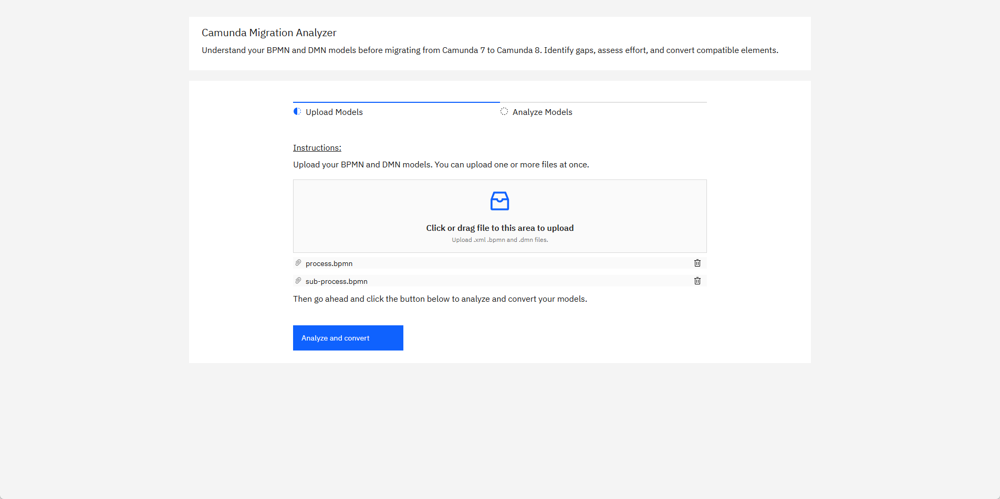
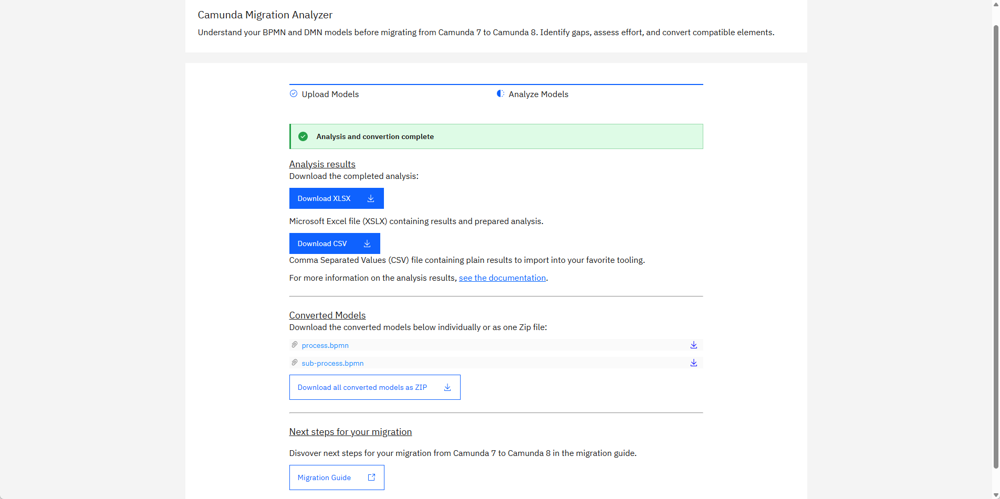
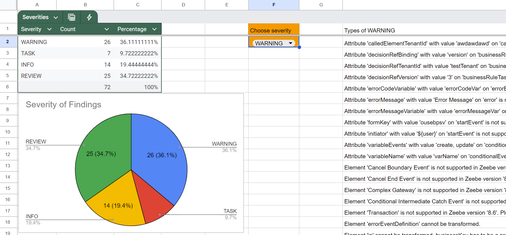

Camunda currently invests in tooling to help support and ease your migration from Camunda 7 to Camunda 8.

:::info
The migration tooling is currently under development, with an initial release planned for **Camunda 8.8 (October 2025)**.
:::

## Migration tools

Camunda provides the following migration tools:

| Migration tool                                                                       | Description                                                                                                                                                                                         | GitHub link                                                                                                     |
| :----------------------------------------------------------------------------------- | :-------------------------------------------------------------------------------------------------------------------------------------------------------------------------------------------------- | --------------------------------------------------------------------------------------------------------------- |
| **[Migration Analyzer & Diagram Converter](#migration-analyzer--diagram-converter)** | Gain a first understanding of migration tasks. Available for local installation (Java or Docker) or [hosted as a free SaaS offering](https://migration-analyzer.consulting-sandbox.camunda.cloud/). | [camunda-7-to-8-migration-analyzer](https://github.com/camunda-community-hub/camunda-7-to-8-migration-analyzer) |
| **[Data Migrator](../data-migrator/)**                                               | Copies active Camunda 7 runtime instances to Camunda 8. History (audit) migration is available as experimental.                                                                                     | [camunda-7-to-8-data-migrator](https://github.com/camunda/camunda-7-to-8-data-migrator)                         |
| **[Code Conversion Utilities](./code-conversion.md)**                                | Mixture of code _mapping tables_, code conversion _patterns_, and automatable _refactoring recipes_.                                                                                                | [camunda-7-to-8-code-conversion](https://github.com/camunda-community-hub/camunda-7-to-8-code-conversion/)      |

## Examples

| Example                                                                                                    | Description                                                        | GitHub link                                                                                                   |
| :--------------------------------------------------------------------------------------------------------- | :----------------------------------------------------------------- | ------------------------------------------------------------------------------------------------------------- |
| **[Simple end-to-end example](https://github.com/camunda-community-hub/camunda-7-to-8-migration-example)** | Showing all tools in action for a simple Spring Boot Java solution | [camunda-7-to-8-migration-example](https://github.com/camunda-community-hub/camunda-7-to-8-migration-example) |

## Migration Analyzer & Diagram Converter

The **Migration Analyzer & Diagram Converter** helps you get a first understanding of migration tasks when moving from Camunda 7 to Camunda 8. It analyzes Camunda 7 model files (BPMN or DMN) and generates a list of tasks required for the migration.

In a second step, it can also convert these files from the Camunda 7 format to the Camunda 8 format. For example, it updates namespaces or renames XML properties if needed.

You can use the Migration Analyzer & Diagram Converter in the following ways:

- **Web Interface**: A wizard-like UI built with Java (Spring Boot) and React. Available:
  - locally as a Java JAR,
  - via Docker, or
  - as a free hosted SaaS version.
- **CLI**: A command-line interface implemented in Java.

The results are available as:

- **XLSX**: A Microsoft Excel file, including pre-built pivot tables for data exploration.
- **CSV**: A plain-text comma-separated file, compatible with any spreadsheet tool.

Let's go through this step-by-step:

- [How to install?](#installation)
- [How to analyze your models?](#analyzing-your-models-using-the-web-interface)
- [How to convert your models?](#converting-your-models)

### Installation

Please refer to the [Installation Guide](https://github.com/camunda-community-hub/camunda-7-to-8-migration-analyzer#installation) for local setup instructions.

To get started right away, try the free SaaS version:  
[https://migration-analyzer.consulting-sandbox.camunda.cloud/](https://migration-analyzer.consulting-sandbox.camunda.cloud/)

### Analyzing your models using the Web Interface

After [local installation](https://github.com/camunda-community-hub/camunda-7-to-8-migration-analyzer#installation), open [http://localhost:8080/](http://localhost:8080/).  
Or use the [SaaS deployment](https://migration-analyzer.consulting-sandbox.camunda.cloud/) (no local setup required).

The wizard is straightforward. Upload one or more models:



Click **Analyze and convert**:



On this screen you can now:

- Download the analyzer results as Microsoft Excel file (XSLX)
- Download the analyzer results as CSV file
- Download the converted models (individually or as ZIP)

Analysis results contain a list of items, where each row represents an action item required for migrating your solution to Camunda 8. Those items are grouped by severity:

- **INFO**: No action needed. Diagram conversion can successfully map attributes to the Camunda 8 implementation.
- **REVIEW**: The convertion will modify some expressions or attributes. Please verify that the intended functionality remains unchanged.
- **WARNING**: A Camunda 7 concept can not be directly mapped to a Camunda 8 equivalent. Consider reviewing the Camunda 8 roadmap or exploring possible workarounds.
- **TASK**: Manual changes are required to make the model work in Camunda 8.

This allows you to focus on the most important findings. Tasks can also be grouped by type. For example, changing a `JavaDelegate` to a `JobWorker` might appear 100 times in your codebase, but still represents just one recurring pattern.

Pivot tables can help you identify tasks that appear multiple times across different files, providing a comprehensive overview of migration efforts.

Let’s take a closer look at how to use those results.

### Understanding analyzer results using Microsoft Excel


The XLSX file includes three tabs:

- **AnalysisSummary**: Pivot tables and charts that summarize typical migration tasks.
- **PivotTable**: A large pivot table for dynamic data exploration.
- **AnalysisResults**: The raw data from the analysis, which you can copy, import, or further process.

You can open the file using Microsoft Excel (desktop or Office 365).

### Understanding analyzer results using Google Sheets or LibreOffice

You can also open the XLSX file in Google Sheets, LibreOffice, OpenOffice, or similar tools. The raw data will be imported correctly, but pivot tables will not be preserved.

Alternatively, download the results as a CSV file and import them directly into your preferred tool.

In this case:

1. Create your own pivot table in the tool.
2. Or copy the contents of the **AnalysisResults** tab into your own spreadsheet.

For Google Sheets, consider using this [Google Spreadsheet template](https://docs.google.com/spreadsheets/d/1ZUxGhj1twgTnXadbopw1CvZg_ZvDnB2VXRQDSrKtmcM/edit?gid=6013418#gid=6013418) created by Camunda consultants.



### Analyzing your models using the CLI

If you prefer the command line over a web interface, the CLI tool is for you. It is ideal for batch conversions or automation.

After [installation](https://github.com/camunda-community-hub/camunda-7-to-8-migration-analyzer#installation), run the CLI:

```shell
java -jar camunda-7-to-8-migration-analyzer-cli.jar local myDiagram.bpmn --xlsx
```

You can also prompt a help message that will guide you through all parameters:

```shell
java -jar camunda-7-to-8-migration-analyzer-cli.jar local

Missing required parameter: '<file>'
Usage: camunda-7-to-8-migration-analyzer-cli local [-dhoV] [--check] [--csv]
       [--delegate-execution-as-job-type] [--disable-append-elements]
       [--disable-default-job-type] [--md] [-nr]
       [--default-job-type=<defaultJobType>]
       [--platform-version=<platformVersion>] [--prefix=<prefix>] <file>
Converts the diagram from the given directory or file

Execute as:

java -Dfile.encoding=UTF-8 -jar camunda-7-to-8-migration-analyzer-cli.jar local

Parameter:
      <file>                 The file to convert or directory to search in
Options:
      --check                If enabled, no converted diagrams are exported
      --csv                  If enabled, a CSV file will be created containing
                               the conversions results
      --xslx                 If enabled, a XSLX file will be created containing
                               the analysis results
  -d, --documentation        If enabled, messages are also appended to
                               documentation
      --default-job-type=<defaultJobType>
                             If set, the default value from the
                               'converter-properties.properties' for the job
                               type is overridden
      --delegate-execution-as-job-type, --delegate-expression-as-job-type
                             If enabled, sets the delegate expression as the
                               job type
      --disable-append-elements
                             Disables adding conversion messages to the bpmn xml
      --disable-default-job-type
                             Disables the default job type
  -h, --help                 Show this help message and exit.
      --md, --markdown       If enabled, a markdown file will be created
                               containing the results for all conversions
      -nr, --not-recursive   If enabled, recursive search in subfolders will be
                               omitted
  -o, --override             If enabled, existing files are overridden
      --platform-version=<platformVersion>
                             Semantic version of the target platform, defaults
                               to latest version
      --prefix=<prefix>      Prefix for the name of the generated file
                               Default: converted-c8-
  -V, --version              Print version information and exit.
```

### Converting your models

As mentioned, the Migration Analyzer & Diagram Converter can also convert BPMN and DMN models for use with Camunda 8.

This includes:

- Updating namespaces
- Adjusting XML structure and properties
- Transforming expressions

Converted files can be downloaded via the web interface or generated via the CLI.

### Extending the conversion logic

You can also extend the conversion logic. See [Extending the Migration Analyzer & Diagram Converter](https://github.com/camunda-community-hub/camunda-7-to-8-migration-analyzer?tab=readme-ov-file#how-to-extend-diagram-conversion) for details.

### Expression conversion

JUEL expressions used in Camunda 7 are not supported in Camunda 8. The Migration Analyzer & Diagram Converter tries to convert simple expressions automatically (see [ExpressionTransformer](https://github.com/camunda-community-hub/camunda-7-to-8-migration-analyzer/blob/main/core/src/main/java/org/camunda/community/migration/converter/expression/ExpressionTransformer.java)). For an overview of what’s supported, see the [ExpressionTransformer test case](https://github.com/camunda-community-hub/camunda-7-to-8-migration-analyzer/blob/main/core/src/test/java/org/camunda/community/migration/converter/ExpressionTransformerTest.java).

More complex expressions may require manual rewriting. The [FEEL Copilot](https://feel-copilot.camunda.com/) can help with this.

You can also customize or extend the transformer logic as needed.
