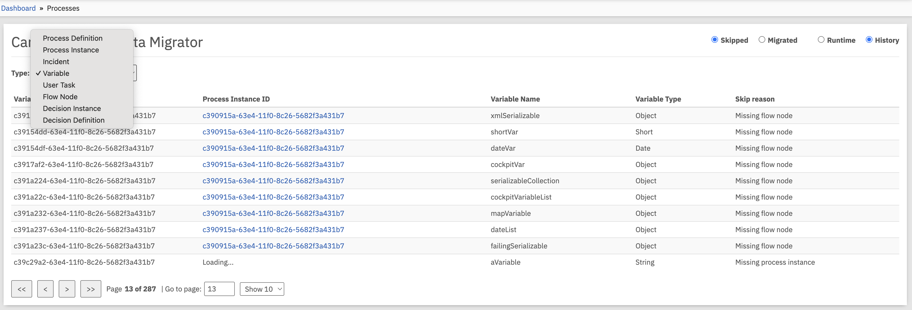
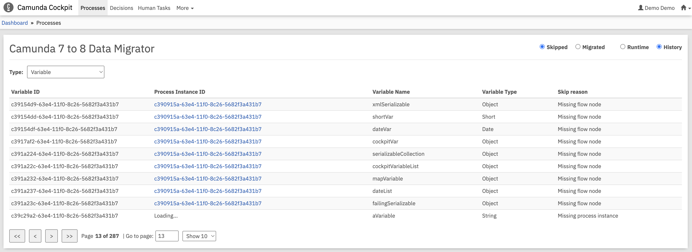

:::warning Experimental feature

- The Cockpit plugin is an **experimental** feature and we don't recommend using it in production environments.
- You can read more about limitations in the [limitations](/guides/migrating-from-camunda-7/migration-tooling/data-migrator/limitations.md#cockpit-plugin) page.
  :::

The Cockpit plugin provides a web-based interface for viewing information about skipped and migrated runtime and history data. It integrates with Camunda 7 Cockpit to give you visibility into which runtime process instances or history data (like variables, flow nodes, etc.) were successfully migrated or skipped during migration and the reasons why.

For more information on Camunda 7 plugins, see the [Camunda 7 documentation](https://docs.camunda.org/manual/latest/webapps/cockpit/extend/plugins/).

## Prerequisites

- **Database Configuration**: The plugin can only access databases that Camunda 7 is connected to, so the migration schema needs to be created in the Camunda 7 database (default behavior), or both Camunda 7 and Camunda 8 databases must point to the same database instance. For an example, see the [Data Migrator setup example](config-examples.md#data-migrator).
- Camunda 7 Webapps are deployed, running, and accessible.
- Migration schema is available in Camunda 7 database.
- The Cockpit plugin requires running the migrator with `save-skip-reason` enabled.
  - The plugin doesn't show skip reasons without this setting because they are not stored.
- To use the Cockpit plugin, run the migrator with the following setting:
  ```yaml
  camunda.migrator:
    save-skip-reason: true
  ```

:::warning Heads-Up

- Saving the skip reason could result in a large amount of data being stored additionally in your database, depending on the order of magnitude of the data to be migrated or potentially skipped.
- We recommend testing your migration in a QA environment before running the Data Migrator against your production database.
  :::

## Installation

1. **Download the latest release** from the [releases page](https://github.com/camunda/camunda-7-to-8-migration-tooling/releases).

2. **Deploy the plugin** to your Camunda 7 installation by copying the generated JAR file into the Camunda 7 plugins directory. For example the paths are:
   - For Tomcat: `./camunda-bpm-ee-tomcat-<camunda-7-version>-ee/server/apache-tomcat-<tomcat-version>/webapps/camunda/WEB-INF/lib/`.
   - For Run: `./camunda-bpm-run-ee-<camunda-7-version>-ee/configuration/userlib/`.

3. **Inspect skipped and migrated data in Cockpit** once the plugin has been deployed.

## Using the Cockpit plugin

After installation and configuration, the Cockpit plugin provides:

- **Skipped entity overview**: View all entities that were skipped during migration.
- **Detailed skip reasons**: Understand why specific entities were not migrated.
- **Migration status tracking**: See data that has been migrated successfully.

## Screenshots

The following screenshots demonstrate the Cockpit plugin interface and functionality:

### Migrated process instances view

Shows a table of successfully migrated process instances from Camunda 7 to Camunda 8, including the process instance ID, process definition key, and the corresponding Camunda 8 key.


### Skipped process instances overview

Displays process instances that were skipped during migration, allowing users to identify which instances failed and need further attention.


### Entity type selection

Allows filtering historic entities by type (process instances, variables, tasks, etc.) to simplify analysis of migration issues.



### Variable-specific skip analysis

When viewing historic variable data, the type and value of primitives are retrieved to provide additional context.


