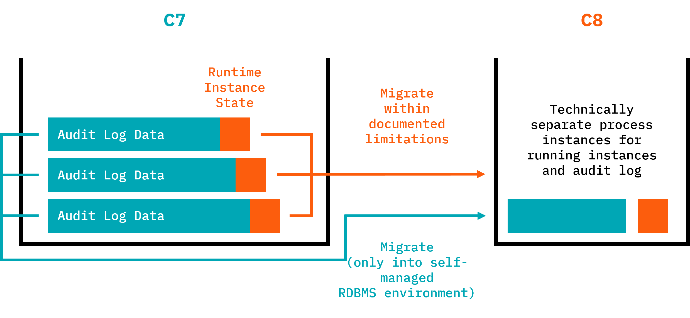

Use the Data Migrator to copy runtime and audit data from Camunda 7 to Camunda 8.

:::info Production Readiness Status

- [History migration](history.md): Experimental and not intended for production usage.
  :::

## Modes of operation

The Data Migrator offers two modes of operation:

- [Runtime migration](runtime.md): Migrate running process instances and continue execution in C8. Production-ready with Camunda 8.8.
- [History migration](history.md): Copy audit (history) data to Camunda 8 (experimental). Not intended for production, currently an experimental feature.

Migration details are summarized as follows:

| What is migrated                                                                                                                                                                   | What is NOT migrated                                                                                                                                                                                                                                                                                                                                                                                               |
| :--------------------------------------------------------------------------------------------------------------------------------------------------------------------------------- | :----------------------------------------------------------------------------------------------------------------------------------------------------------------------------------------------------------------------------------------------------------------------------------------------------------------------------------------------------------------------------------------------------------------- |
| 
<ul><li>
Running process instances (state-preserving).
</li><li>Process variables and their values.</li><li>Execution history (experimental mode available).</li></ul>
 | <ul><li>
BPMN process models (use the [Migration Analyzer & Diagram Converter](/guides/migrating-from-camunda-7/migration-tooling/index.md#migration-analyzer--diagram-converter)).
</li><li>Custom code or integrations (use [Code Conversion Utilities](../code-conversion)).</li><li>Users, groups, tenants, and authorizations.</li><li>Task assignments and states (due date, priority, etc.).</li></ul> |

## Key features

- Preserves the execution state of running process instances during migration.
- Converts and migrates runtime/history process variables, decision inputs, and decision outputs with proper type handling.
- Supports customizable variable interceptors for both runtime and history migration contexts.
- Validates data before migration to help ensure a successful run.
- Allows you to skip or retry problematic instances during migration.
- Provides detailed logging and reporting to monitor migration progress.
- Supports multiple database vendors, including H2, PostgreSQL, and Oracle.

## Typical choreography of runtime and history migration

As described in [the roll-out phase of the migration journey](../../migration-journey.md), you will typically use the following sequence of tasks when applying both data migrations (while keeping downtimes to a minimum):

1. Stop the Camunda 7 solution (normally shut down your application).
2. Start the Data Migrator in "running instance migration mode".
3. Wait until running instance migration is completed.
4. Start the new Camunda 8 solution immediately so migrated process instances can continue right away.
5. Start the Data Migrator in "history migration mode".
6. The migrator runs until all history data is migrated while Camunda 8 process execution continues in parallel.

With this approach, the duration of history migration doesn't block big bang migrations.

## Customization

You might need to customize the data migration, especially if you used complex data formats in Camunda 7 (for example, Java objects) that need to be converted to something Camunda 8 can handle (for example, JSON).

As part of this step, you might also need to extract big payloads and binaries (like documents) into an external data store and reference it from the process (using, for example, upcoming document handling possibilities).

<!-- TODO link to document handling docs -->

## Repository

You can track progress and releases in the repository: https://github.com/camunda/camunda-7-to-8-migration-tooling

## Cockpit Plugin

The [Cockpit plugin](cockpit-plugin.md) provides a web-based interface to view information about skipped and migrated data during the migration process (experimental).
