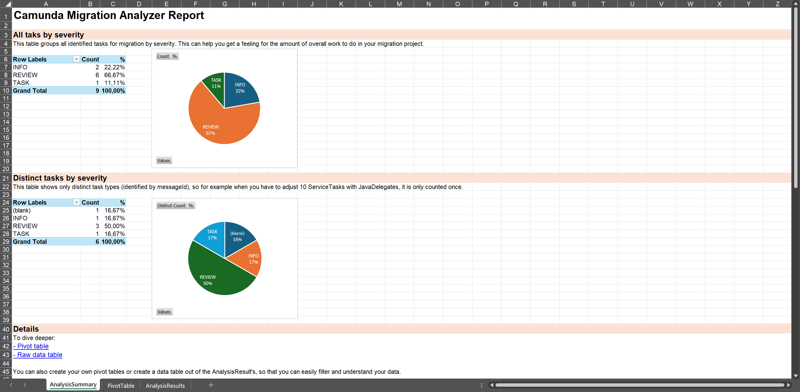
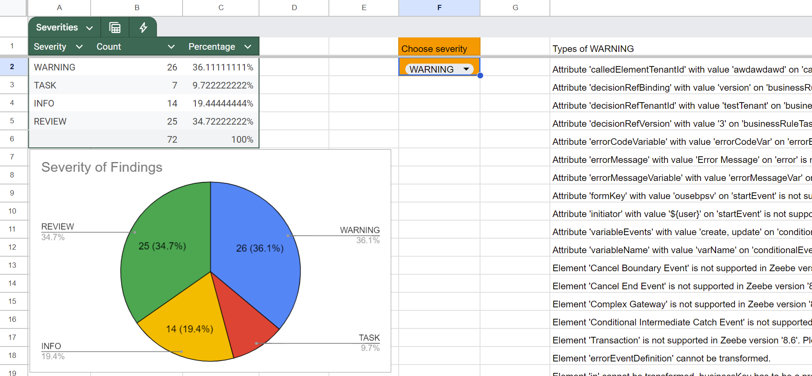

With **Diagram Converter**, you'll get an initial understanding of the migration tasks you'll need to perform when moving from Camunda 7 to Camunda 8. It analyzes Camunda 7 diagram files (BPMN or DMN) and generates a list of tasks required for the migration.

In a second step, it can also convert these files from the Camunda 7 format to the Camunda 8 format. For example, it updates namespaces and renames XML properties, if needed.

All BPMN elements supported by Camunda 8 can be transformed. For the full list see the [BPMN coverage page](../../../components/modeler/bpmn/bpmn-coverage.md).

You can use the Diagram Converter in the following ways:

- **Web Interface**: A wizard-like UI built with Java (Spring Boot) and React. Available versions:
  - Java JAR
  - Docker
  - Free, hosted SaaS
- **CLI**: A command-line interface implemented in Java.

The results are available as:

- **XLSX**: A Microsoft Excel file, including pre-built pivot tables for data exploration.
- **CSV**: A plain-text comma-separated file, compatible with any spreadsheet tool.

In the following sections, you'll learn how to:

- [Install the Diagram Converter](#install-the-diagram-converter)
- [Analyze your diagrams using the web interface](#analyze-your-diagrams-using-the-web-interface)
- [Use the CLI](#use-the-cli)
- [Convert your diagrams](#convert-your-diagrams)

## Install the Diagram Converter

### Hosted Diagram Converter

Use the hosted Diagram Converter at [https://diagram-converter.camunda.io/](https://diagram-converter.camunda.io/). This option requires no local setup and is suitable for quick evaluations or one-off migrations.

Your models are not stored on this platform, and all processing happens in-memory. Your data is transmitted securely over HTTPS.

### Local web application

#### Prerequisites

- Java 21 or later

#### Steps

1. Download the latest `camunda-7-to-8-diagram-converter-webapp-{version}.jar` from [GitHub Releases](https://github.com/camunda/camunda-7-to-8-migration-tooling/releases).
2. Run the application:

   ```shell
   java -jar camunda-7-to-8-diagram-converter-webapp-{version}.jar
   ```

3. Access the web application at [http://localhost:8080/](http://localhost:8080/).

To run the application on a different port, for example `8090`:

```shell
java -Dserver.port=8090 -jar camunda-7-to-8-diagram-converter-webapp-{version}.jar
```

### CLI installation

#### Prerequisites

- Java 21 or later

#### Steps

1. Download the latest `camunda-7-to-8-diagram-converter-cli-{version}.jar` from [GitHub Releases](https://github.com/camunda/camunda-7-to-8-migration-tooling/releases).
2. Verify the installation:

   ```shell
   java -jar camunda-7-to-8-diagram-converter-cli-{version}.jar --help
   ```

## Analyze your diagrams using the web interface

Open the Diagram Converter:

- For a local installation, open [http://localhost:8080/](http://localhost:8080/).
- For the hosted SaaS version, open [https://diagram-converter.camunda.io/](https://diagram-converter.camunda.io/).

Upload one or more diagrams:


Click **Analyze and convert**:


On this screen you can:

- Download the analyzer results as a Microsoft Excel file (XLSX)
- Download the analyzer results as a CSV file
- Download the converted diagrams (individually or as ZIP)

Analysis results contain a list of items where each row represents an action item required for migrating your solution to Camunda 8. These items are grouped by severity:

- **INFO**: No action needed. Diagram conversion can successfully map attributes to the Camunda 8 implementation.
- **REVIEW**: The conversion will modify some expressions or attributes. Please verify that the intended functionality remains unchanged.
- **WARNING**: A Camunda 7 concept can not be directly mapped to a Camunda 8 equivalent. Consider reviewing the Camunda 8 roadmap or exploring possible workarounds.
- **TASK**: Manual changes are required to make the diagram work in Camunda 8.

This allows you to focus on the most important findings. Tasks can also be grouped by type. For example, changing a `JavaDelegate` to a `JobWorker` might appear 100 times in your codebase, but still represents just one recurring pattern.

Pivot tables can help you identify tasks that appear multiple times across different files, providing a comprehensive overview of migration efforts.

Next, you'll learn how to use those results.

### Analyze results in Microsoft Excel



The XLSX file includes three tabs:

- **AnalysisSummary**: Pivot tables and charts that summarize typical migration tasks.
- **PivotTable**: A large pivot table for dynamic data exploration.
- **AnalysisResults**: The raw data from the analysis, which you can copy, import, or process further.

You can open the file using Microsoft Excel (desktop or Office 365).

### Analyze results in Google Sheets or LibreOffice

You can also open the XLSX file in Google Sheets, LibreOffice, OpenOffice, or similar tools. The raw data will be imported correctly, but pivot tables won't be preserved.

Alternatively, download the results as a CSV file, and import them directly into your preferred tool.

In this case, either:

- Create your own pivot table in the tool.
- Copy the contents of the **AnalysisResults** tab into your own spreadsheet.

For Google Sheets, consider using this [Google Spreadsheet template](https://docs.google.com/spreadsheets/d/1ZUxGhj1twgTnXadbopw1CvZg_ZvDnB2VXRQDSrKtmcM/edit?gid=6013418#gid=6013418) created by Camunda consultants.



## Use the CLI

If you prefer the command line, use the CLI for batch processing or automation.

The CLI supports two modes:

- **local**: Analyze and convert diagrams from your file system
- **engine**: Analyze and convert diagrams directly from a running Camunda 7 process engine

### Local mode

```shell
java -jar camunda-7-to-8-diagram-converter-cli-{version}.jar local myDiagram.bpmn --xlsx
```

To process all diagrams in a directory (including subdirectories):

```shell
java -jar camunda-7-to-8-diagram-converter-cli-{version}.jar local ./my-processes/
```

Key options for `local` mode:

| Option               | Description                                                   |
| -------------------- | ------------------------------------------------------------- |
| `--platform-version` | Semantic version of the target platform (defaults to latest)  |
| `--csv`              | Create a CSV file with analysis results                       |
| `--xlsx`             | Create an XLSX file with analysis results                     |
| `--prefix`           | Prefix for the generated file name (default: `converted-c8-`) |
| `-o, --override`     | Override existing files                                       |

To see all available options:

```shell
java -jar camunda-7-to-8-diagram-converter-cli-{version}.jar local --help
```

### Engine mode

Use engine mode to process diagrams directly from a running Camunda 7 engine via its REST API:

```shell
java -jar camunda-7-to-8-diagram-converter-cli-{version}.jar engine http://localhost:8080/engine-rest
```

Key options for `engine` mode:

| Option                   | Description                                                    |
| ------------------------ | -------------------------------------------------------------- |
| `--platform-version`     | Semantic version of the target platform (defaults to latest)   |
| `-u, --username`         | Username for basic auth                                        |
| `-p, --password`         | Password for basic auth                                        |
| `-t, --target-directory` | Directory to save the .bpmn files (default: current directory) |
| `--csv`                  | Create a CSV file with analysis results                        |
| `--xlsx`                 | Create an XLSX file with analysis results                      |

To see all available options:

```shell
java -jar camunda-7-to-8-diagram-converter-cli-{version}.jar engine --help
```

## Convert your diagrams

As mentioned, the Diagram Converter can also convert BPMN and DMN diagrams for use with Camunda 8.

This includes:

- Updating namespaces
- Adjusting XML structure and properties
- Transforming expressions

Converted files can be downloaded via the web interface or generated via the CLI.

## Extend the conversion logic

You can extend the conversion logic by implementing custom visitors and conversions using the Java Service Provider Interface (SPI). This lets you:

- Add custom conversion rules for proprietary extensions
- Modify how specific BPMN elements are transformed
- Add custom analysis messages

For implementation details and examples, see the [extension example on GitHub](https://github.com/camunda/camunda-7-to-8-migration-tooling/tree/main/diagram-converter/extension-example).

## Convert expressions

JUEL expressions used in Camunda 7 aren't supported in Camunda 8. The Diagram Converter tries to [convert simple expressions, automatically](https://github.com/camunda/camunda-7-to-8-migration-tooling/blob/8a9a37/diagram-converter/core/src/main/java/io/camunda/migration/diagram/converter/expression/ExpressionTransformer.java). For an overview of what’s supported, see the [ExpressionTransformer test case](https://github.com/camunda/camunda-7-to-8-migration-tooling/blob/8a9a37/diagram-converter/core/src/test/java/io/camunda/migration/diagram/converter/ExpressionTransformerTest.java).

You may have to manually rewrite more complex expressions. The [FEEL Copilot](https://feel-copilot.camunda.com/) can help with this.

You can also customize or extend the transformer logic as needed.
