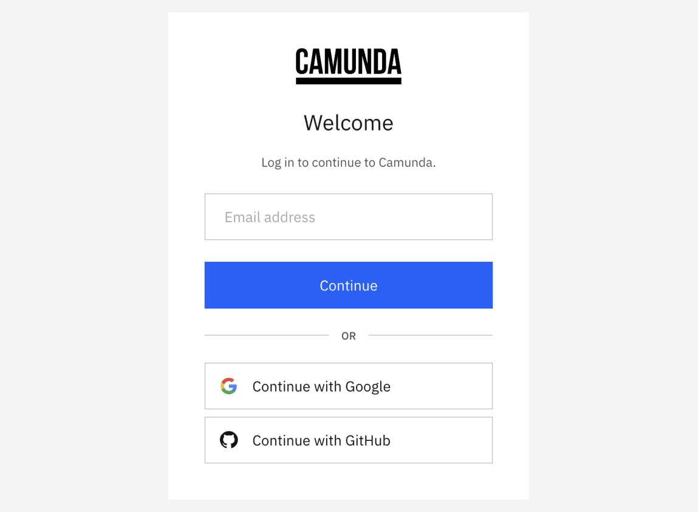
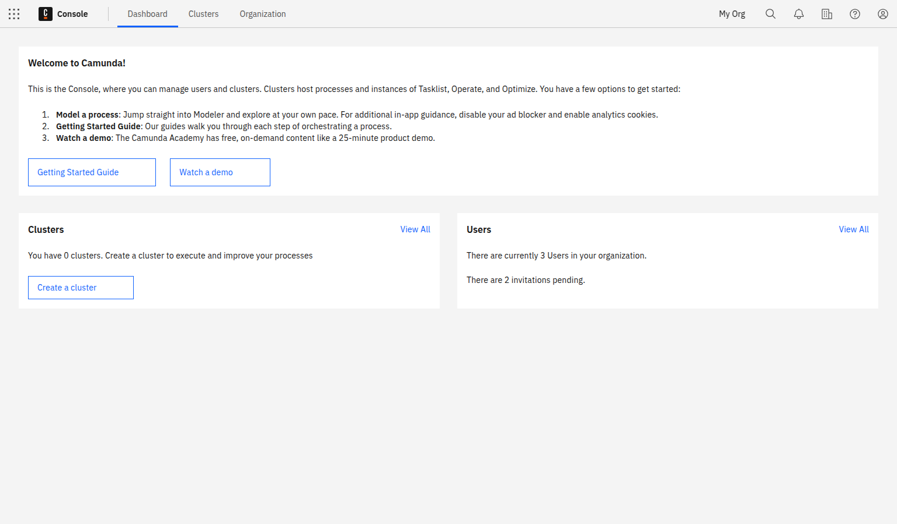

---
---

## Sign Up

Visit [signup.camunda.com/accounts](https://signup.camunda.com/accounts?utm_source=docs.camunda.io&utm_medium=referral) to sign up.

### Create an account

Fill out the form and click **Create account**.

When you fill out the form, you'll receive a confirmation email. Click on the link to verify your email address.

## Log in to your Camunda 8 account

Log in with the email address and password you used in the previous form, or use the social login buttons. To access the login site directly, navigate to [camunda.io](https://weblogin.cloud.camunda.io/).

After login, select the square-shaped **Camunda components** icon in the upper-left corner, and select **Console** to view the Console overview page. This is the central place to manage the clusters, diagrams, and forms you want to deploy to Camunda 8.

