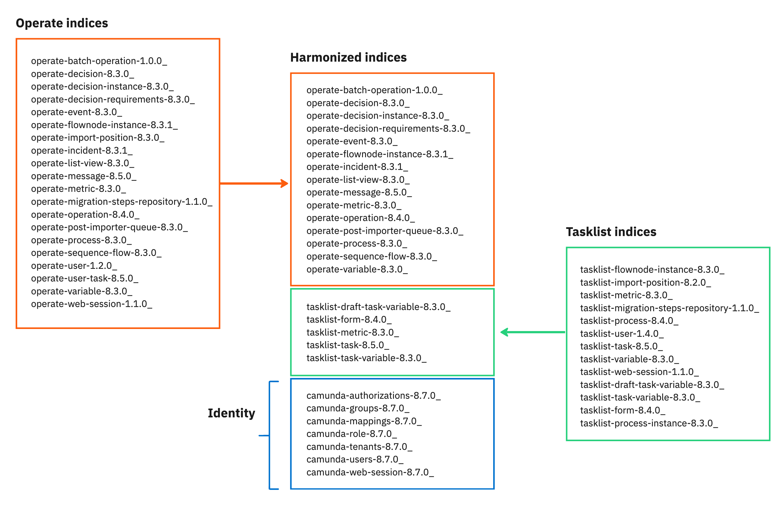

import DeployDiagramImg from '../../img/deploy-diagram-modal.png';

Supported environment changes and breaking changes or deprecations for the Camunda 8.8 release.

| Minor release date | Scheduled end of maintenance | Release notes                                                                        | Release blog | Upgrade guides                                                                                 |
| ------------------ | ---------------------------- | ------------------------------------------------------------------------------------ | ------------ | ---------------------------------------------------------------------------------------------- |
| 14 October 2025    | 13 April 2027                | [8.8 release notes](/reference/announcements-release-notes/880/880-release-notes.md) | -            | [Upgrade guides](/reference/announcements-release-notes/880/whats-new-in-88.md#upgrade-guides) |

:::info 8.8 resources

- See [release notes](/reference/announcements-release-notes/880/880-release-notes.md) to learn more about new features and enhancements.
- See [What's new in Camunda 8.8](/reference/announcements-release-notes/880/whats-new-in-88.md) for important changes to consider when planning your upgrade from Camunda 8.7.
- Refer to the [quality board](https://github.com/orgs/camunda/projects/187/views/15) for an overview of known bugs by component and severity.

:::

## Supported environment changes

<div className="release-announcement-row">
<div className="release-announcement-badge">
<span className="badge badge--change">Change</span>
</div>
<div className="release-announcement-content">
  
#### Elasticsearch and OpenSearch minimal supported versions
Elasticsearch 8.16+ and OpenSearch 2.17+ are now supported as minimal versions to ensure you can benefit from the latest, most stable database releases. Older versions are no longer supported.

</div>
</div>

<div className="release-announcement-row">
<div className="release-announcement-badge">
<span className="badge badge--change">Change</span>
</div>
<div className="release-announcement-content">
  
#### PostgreSQL, Oracle and Microsoft SQL Server supported versions
Management Identity now supports PostgreSQL and Amazon Aurora PostgreSQL versions 16.x and 17.x.

Web Modeler now supports PostgreSQL version 18.x, Amazon Aurora PostgreSQL version 17.x, Oracle versions 19c and 23ai and Microsoft SQL Server versions 2019 and 2022.

</div>
</div>

<div className="release-announcement-row">
<div className="release-announcement-badge">
<span className="badge badge--change">Change</span>
</div>
<div className="release-announcement-content">
  
#### Zeebe, Operate, Tasklist, and Identity must run on same minor and patch levels
From version `8.8.0` onwards, the Zeebe, Operate, Tasklist, and Identity [Orchestration Cluster](/self-managed/reference-architecture/reference-architecture.md#orchestration-cluster) components must run on the exact same `minor`and `patch` level to ensure compatibility.

:::info
See the [component version matrix](/reference/supported-environments.md#component-version-matrix) or the [Self-Managed reference architecture](/self-managed/reference-architecture/reference-architecture.md#orchestration-cluster) for a component overview.
:::

</div>
</div>

## Key changes

### APIs & tools

<div className="release-announcement-row">
<div className="release-announcement-badge">
<span className="badge badge--breaking-change">Removed</span>
</div>
<div className="release-announcement-content">
  
#### Removed: Tasklist GraphQL API

With the Camunda 8.8 release, the deprecated Tasklist GraphQL API is removed.

</div>
</div>

<div className="release-announcement-row">
<div className="release-announcement-badge">
<span className="badge badge--breaking-change">Removed</span>
</div>
<div className="release-announcement-content">
  
#### Removed: Deprecated OpenAPI objects

With the Camunda 8.8 release, deprecated API objects containing number keys are removed, including the
corresponding `application/vnd.camunda.api.keys.number+json` content type header.

- In previous releases, entity keys were transitioned from `integer (int64)` to `string` types, with deprecated `integer (int64)` keys still supported. Support for `integer (int64)` keys is removed in Camunda 8.8.

- To update to Camunda 8.8, API objects using `integer (int64)` keys must be updated to use `string` keys and the
  `application/json` header.

:::info
To learn more about the key attribute type change, see [8.7 API key attributes overview](/versioned_docs/version-8.7/apis-tools/camunda-api-rest/camunda-api-rest-overview.md#api-key-attributes).
:::

</div>
</div>

<div className="release-announcement-row">
<div className="release-announcement-badge">
<span className="badge badge--breaking-change">Removed</span>
</div>
<div className="release-announcement-content">
  
#### Removed: Optimize Index Rollover

Prior to the Camunda 8.8 release, Optimize used the following configuration properties to apply index rollover to its External Variable Indices:

- `externalVariable.variableIndexRollover.maxIndexSizeGB`
- `externalVariable.variableIndexRollover.scheduleIntervalInMinutes`

These properties are deleted in Camunda 8.8, with External Variables now stored in a single index.

</div>
</div>

<div className="release-announcement-row">
<div className="release-announcement-badge">
<span className="badge badge--deprecated">Deprecated</span>
</div>
<div className="release-announcement-content">
  
#### Deprecated: Web Modeler API milestone endpoints

With the Camunda 8.8 release, the [Web Modeler API](/apis-tools/web-modeler-api/index.md) endpoints under `/api/v1/milestones` are deprecated and scheduled for removal in 8.9. You can use the corresponding endpoints under `/api/v1/versions` instead.

</div>
</div>

<div className="release-announcement-row">
<div className="release-announcement-badge">
<span className="badge badge--deprecated">Deprecated</span>
</div>
<div className="release-announcement-content">
  
#### Deprecated: Operate and Tasklist v1 REST APIs

With the Camunda 8.8 release, the deprecation process for the [Operate](/apis-tools/operate-api/overview.md) and [Tasklist](/apis-tools/tasklist-api-rest/tasklist-api-rest-overview.md) REST APIs begins.

You can begin migrating to the [Orchestration Cluster REST API](/apis-tools/orchestration-cluster-api-rest/orchestration-cluster-api-rest-overview.md) for querying to prepare for this change.

| Version      | Description                                                                              |
| :----------- | :--------------------------------------------------------------------------------------- |
| Camunda 8.8  | These APIs remain available and functional.                                              |
| Camunda 8.9  | These APIs remain available but deprecated, and not recommended for new implementations. |
| Camunda 8.10 | These APIs are removed.                                                                  |

:::warning Impact on user task access restrictions
[User task access restrictions](/components/tasklist/user-task-access-restrictions.md) are only supported with the Tasklist v1 API. After switching to the v2 API with Tasklist, user task access restrictions do not apply.
:::

:::info
To learn more about the differences between Tasklist v1 and v2 UI modes, see [Tasklist API versions](/components/tasklist/api-versions.md).
:::

</div>
</div>

<div className="release-announcement-row">
<div className="release-announcement-badge">
<span className="badge badge--deprecated">Deprecated</span>
</div>
<div className="release-announcement-content">
  
#### Deprecated: Job-based user tasks querying

With the Camunda 8.8 release, the deprecation process for job-based user tasks begins.

- As job-based user tasks are not supported for querying/task management with Camunda 8.10, Camunda recommends using **Camunda user task** type (formerly **Zeebe user task**) in your process definitions.
- You might still see Zeebe user task references in your XML, but this is the same thing as a Camunda user task.

| Version      | Description                                                                                                                                                                                                                                                                                                                                                                                                                                    |
| :----------- | :--------------------------------------------------------------------------------------------------------------------------------------------------------------------------------------------------------------------------------------------------------------------------------------------------------------------------------------------------------------------------------------------------------------------------------------------- |
| Camunda 8.9  | Job-based user tasks are available for querying, but Modeler automatically applies the Camunda user task and shows a warning message for each job-based user task.                                                                                                                                                                                                                                                                             |
| Camunda 8.10 | With the removal of the Tasklist REST API, job-based user tasks are no longer supported for querying and task management. <ul><li><p>With Camunda 8.9+, customers can still use job-based user tasks as standard jobs with headers to enable open architecture and composable solutions.</p></li><li><p>For customers who require task lifecycle support and task querying, Camunda recommends using the Camunda User Task type.</p></li></ul> |

</div>
</div>

<div className="release-announcement-row">
<div className="release-announcement-badge">
<span className="badge badge--deprecated">Deprecated</span>
</div>
<div className="release-announcement-content">
  
#### Deprecated: Zeebe Client job worker metrics

With the Camunda 8.8 release, the deprecation of Zeebe client job worker metrics is announced.

These metrics are scheduled for removal in the Camunda 8.10 release.

:::info
To learn more, see [Zeebe client job worker](/apis-tools/java-client/job-worker.md) and [Zeebe client job worker concept](/components/concepts/job-workers.md).
:::

</div>
</div>

<div className="release-announcement-row">
<div className="release-announcement-badge">
<span className="badge badge--deprecated">Deprecated</span>
</div>
<div className="release-announcement-content">
  
#### Deprecated: File type `connector_template` in Web Modeler API

With the Camunda 8.8 release, the `connector_template` file type in the [Web Modeler API](/apis-tools/web-modeler-api/index.md) endpoint for file creation (`POST /api/v1/files`) is deprecated.

This file type will be removed in the Camunda 8.10 release.

You should use `element_template` instead, which provides equivalent functionality.

</div>
</div>

<div className="release-announcement-row">
<div className="release-announcement-badge">
<span className="badge badge--deprecated">Deprecated</span>
</div>
<div className="release-announcement-content">
  
#### Deprecated: Zeebe Process Test

With the Camunda 8.8 release, the deprecation of [Zeebe Process Test](../../../apis-tools/testing/zeebe-process-test.md) is announced.

- Zeebe Process Test is superseded by [Camunda Process Test](../../../apis-tools/testing/getting-started.md).
- Zeebe Process Test is scheduled for removal in the Camunda 8.10 release.

:::info
To learn more, see [migrate to Camunda Process Test](../../../apis-tools/migration-manuals/migrate-to-camunda-process-test.md) and [Introducing Camunda Process Test - The Next Generation Testing Library](https://camunda.com/blog/2025/04/camunda-process-test-the-next-generation-testing-library/).
:::

</div>
</div>

<div className="release-announcement-row">
<div className="release-announcement-badge">
<span className="badge badge--deprecated">Deprecated</span>
</div>
<div className="release-announcement-content">
  
#### Deprecated: Operate & Tasklist usage metrics endpoints

With the Camunda 8.8 release, the deprecation of usage metrics endpoints in Operate and Tasklist is announced.

- [Deprecated Operate endpoints](/self-managed/components/orchestration-cluster/core-settings/concepts/usage-metrics.md)
- [Deprecated Tasklist endpoint](/self-managed/components/orchestration-cluster/core-settings/concepts/usage-metrics.md).

:::warning Breaking change
The Assignees list is removed from the response.
:::

- These endpoints are superseded by [usage metrics endpoint](../../../apis-tools/orchestration-cluster-api-rest/specifications/get-usage-metrics.api.mdx).
- The Operate and Tasklist usage metrics endpoints are scheduled for removal in the 8.10 release.

</div>
</div>

<div className="release-announcement-row">
<div className="release-announcement-badge">
<span className="badge badge--deprecated">Deprecated</span>
</div>
<div className="release-announcement-content">

#### Deprecated: start public process via form in Tasklist

With the Camunda 8.8 release, the deprecation of the [start public process via form](/components/tasklist/userguide/starting-processes.md#start-public-processes-via-form) feature is announced.

- This SaaS feature is deprecated and does not work with [Tasklist running in V2 mode](/components/tasklist/api-versions.md). This feature will be removed in the 8.10 release.
- To continue using this feature with Camunda 8.8, you must run [Tasklist in V1 mode](/components/tasklist/api-versions.md).

</div>
</div>

<div className="release-announcement-row">
<div className="release-announcement-badge">
<span className="badge badge--change">Change</span>
</div>
<div className="release-announcement-content">
   
#### Public API definition for greater platform stability

To enhance predictability and offer a more stable experience for developers, Camunda introduced the official [public API definition for Camunda 8](/reference/public-api.md).

- This document explicitly identifies the components and interfaces that are covered by our semantic versioning guarantees.

- By formally defining the public API, Camunda commits to avoiding breaking changes in minor and patch releases for these areas. This empowers you to build on Camunda 8 with greater confidence and reduced maintenance effort.

</div>
</div>

<div className="release-announcement-row">
<div className="release-announcement-badge">
<span className="badge badge--change">Change</span>
</div>
<div className="release-announcement-content">
  
#### Camunda Java client and Camunda Spring Boot Starter

With the Camunda 8.8 release, Camunda Java Client and Camunda Spring Boot Starter replace the Zeebe Java client and Spring Zeebe SDK. This allows you to use a single consolidated client to interact with Camunda orchestration clusters.

The `CamundaClient` replaces the `ZeebeClient`, offering the same functionality and adding new capabilities.

The Camunda Spring Boot Starter is based on Spring Boot 3.5, see [version compatibility matrix](/apis-tools/camunda-spring-boot-starter/getting-started.md#version-compatibility).

- The new `CamundaClient` uses REST as the default communication protocol, and explicitly uses the configuration option `preferRestOverGrpc=false` to switch to gRPC as the default protocol. (Note: job streaming is only supported via gRPC, but can be used alongside REST for other operations).

- If you need to continue using the old `ZeebeClient`, you can use the new version 8.8 `CamundaClient` artifact without issues, as it still contains the related `ZeebeClient` classes. Those classes are marked as deprecated, so you can easily identify code you need to adjust to the `CamundaClient`.

- The old `zeebe-client-java` artifact is now relocation-only, so your build system is redirected to the new `camunda-client-java` artifact. We will discontinue the old artifact in version 8.10 and recommend using the new one.

- The Zeebe Java client will not be developed further and will only receive bug fixes while version 8.7 is officially supported.

:::note

- The new Camunda Spring Boot Starter provides the `CamundaClient` when requested.
- The `CamundaClient` uses REST as the default communication protocol, while the deprecated `ZeebeClient` still prefers gRPC.
- If you want to continue using gRPC by default with the `CamundaClient`, you must explicitly set `camunda.client.prefer-rest-over-grpc: false` in your Spring configuration.

:::
:::info
To learn more about migrating to the Camunda Java client, see the [migration guide](/apis-tools/migration-manuals/migrate-to-camunda-java-client.md).
:::

</div>
</div>

### Connectors

<div className="release-announcement-row">
<div className="release-announcement-badge">
<span className="badge badge--change">Change</span>
</div>
<div className="release-announcement-content">
  
#### Connector SDK: Core SDK restructuring

The internal structure of the Connector SDK has been updated to make the Core SDK more lightweight, with **no dependency on the Camunda client**.

Some classes and interfaces have been relocated, which means external connectors may need to be **recompiled** before they can be used with Connector runtime 8.8.

This affects the following classes and interfaces previously located in the `io.camunda.document` package:

```
DocumentFactory
Document
DocumentLinkParameters
```

These classes and interfaces are now located in the `io.camunda.connector.api.document` package.

Additionally, the following classes and interfaces from the official Camunda Java client (`io.camunda.client.api.response`) have been **replicated** in the Connector SDK and are now located in the `io.camunda.connector.api.document` package:

```
DocumentMetadata
DocumentReference
```

</div>
</div>

<div className="release-announcement-row">
<div className="release-announcement-badge">
<span className="badge badge--change">Change</span>
</div>
<div className="release-announcement-content">
  
#### Connector SDK: Changes to activity logging in inbound connectors

The Connector SDK 8.8 introduces a new way to [log activities](/components/console/manage-clusters/manage-connectors.md#activity-log) in inbound connectors.

Objects of the `InboundConnectorContext` class now provide a new overloaded method:

```java
void log(Consumer<ActivityBuilder> activityBuilderConsumer)
```

This method works with the new `ActivityBuilder` interface.

**Usage example:**

```json
connector.context()
    .log(
        activity ->
            activity
            .withSeverity(Severity.INFO)
            .withTag("Consumer")
            .withMessage("Successfully processed message")
            .andReportHealth(Health.up()));
```

The old builder pattern (`Activity.newBuilder()`) is deprecated and will be removed in upcoming releases.

The new `ActivityBuilder` interface provides a more flexible and fluent API for logging activities in inbound connectors.

</div>
</div>

<div className="release-announcement-row">
<div className="release-announcement-badge">
<span className="badge badge--change">Change</span>
</div>
<div className="release-announcement-content">
  
#### Harmonized Error Contexts for jobError and bpmnError in Connectors

With the Camunda 8.8 release, Camunda has harmonized the error context structures returned by the `jobError` and `bpmnError` functions in connectors to align with the corresponding error handling in Camunda core.

This ensures that connector errors now follow the same conventions and structure as errors handled by the core engine, supporting greater consistency across process modeling and execution.

Updated context structure:

- `bpmnError` now returns an entry containing: `errorType`, `errorCode` `errorMessage` `variables`
- `jobError` now returns an entry containing : `errorType`, `errorMessage`, `variables`, `retries`, `retryBackoff`

Developers and integrators should review any custom connector logic to take full advantage of the new fields and adapt error handling as necessary.

:::note
These changes do not introduce new fields or richer context, but instead ensure that error data is structured and surfaced consistently between connectors and Camunda core. This makes error handling more predictable, especially for teams working across both domains.
:::

</div>
</div>

### Data

<div className="release-announcement-row">
<div className="release-announcement-badge">
<span className="badge badge--breaking-change">Breaking change</span>
</div>
<div className="release-announcement-content">
  
#### Elasticsearch and OpenSearch: Single instance

With the Camunda 8.8 release, the use of more than one isolated Elasticsearch/OpenSearch instance for exported Zeebe, Operate, and Tasklist data is no longer supported.

- If your environment uses multiple Elasticsearch/OpenSearch instances, you must manually migrate the data from each to a single Elasticsearch/OpenSearch cluster before updating to Camunda 8.8.
- The migration should target Zeebe, Operate, and Tasklist indices, index templates, aliases, and ILM policies.

</div>
</div>

<div className="release-announcement-row">
<div className="release-announcement-badge">
<span className="badge badge--change">Change</span>
</div>
<div className="release-announcement-content">

#### Elasticsearch and OpenSearch: Replica default increased to 1

With the Camunda 8.8 release, the default replica count for Camunda indices in Elasticsearch and OpenSearch changes from 0 to 1. This ensures that if an Elasticsearch node goes down, Camunda is not blocked by a temporary outage of the secondary data store.

This change increases storage requirements as follows:

- **Single-node clusters:** Running with one node turns the cluster state yellow (replicas unassigned). Run at least two master-eligible nodes.
- **Multi-node clusters:** Increase disk capacity to at least 2.5× the previously used disk capacity (accounts for watermarks, overhead, and growth).

To revert to 0 replicas, set:

- YAML: `camunda.database.index.numberOfReplicas: 0`
- Environment variable: `CAMUNDA_DATABASE_INDEX_NUMBER_OF_REPLICAS=0`

:::info
To learn more, see [Elasticsearch changes in Components update 8.7 to 8.8](/self-managed/components/components-upgrade/870-to-880.md#elasticsearch).
:::

</div>
</div>

<div className="release-announcement-row">
<div className="release-announcement-badge">
<span className="badge badge--change">Change</span>
</div>
<div className="release-announcement-content">

#### Camunda Exporter

Previously, Camunda web applications used importers and archivers to consume, aggregate, and archive historical data provided by the Elasticsearch (ES) or OpenSearch (OS) exporters.


With the Camunda 8.8 release, a new Camunda Exporter is introduced:

- Importing and archiving logic of web components (Tasklist and Operate) is brought closer to the distributed platform (Zeebe).
- Benefits include simplified installation, scalability enabled for the web applications, reduced latency when showing runtime and historical data, and reduced data duplication (resource consumption).


The new Camunda Exporter helps Camunda achieve a more streamlined architecture, better performance, and improved stability (especially concerning ES/OS).

:::info
To learn more, see the blog post [One Exporter to Rule Them All: Exploring Camunda Exporter](https://camunda.com/blog/2025/02/one-exporter-to-rule-them-all-exploring-camunda-exporter/).
:::

#### Harmonized index schema

The existing data schema in the secondary storage has been harmonized, to be used by all Camunda components.

- This removes unnecessary duplications over multiple indices due to the previous architecture.
- With this change, several Operate indices can and will be used by Tasklist.
- New indices have been created to integrate Identity into the system.



</div>
</div>

### Deployment

<div className="release-announcement-row">
<div className="release-announcement-badge">
<span className="badge badge--breaking-change">Removed</span>
</div>
<div className="release-announcement-content">
  
#### Helm chart: Separated Ingress deprecation

The separated Ingress Helm configuration for Camunda 8 Self-Managed was deprecated in Camunda 8.6 and is removed from the Helm chart in Camunda 8.8.

Only the combined Ingress configuration is officially supported. See the [Ingress guide](/self-managed/deployment/helm/configure/ingress/ingress-setup.md) for more information on configuring a combined Ingress setup.

- If you are using the recommended Camunda 8 deployment option ([Helm charts](/self-managed/deployment/helm/install/quick-install.md)), the upgrade path from version 8.7 to 8.8 will be straightforward by changing the values file to the new syntax.
- New migration guides are also provided to support you when migrating from a previous Camunda version.

:::caution
Additional upgrade considerations are necessary for deployments that use custom scripts, such as Docker containers, manual installations, or custom-developed Kubernetes deployments. For these deployments, customers can either continue to deploy with their original 8.7 topology and upgrade each component independently, or adopt our Helm chart approach for the upgrade, which allows for unifying the deployment into a single JAR or container executable.
:::

</div>
</div>

<div className="release-announcement-row">
<div className="release-announcement-badge">
<span className="badge badge--breaking-change">Breaking change</span>
</div>
<div className="release-announcement-content">
  
#### Orchestration Cluster: Unified component configuration

With the Camunda 8.8 release, the new unified configuration is introduced.

- Camunda 8.8 introduces a unified configuration with a shared YAML schema across Orchestration cluster components. This allows you to define all essential cluster and component behavior in a single, centralized configuration system.

- In Camunda 8.7 and earlier, managing and configuring core components (Zeebe, Operate, Tasklist, Identity) was done separately.

This means some configuration properties have changed or are replaced with new properties.

:::note
Only a partial set of unified configuration properties are introduced in Camunda 8.8, with remaining properties planned for delivery with Camunda 8.9.
:::

</div>
</div>

<div className="release-announcement-row">
<div className="release-announcement-badge">
<span className="badge badge--deprecated">Deprecated</span>
</div>
<div className="release-announcement-content">

#### Orchestration Cluster: Docker image unification

With the Camunda 8.8 release, the [Orchestration Cluster](/self-managed/components/orchestration-cluster/overview.md) is provided as a [unified Docker image](https://hub.docker.com/r/camunda/camunda): `camunda/camunda`.

As a result, the following Docker images are deprecated as of Camunda 8.8:

- [camunda/zeebe](https://hub.docker.com/r/camunda/zeebe)
- [camunda/operate](https://hub.docker.com/r/camunda/operate)
- [camunda/tasklist](https://hub.docker.com/r/camunda/tasklist)

</div>
</div>

<div className="release-announcement-row">
<div className="release-announcement-badge">
<span className="badge badge--deprecated">Deprecated</span>
</div>
<div className="release-announcement-content">
  
#### Helm chart: Secret management improvements and deprecations

With the Camunda 8.8 release, a consistent secret pattern for Helm charts is introduced. The legacy secret configuration is deprecated and will be removed with 8.9, but remains functional during the transition period.

:::info
See the [secret management guide](/self-managed/deployment/helm/configure/secret-management.md) for migration instructions and examples.
:::

</div>
</div>

<div className="release-announcement-row">
<div className="release-announcement-badge">
<span className="badge badge--change">Change</span>
</div>
<div className="release-announcement-content">
  
#### Helm chart: External database for Web Modeler REST API

With the Camunda 8.8 release, the configuration for the external database used by the Web Modeler REST API is updated to align with the Identity component's database configuration.

- A new value, `webModeler.restapi.externalDatabase`, is now available and mirrors the structure of `identity.externalDatabase`.
- To ensure backward compatibility, the existing `webModeler.restapi.externalDatabase.url` field is retained and will take precedence if set.

</div>
</div>

<div className="release-announcement-row">
<div className="release-announcement-badge">
<span className="badge badge--change">Change</span>
</div>
<div className="release-announcement-content">
  
#### Helm chart: Default username claim in Web Modeler

With the Camunda 8.8 release, the default ID token claim that Web Modeler uses to assign usernames has changed from `name` to `preferred_username`.

- This change aligns the configuration with other Camunda 8 components for consistency across the platform.
- To continue using the `name` claim, explicitly set `CAMUNDA_IDENTITY_USERNAMECLAIM=name` as an environment variable for the Web Modeler `webapp`. See [Identity / Keycloak configuration](/self-managed/components/modeler/web-modeler/configuration/configuration.md#identity--keycloak-1).

</div>
</div>

<div className="release-announcement-row">
<div className="release-announcement-badge">
<span className="badge badge--change">Change</span>
</div>
<div className="release-announcement-content">

#### Helm chart: Bitnami Docker repository migration

With the Camunda 8.8 release, the Camunda Helm charts are updated to use the new Bitnami Docker repository.

:::info
See [Bitnami Docker repository migration](/self-managed/deployment/helm/upgrade/index.md#bitnami-docker-repository-migration) for migration details.
:::

</div>
</div>

<div className="release-announcement-row">
<div className="release-announcement-badge">
<span className="badge badge--change">Change</span>
</div>
<div className="release-announcement-content">
  
#### Bitnami: Alternative container images

<!-- https://github.com/camunda/product-hub/issues/2826 -->

With the Camunda 8.8 release, alternative container images to the previously used Bitnami open source images are added. This improves security, reliability, and support for Camunda 8 Self-Managed deployments.

- These images are hosted by Camunda on `registry.camunda.cloud`.

- Beginning with Camunda 8.8, these images are considered the default supported option when deploying Camunda 8 via Helm charts, as they ensure faster delivery of security patches (including CVE fixes) and better alignment with supported environments.

- To adopt these images, update your Helm deployment to reference the `values-images-ee.yml` file.

:::info
Full setup instructions are available in the [installation guide](/self-managed/deployment/helm/install/quick-install.md).
:::

</div>
</div>

### Identity

<div className="release-announcement-row">
<div className="release-announcement-badge">
<span className="badge badge--breaking-change">Removed</span>
</div>
<div className="release-announcement-content">

#### Tenant-providing interceptors

With the 8.8 release, Camunda announces the removal of tenant-providing interceptors.

It is superseded by built-in [tenant management](/components/identity/tenant.md).

</div>
</div>

<div className="release-announcement-row">
<div className="release-announcement-badge">
<span className="badge badge--breaking-change">Removed</span>
</div>
<div className="release-announcement-content">

#### User storage in Elasticsearch/OpenSearch for Operate or Tasklist

With the Camunda 8.8 release, user storage in Elasticsearch/OpenSearch for Operate or Tasklist is no longer supported.

You must transition to using [Basic authentication](/self-managed/concepts/authentication/authentication-to-orchestration-cluster.md#basic-authentication) and recreate users in Orchestration Cluster Identity.

</div>
</div>

<div className="release-announcement-row">
<div className="release-announcement-badge">
<span className="badge badge--breaking-change">Removed</span>
</div>
<div className="release-announcement-content">

#### LDAP authentication for Operate or Tasklist

With the Camunda 8.8 release, LDAP authentication for Operate or Tasklist is no longer supported.

You must transition to use [OIDC or Basic Authentication](/self-managed/concepts/authentication/authentication-to-orchestration-cluster.md).

</div>
</div>

### Marketplace

<div className="release-announcement-row">
<div className="release-announcement-badge">
<span className="badge badge--deprecated">Deprecated</span>
</div>
<div className="release-announcement-content">
  
#### AWS Marketplace offering for Self-Managed

As of October 2025, the Self-Managed AWS Marketplace offering is deprecated and no longer publicly available.  
Existing customers can continue to use the product until their contracts expire.

For future use, refer to the [new AWS Marketplace listing](https://aws.amazon.com/marketplace/pp/prodview-6y664fcnydiqg?sr=0-1&ref_=beagle&applicationId=AWSMPContessa) for more information.

</div>
</div>

### Modeler

<div className="release-announcement-row">
<div className="release-announcement-badge">
<span className="badge badge--breaking-change">Removed</span>
</div>
<div className="release-announcement-content">

#### Removed: Cluster authentication `OAUTH` and `CLIENT_CREDENTIALS` in Web Modeler Self-Managed

With the Camunda 8.8 release, the deprecated authentication methods `OAUTH` and `CLIENT_CREDENTIALS` for configured [clusters in Web Modeler Self-Managed](/self-managed/components/modeler/web-modeler/configuration/configuration.md#clusters) are no longer supported.

For more information on how to migrate, see the [upgrade guide](/self-managed/components/components-upgrade/870-to-880.md#cluster-configuration).

</div>
</div>

<div className="release-announcement-row">
<div className="release-announcement-badge">
<span className="badge badge--breaking-change">Breaking change</span>
</div>
<div className="release-announcement-content">

#### Cluster configuration in Web Modeler Self-Managed

The available configuration options for [clusters in Web Modeler Self-Managed](/self-managed/components/modeler/web-modeler/configuration/configuration.md#clusters) now depend on the version of the cluster.
For version 8.8 and above, [new configuration options](/self-managed/components/modeler/web-modeler/configuration/configuration.md#additional-configuration-for-cluster-versions--88) are required.

For more information on how to modify your existing configuration, see the [upgrade guide](/self-managed/components/components-upgrade/870-to-880.md#changed-configuration-options).

</div>
</div>

<div className="release-announcement-row">
<div className="release-announcement-badge">
<span className="badge badge--deprecated">Deprecated</span>
</div>
<div className="release-announcement-content">
  
#### Play job-based user tasks

With the Camunda 8.8 release, user tasks with a job worker implementation are deprecated and no longer supported in Play from cluster versions 8.8 and above.

- [Deprecated Operate endpoints](/self-managed/components/orchestration-cluster/core-settings/concepts/usage-metrics.md)
- [Deprecated Tasklist endpoint](/self-managed/components/orchestration-cluster/core-settings/concepts/usage-metrics.md).

You should consider migrating to [Camunda user tasks](/components/modeler/bpmn/user-tasks/user-tasks.md#camunda-user-tasks).

</div>
</div>

### SaaS

<div className="release-announcement-row">
<div className="release-announcement-badge">
<span className="badge badge--breaking-change">Removed</span>
</div>
<div className="release-announcement-content">
  
#### Removed: Starter plan

The Camunda SaaS Starter plan is no longer available.

- Existing customers using a Starter plan must upgrade to the Enterprise plan or move to the Free plan.
- Compare plan features and contact us for advice and an Enterprise plan quote. See [Camunda 8 pricing](https://camunda.com/pricing/?utm_source=docs.camunda.io&utm_medium=referral).

</div>
</div>
