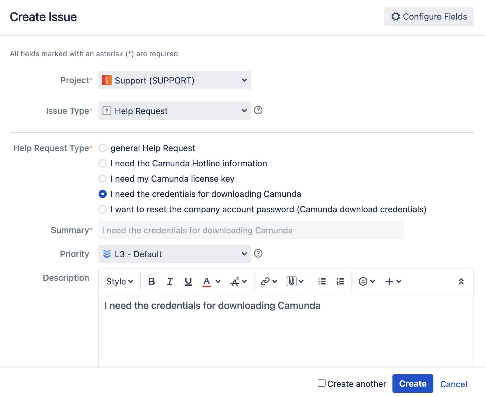

There are a few different channels you can reach us based on your needs:

- We encourage everyone to participate in our **community** via the [Camunda community forum](https://forum.camunda.io/), where you can exchange ideas with other Camunda users, as well as Camunda employees. For all other Camunda community programs and resources, visit our [Camunda Developer Hub](https://camunda.com/developers).

- We welcome your **bug** reports and **feature requests** through our community channels mentioned above.

- For **security-related issues**, review our [security notices](/reference/notices.md) for the most up-to-date information on known issues and steps to report a vulnerability so we can solve the problem as quickly as possible. Do not use GitHub for security-related issues.

- **Feedback and support** can be submitted or requested via JIRA by following our [Enterprise support process](https://camunda.com/services/enterprise-support-guide/). All users can also find feedback and support options in the Help Center or [Camunda community forum](https://forum.camunda.io/).

- For sales inquiries, information about Camunda 8 performance and benchmarking, or anything not listed above, use our [Contact Us](https://camunda.com/contact/) form.

## Locating Camunda 8 credentials

Need assistance locating your Camunda 8 credentials? You can obtain these credentials from Camunda by submitting a **Help Request**. To do this, take the following steps:

1. Log in to [Jira](https://jira.camunda.com/secure/Dashboard.jspa).
2. Click **Create** in the navigation bar at the top of the page. This launches a **Create Issue** pop-up.
3. In the **Issue Type** field, select **Help Request**.
4. In the **Help Request Type** field, click the option that reads **I need the credentials for downloading Camunda**.
5. In the **Summary** and **Description** fields, **I need the credentials for downloading Camunda** will populate by default.
   
6. (Optional) Add more details, such as the priority level or authorized support contacts.
7. Click **Create** at the bottom of the pop-up **Create Issue** box.

After completing these steps, your request is generated. Find additional details on submitting a self-service help request [here](https://camunda.com/services/enterprise-support-guide/).
