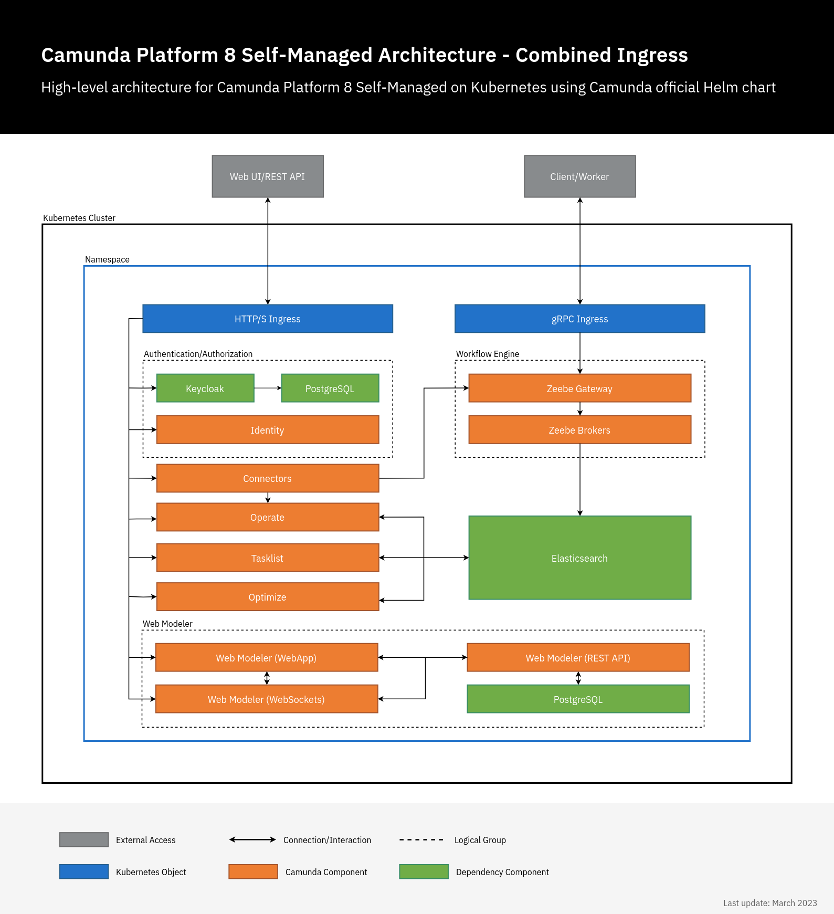

import Components from './react-components/components.md'

:::note

Camunda 8 Self-Managed is not Camunda 7. [Find Camunda 7 documentation here](https://docs.camunda.org).

:::

Camunda 8 Self-Managed is a self-hosted alternative to using Camunda 8 SaaS. Building process automation solutions with Camunda 8 works similarly regardless of hosting and deployment.

For more information on Camunda 8 SaaS, visit [What is Camunda 8?](../components/concepts/what-is-camunda-8.md) If you are new to Camunda 8, we recommend you start your journey with [Camunda 8 SaaS-based guides](../../guides/).

The content in this section of the documentation includes:

- Everything you need to download, configure, and work with each component of Camunda 8 Self-Managed.
- Features specific to Camunda 8 Self-Managed.

To get started with your Self-Managed installation, see our [installation overview](./setup/overview.md).

## Components

<Components/>

## Architecture

Camunda 8 Self-Managed consists of multiple web applications and gRPC services. The following example architecture diagram uses two [Ingress objects](./setup/guides/ingress-setup.md#combined-ingress-setup) to access these services externally: an Ingress with HTTP(S) protocol for all web applications using a single domain, and another Ingress with gRPC protocol for the Zeebe workflow engine.

In this configuration, Camunda 8 Self-Managed can be accessed as follows:

- Identity, Operate, Optimize, Tasklist, Modeler: `https://camunda.example.com/[identity|operate|optimize|tasklist|modeler]`
  - Web Modeler also exposes a WebSocket endpoint on `https://camunda.example.com/modeler-ws`. This is only used by the application itself and should not be accessed by users directly.
- Keycloak authentication: `https://camunda.example.com/auth`
- Zeebe Gateway: `grpc://zeebe.camunda.example.com`
