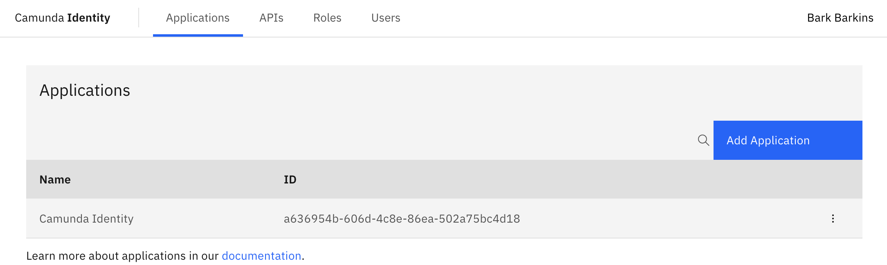

import IdentityLoginImg from './img/identity-login-page.png';

Get started with Management Identity in Self-Managed by learning how to open and log in to the Management Identity interface.

:::note
Management Identity is included in the [Docker-Compose](/self-managed/quickstart/developer-quickstart/docker-compose.md) and [Helm charts](/self-managed/deployment/helm/install/quick-install.md) deployments of Camunda 8 Self-Managed. With the default configuration, Management Identity uses an included Keycloak container/pod.
:::

## Log in to Management Identity

Once Management Identity has successfully started, you can open the **Log in** page and log in to Management Identity.


If you are running the default configuration, you can access the Management Identity interface via the following URLs:

- [Docker-Compose](/self-managed/quickstart/developer-quickstart/docker-compose.md): `http://localhost:8084/`
- [Helm](/self-managed/deployment/helm/install/quick-install.md): Follow your [`port-forward` or Ingress configuration](/self-managed/deployment/helm/configure/ingress/accessing-components-without-ingress.md)
- [Manual](docs/self-managed/deployment/manual/install.md): `http://localhost:8080/`

## Default user

In the default configuration, Management Identity creates a default example user during installation.

You can log in with this example user account using the following credentials:

```text
Username: demo
Password: demo
```

:::tip Want to create more users?
Management Identity uses the users managed in Keycloak. To create a user, refer to [Keycloak's documentation on creating a user](https://www.keycloak.org/docs/latest/server_admin/#proc-creating-user_server_administration_guide) for your version of Keycloak.
:::

## Management Identity home page

You are directed to the home page once you have successfully logged in.



## Next steps

Once you log in to Management Identity, you can start managing authentication, access and permissions to Web Modeler, Console and Optimize.

- [Manage users, groups, roles, and applications](application-user-group-role-management/identity-application-user-group-role-management-overview.md)
- [Manage access and permissions](access-management/access-management-overview.md)
- [Manage tenants](manage-tenants.md)

:::info
Learn more about how to [configure Management Identity](configuration/identity-configuration-overview.md) and [authentication](authentication.md).
:::
