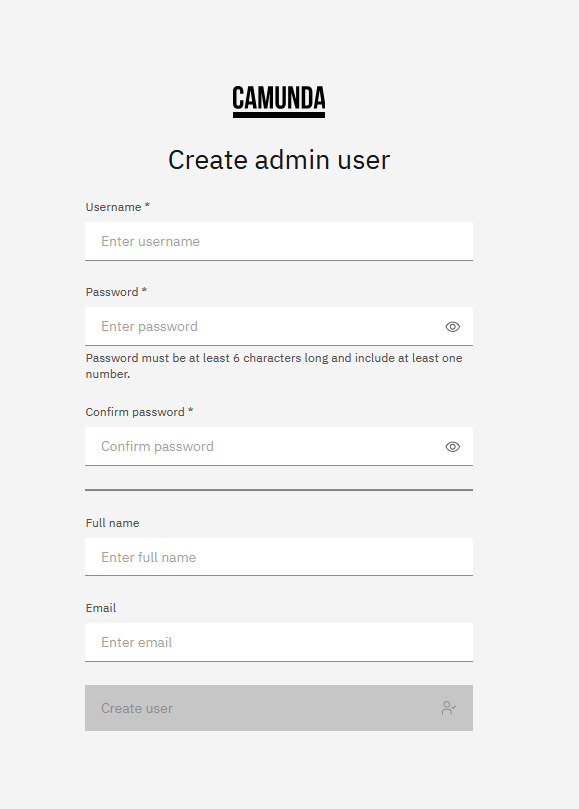

import Tabs from '@theme/Tabs';
import TabItem from '@theme/TabItem';

Authentication and authorization to an orchestration cluster and its resources is managed by the **Orchestration Cluster Identity**.

:::note
For a general overview of Orchestration Cluster Identity, follow [this guide](/components/identity/identity-introduction.md).
:::

The default setup of Identity depends on your Self-Managed deployment method.

<Tabs groupId="installation" defaultValue="c8run" queryString values={
[
{label: 'Camunda 8 Run', value: 'c8run'},
{label: 'Docker Compose', value: 'docker'},
{label: 'Helm charts', value: 'helm'},
{label: 'Manual', value: 'manual'}
]}>
<TabItem value="c8run">

For [Camunda 8 Run](/self-managed/quickstart/developer-quickstart/c8run.md) clusters:

- **Authentication:** Basic authentication is used.
- **API access:** API authentication is **disabled** ([unprotected mode](/self-managed/concepts/authentication/authentication-to-orchestration-cluster.md#unprotected-api-mode)).
- **Authorization:** Authorizations are **disabled**.
- **Admin role:** Predefined `admin` role exists with full permissions.
- **Initial user:** `demo` / `demo` user with `admin` role.

</TabItem>
<TabItem value="docker">

For [Docker Compose](/self-managed/quickstart/developer-quickstart/docker-compose.md) clusters, the configuration is identical to Camunda 8 Run:

- **Authentication:** Basic authentication.
- **API access:** Disabled.
- **Authorization:** Disabled.
- **Admin role:** Predefined `admin` role.
- **Initial user:** `demo` / `demo`.

</TabItem>
<TabItem value="helm">

For [Helm](/self-managed/deployment/helm/index.md) installations:

- **Authentication:** Basic authentication is used.
- **API access:** API authentication is **enabled** (unprotected API mode disabled).
- **Authorization:** Authorizations are **enabled**.
- **Admin role:** Predefined `admin` role exists with full permissions.
- **Initial user:** `demo` / `demo`.

</TabItem>
<TabItem value="manual">

For [Manual](/self-managed/deployment/manual/install.md) installations, the configuration is the same as Helm:

- **Authentication:** Basic authentication.
- **API access:** API authentication **enabled**.
- **Authorization:** Authorizations **enabled**.
- **Admin role:** Predefined `admin` role exists with full permissions.
- **Initial user:** `demo` / `demo`.

</TabItem>
</Tabs>

To modify the initial setup, see [supported configuration properties](/self-managed/components/orchestration-cluster/core-settings/configuration/properties.md).

## Configure initial users

You can create initial users in one of the following ways:

- [Startup configuration](#configure-initial-users-via-configuration)
- [Orchestration Cluster UI](#create-admin-user-via-orchestration-cluster-ui)
- [Setup endpoint of the Orchestration Cluster REST API](#create-admin-user-via-setup-rest-api)

:::warning
Ensure at least one user remains assigned to the `admin` role. If no admin exists, a third party could gain full access.
:::

### Define initial users via startup configuration {#configure-initial-users-via-configuration}

<Tabs groupId="option" defaultValue="env" queryString values={
[
{label: 'Environment variables', value: 'env'},
{label: 'application.yaml', value: 'application-yaml'},
{label: 'Helm values', value: 'helm-values'}
]}>
<TabItem value="env">

```shell
CAMUNDA_SECURITY_INITIALIZATION_USERS_0_USERNAME=<username>
CAMUNDA_SECURITY_INITIALIZATION_USERS_0_PASSWORD=<password>
CAMUNDA_SECURITY_INITIALIZATION_USERS_0_NAME=<full name>
CAMUNDA_SECURITY_INITIALIZATION_USERS_0_EMAIL=<email>

# Add more users by incrementing the index (USERS_1, USERS_2, etc.)
```

</TabItem>

<TabItem value="application-yaml">

```yaml
camunda.security.initialization.users[0].username: <username>
camunda.security.initialization.users[0].password: <password>
camunda.security.initialization.users[0].name: <full name>
camunda.security.initialization.users[0].email: <email>
# Add more users by incrementing the index
```

</TabItem>

<TabItem value="helm-values">

```yaml
orchestration:
  security:
    initialization:
      users:
        - username: <username>
          password: <password>
          name: <full name>
          email: <email>
        # Add more users as needed
```

</TabItem>

</Tabs>

By default, a user is not assigned to any roles and therefore has no permissions. See the next section to learn how to assign a user to a role via configuration.

### Create an initial admin user in Orchestration Cluster UI {#create-admin-user-via-orchestration-cluster-ui}

For [Helm charts](/self-managed/deployment/helm/install/index.md) and [Manual](/self-managed/deployment/manual/install.md) installations, if an initial admin user is not defined in the configuration (or was removed from the configuration), the web UI automatically prompts you to create one on the first start:



This user will be assigned to the `admin` role and granted all permissions in the system. Once an admin user exists, this screen is no longer shown.

:::note
This option does not apply to **Camunda 8 Run** and **Docker Compose** installations, as they come with a pre-configured `demo` user by default.
:::

### Create an initial admin user via the Setup endpoint of Orchestration Cluster REST API {#create-admin-user-via-setup-rest-api}

As a programmatic alternative to the UI, you can create the first admin user by calling the Setup API endpoint. This is useful for automated or headless installations.

- **API endpoint**: `POST /v2/setup/user` (see the [documentation](/apis-tools/orchestration-cluster-api-rest/specifications/create-admin-user.api.mdx))

The following JSON request body can be used:

```json
{
  "username": "<your chosen username>",
  "password": "<your chosen password>",
  "name": "<the user's full name>",
  "email": "<the user's email address>"
}
```

This endpoint is only available as long as **no user is assigned to the `admin` role**.

### Assign users, clients, groups, or mapping rules to roles via configuration

The Orchestration Cluster provides a number of [built-in roles](/components/concepts/access-control/authorizations.md#default-roles) with predefined permissions for easier setup.

To assign users, clients, groups, or [mapping rules](/components/concepts/access-control/mapping-rules.md) to roles, add the appropriate properties to your `application.yaml` or set them as environment variables.

<Tabs groupId="option" defaultValue="env" queryString values={
[
{label: 'Environment variables', value: 'env' },
{label: 'application.yaml', value: 'application-yaml' },
{label: 'Helm values', value: 'helm-values' },
]}>

<TabItem value="env">

```shell
CAMUNDA_SECURITY_INITIALIZATION_DEFAULTROLES_<role>_USERS_0=<username>
CAMUNDA_SECURITY_INITIALIZATION_DEFAULTROLES_<role>_CLIENTS_0=<client id>
CAMUNDA_SECURITY_INITIALIZATION_DEFAULTROLES_<role>_GROUPS_0=<group id>
CAMUNDA_SECURITY_INITIALIZATION_DEFAULTROLES_<role>_MAPPINGS_0=<mapping id>

# add more members as desired by repeating the variables with an incremented index
```

</TabItem>

<TabItem value="application-yaml">

```yaml
camunda.security.initialization.default-roles.<role>.users[0]: <username>
camunda.security.initialization.default-roles.<role>.clients[0]: <client id>
camunda.security.initialization.default-roles.<role>.groups[0]: <group id>
camunda.security.initialization.default-roles.<role>.mappingrules[0]: <mapping id>
# add more members as desired by incrementing the index
```

</TabItem>

<TabItem value="helm-values">

```yaml
orchestration:
  security:
    initialization:
      defaultRoles:
        <role>:
          users:
            - <username>
          clients:
            - <client id>
          groups:
            - <group id>
          mappings:
            - <mapping id>
          # add more members as desired
```

</TabItem>

</Tabs>

Replace `<role>` with the ID of the role you want to configure.

### Example: assign user `demo` to the admin role

<Tabs groupId="option" defaultValue="env" queryString values={
[
{label: 'Environment variables', value: 'env' },
{label: 'application.yaml', value: 'application-yaml' },
{label: 'Helm values', value: 'helm-values' },
]}>
<TabItem value="env">

```shell
CAMUNDA_SECURITY_INITIALIZATION_DEFAULTROLES_ADMIN_USERS_0=demo
```

</TabItem>

<TabItem value="application-yaml">

```yaml
camunda.security.initialization.default-roles.admin.users[0]: demo
```

</TabItem>

<TabItem value="helm-values">

```yaml
orchestration:
  security:
    initialization:
      defaultRoles:
        admin:
          users:
            - demo
```

</TabItem>

</Tabs>

You can assign a user to multiple roles by listing them in the respective section of each role.

## Enable API authentication and authorizations

For development setups like [Camunda 8 Run](../../../quickstart/developer-quickstart/c8run.md) and [Docker Compose](../../../quickstart/developer-quickstart/docker-compose.md), API access is [unprotected](../../../concepts/authentication/authentication-to-orchestration-cluster.md#unprotected-api-mode), and [authorizations](/components/identity/authorization.md) are disabled by default.

To enable them, you can apply the following configuration:

<Tabs groupId="option" defaultValue="env" queryString values={
[
{label: 'Environment variables', value: 'env' },
{label: 'application.yaml', value: 'application-yaml' },
{label: 'Helm values', value: 'helm-values' },
]}>
<TabItem value="env">

```shell
CAMUNDA_SECURITY_AUTHENTICATION_UNPROTECTED_API=false
CAMUNDA_SECURITY_AUTHORIZATIONS_ENABLED=true
```

</TabItem>

<TabItem value="application-yaml">

```yaml
camunda.security.authentication.unprotected-api: false
camunda.security.authorizations.enabled: true
```

</TabItem>

<TabItem value="helm-values">

```yaml
orchestration:
  security:
    authentication:
      unprotectedApi: false
    authorizations:
      enabled: true
```

</TabItem>

</Tabs>
