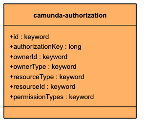
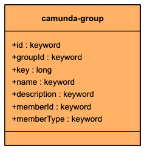
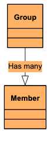
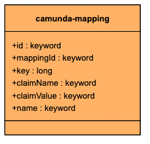
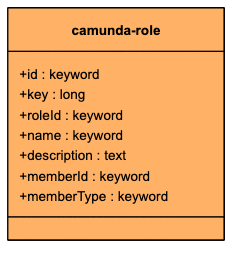
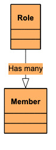
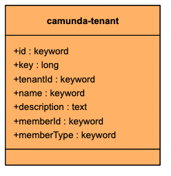
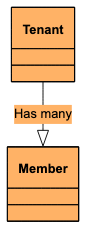
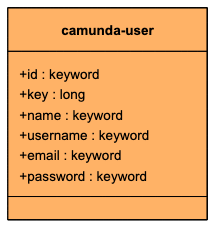
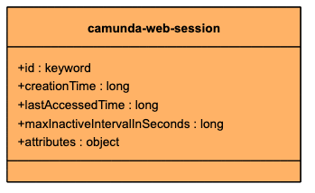

The following index diagrams show Camunda Exporter indices for Camunda identity.

- [camunda-authorization](#camunda-authorization)
- [camunda-group](#camunda-group)
- [camunda-mapping](#camunda-mapping)
- [camunda-role](#camunda-role)
- [camunda-tenant](#camunda-tenant)
- [camunda-user](#camunda-user)
- [camunda-web-session](#camunda-web-session)

## camunda-authorization

## camunda-group

## camunda-mapping

## camunda-role

## camunda-tenant

## camunda-user

## camunda-web-session

