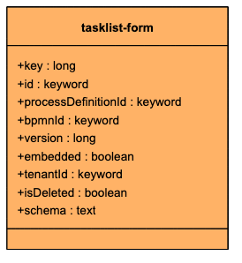
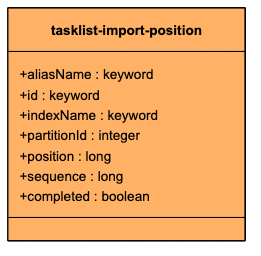
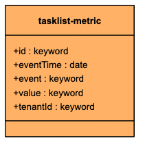
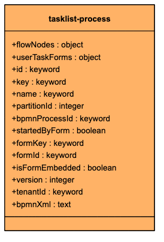
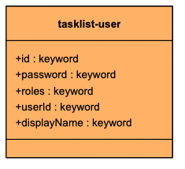
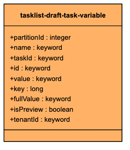
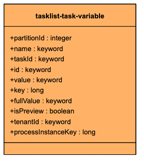
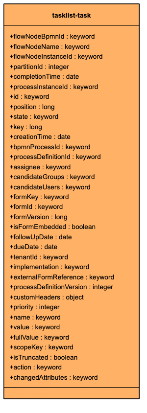
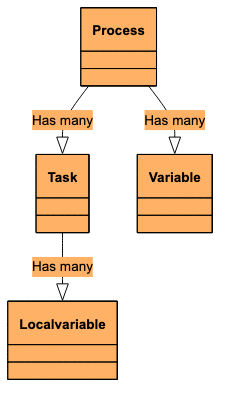

The following index diagrams show Camunda Exporter indices for Tasklist.

- [tasklist-form](#tasklist-form)
- [tasklist-import-position](#tasklist-import-position)
- [tasklist-metric](#tasklist-metric)
- [tasklist-process](#tasklist-process)
- [tasklist-user](#tasklist-user)
- [tasklist-draft-task-variable](#tasklist-draft-task-variable)
- [tasklist-task-variable](#tasklist-task-variable)
- [tasklist-task](#tasklist-task)

## tasklist-form

## tasklist-import-position

## tasklist-metric

## tasklist-process

## tasklist-user

## tasklist-draft-task-variable

## tasklist-task-variable

## tasklist-task

