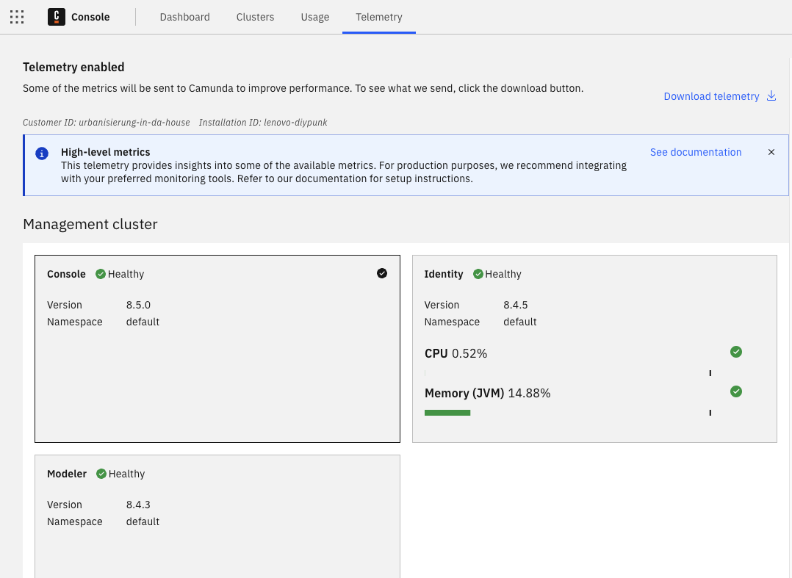

At Camunda, we strive to offer an excellent user experience at a high and stable level. On a strictly opt-in basis, we are looking to collect environment and usage data to improve your user experience further. These insights help us understand typical environment setups and product usage patterns and will be used to make informed product improvement decisions that benefit you.

## Design

Camunda 8 Console Self-Managed incorporates a telemetry mechanism designed to periodically report usage data to Camunda. This telemetry operates seamlessly in the background and is activated only when telemetry is explicitly enabled. The data collection mechanism is structured to function without interrupting or degrading the performance of the implemented processes. When enabled, the collected data is sent once every 24 hours via HTTPS.

Once telemetry is enabled, a new Console telemetry page will be enabled and will display collected information. This page can be used to view component metrics as a simple monitoring interface. Console will collect a subset of metrics, which you can download and inspect anytime.



### Collected data

The telemetry feature categorizes the collected data into general Camunda data and metrics data:

- General data: This includes information about deployed Camunda components, customer ID, and unique installation identifier.
- Metrics data: Captures selected Prometheus metrics available for each component via monitoring endpoint. For example, command counts, metrics related to process instances, CPU load, and memory allocation.

### How to enable telemetry

By default, the telemetry configuration is set to `disabled`. Telemetry can be activated by setting the appropriate configuration in the Camunda 8 Helm chart or setting the appropriate environment variables in the Console configuration. Refer to [Console configuration](./configuration/configuration.md) for more information.

### Telemetry configuration options explained

When the telemetry configuration is set to `disabled` (default), Console will not collect or send any metrics. This feature will not be running.

When the telemetry configuration is set to `download`, Console collects metrics and shows them on a telemetry page. However, it will not send any information to Camunda automatically. With this option, you can report telemetry to Camunda by downloading this data from the telemetry page and sending it to our team on request.

When the telemetry configuration is set to `online` (recommended), Console collects metrics and shows them on a telemetry page. Console will collect metrics regularly and automatically send this data once every 24 hours. This mode will simplify sharing this data with us and provide us with better insight into Camunda 8 use.

### Example

You can download an example [data file](https://github.com/camunda/camunda-docs/blob/main/docs/self-managed/console-deployment/telemetry-sample.json). Below is an extract to highlight the types of data collected:

```json
{
 "installation": {
   "cid": "customer",
   "iid": "any-text-identifier"
 },
 "dataPoints": [
   {
     "entities": [
       {
         "id": "installation",
         "type": "global"
       },
       {
         "id": "operate",
         "type": "component"
       },
       {
         "id": "a22efefbb00546c04512fc7d4b455e77",
         "type": "cluster"
       }
     ],
     "key": "component-count",
     "type": 1,
     "transferredValue": "1",
     "value": 1,
     "tsFrom": 1712228731639
   },
   {
     "entities": [
       {
         "id": "installation",
         "type": "global"
       },
       {
         "id": "optimize",
         "type": "component"
       },
       {
         "id": "a22efefbb00546c04512fc7d4b455e77",
         "type": "cluster"
       }
     ],
     "key": "component-count",
     "type": 1,
     "transferredValue": "1",
     "value": 1,
     "tsFrom": 1712228731639
   },
   {
     "entities": [
       {
         "id": "a22efefbb00546c04512fc7d4b455e77",
         "type": "cluster"
       },
       {
         "id": "operate",
         "type": "component"
       }
     ],
     "key": "jvm_memory_max_bytes",
     "type": 0,
     "tags": {
       "area": "heap",
       "id": "G1 Old Gen"
     },
     "transferredValue": "5.36870912E8",
     "value": "5.36870912E8",
     "tsFrom": 1712228731639
   },
```

### Legal and privacy considerations

Before enabling telemetry in Camunda 8 Console Self-Managed, ensure you are authorized to take this step and that the installation or activation of the telemetry functionality is not in conflict with any company-internal policies, compliance guidelines, any contractual or other provisions or obligations of your company.

Camunda cannot be held responsible for the unauthorized installation or activation of this function.
