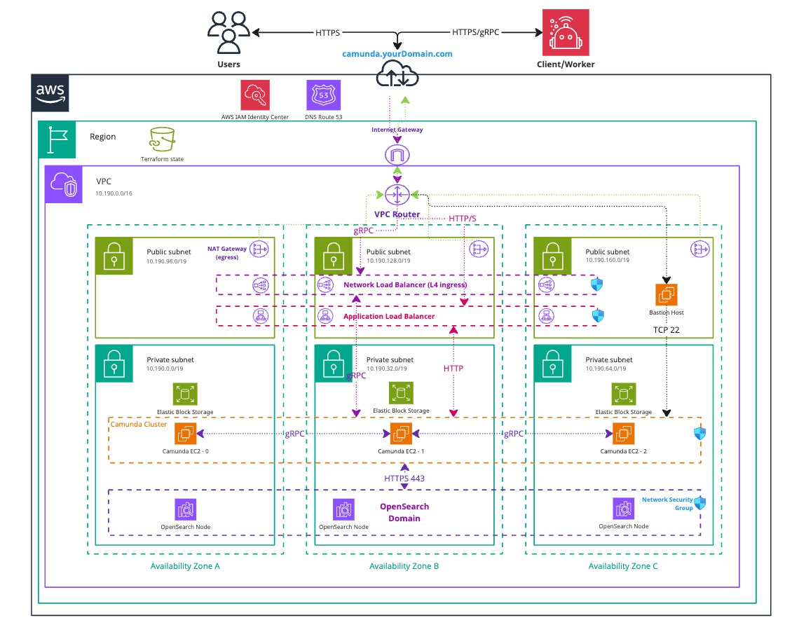

This guide provides a detailed walkthrough for installing the Camunda 8 single JAR on AWS EC2 instances. It focuses on managed services provided by AWS and their cloud offering. Finally, you will verify that the connection to your Self-Managed Camunda 8 environment is functioning correctly.

This guide focuses on setting up the [Orchestration Cluster](/self-managed/reference-architecture/reference-architecture.md#orchestration-cluster-vs-web-modeler-and-console) for Camunda 8. Web Modeler and Console are not covered in this manual deployment approach, as these components are not supported on virtual machines. To deploy Web Modeler and Console, explore the available options for [Kubernetes-based deployments](/self-managed/deployment/helm/install/quick-install.md#install-web-modeler).

:::note Using other cloud providers
This guide is based on tools and services provided by AWS but is not limited to them. The scripts and concepts included can be adapted for other cloud providers and use cases.

When using a different cloud provider, you are responsible for configuring and maintaining the resulting infrastructure. Support is limited to questions related to this guide—not to the specific tools or services of your chosen cloud provider.
:::

:::danger Cost management
Following this guide will incur costs on your cloud provider account—primarily for EC2 instances and OpenSearch. Visit AWS and their [pricing calculator](https://calculator.aws/#/) for detailed cost estimates, as pricing varies by region.

You may refer to this [example calculation](https://calculator.aws/#/estimate?id=ca54a43f3b3b7eb42fe8836854775e60d8c7e04d), which can be further optimized for your specific use case.
:::

## Architecture

The architecture outlined below describes a standard three-node deployment, distributed across three [availability zones](https://docs.aws.amazon.com/AWSEC2/latest/UserGuide/using-regions-availability-zones.html) within a single AWS region. It includes a managed OpenSearch domain deployed under the same conditions. This approach ensures high availability and redundancy in case of a zone failure.

<!-- The following diagram should be exported as an image and as a PDF from the sources https://miro.com/app/board/uXjVL-6SrPc=/ -->
<!-- To export: click on the frame > "Export Image" > as PDF and as JPG (low res), then save it in the ./assets/ folder -->

_Infrastructure diagram for a 3-node EC2 architecture (click the image to view the PDF version)_

[](./assets/aws-ec2-arch.pdf)

The setup includes:

- A [Virtual Private Cloud](https://docs.aws.amazon.com/vpc/latest/userguide/what-is-amazon-vpc.html) (VPC), which is a logically isolated virtual network.
  - A [Private Subnet](https://docs.aws.amazon.com/vpc/latest/userguide/configure-subnets.html), which does not have direct internet access.
    - Three [EC2](https://aws.amazon.com/ec2/) instances running Ubuntu—one in each availability zone—host the Camunda 8 components.
    - A [managed OpenSearch](https://aws.amazon.com/what-is/opensearch/) cluster, also distributed across the three zones.
  - A [Public Subnet](https://docs.aws.amazon.com/vpc/latest/userguide/configure-subnets.html), which has internet access via an [Internet Gateway](https://docs.aws.amazon.com/vpc/latest/userguide/VPC_Internet_Gateway.html).
    - (Optional) An [Application Load Balancer](https://docs.aws.amazon.com/elasticloadbalancing/latest/application/introduction.html) (ALB) to expose web interfaces such as Operate, Tasklist, Connectors, and the Orchestration Cluster REST API. This uses sticky sessions, as requests are otherwise distributed round-robin across EC2 instances.
    - (Optional) A [Network Load Balancer](https://docs.aws.amazon.com/elasticloadbalancing/latest/network/introduction.html) (NLB) to expose the gRPC endpoint of the Zeebe Gateway, if external applications need to connect.
    - (Optional) A [Bastion Host](https://en.wikipedia.org/wiki/Bastion_host) to allow access to private EC2 instances that are not publicly exposed.
      - Alternatively, use [AWS Client VPN](https://docs.aws.amazon.com/vpn/latest/clientvpn-admin/what-is.html) to access the private subnet. This setup requires additional effort and certificates but can be implemented using [AWS’s getting started guide](https://docs.aws.amazon.com/vpn/latest/clientvpn-admin/cvpn-getting-started.html).
    - A [NAT Gateway](https://docs.aws.amazon.com/vpc/latest/userguide/vpc-nat-gateway.html) that allows private EC2 instances to access the internet for downloading and updating software packages. Note that this does **not** provide inbound access to the instances.
- [Security Groups](https://docs.aws.amazon.com/vpc/latest/userguide/vpc-security-groups.html) to control network traffic to and from the EC2 instances.
- An [Internet Gateway](https://docs.aws.amazon.com/vpc/latest/userguide/VPC_Internet_Gateway.html) to route traffic between the VPC and the internet.

Both subnet types are distributed across three availability zones in a single AWS region, supporting a high-availability architecture.

:::note Single deployment
You can also run this setup using a single AWS EC2 instance. However, in the event of a zone failure, the entire environment would become unreachable.
:::

## Requirements

- An AWS account to provision resources.
  - At a high level, permissions are needed for **ec2**, **iam**, **elasticloadbalancing**, **kms**, **logs**, and **es** services.
  - For detailed permissions, refer to this [example policy](https://github.com/camunda/camunda-deployment-references/tree/main/aws/compute/ec2-single-region/example/policy.json).
- Terraform (v1.7 or later)
- A Unix-based operating system with `ssh` and `sftp`
  - Windows may be used with [Cygwin](https://www.cygwin.com/) or [Windows WSL](https://learn.microsoft.com/en-us/windows/wsl/install), though these configurations have not been tested.

### Outcome

The result is a fully functioning Camunda Orchestration Cluster deployed in a high-availability setup using AWS EC2 and a managed OpenSearch domain.

Each EC2 instance includes an additional disk, dedicated to Camunda, to separate application data from the operating system.

## 1. Configure AWS and initialize Terraform

:::note Terraform infrastructure example
We do not recommend using the following Terraform-based infrastructure as a module, since we cannot guarantee compatibility.

Instead, we suggest reusing or extending components of the Terraform example to ensure alignment with your environment.
:::

### Obtain a copy of the reference architecture

Start by downloading a copy of the reference architecture from the GitHub repository. This content will be used throughout the rest of the guide. The reference architectures are versioned according to Camunda releases (e.g., stable/8.x).

The reference architecture repository allows you to reuse and extend the provided Terraform examples. This flexible implementation avoids the constraints of relying on third-party-maintained Terraform modules:

```bash reference
https://github.com/camunda/camunda-deployment-references/blob/stable/8.8/aws/compute/ec2-single-region/procedure/get-your-copy.sh
```

With the reference architecture in place, you can proceed with the remaining steps in this documentation. Make sure you're in the correct directory before continuing with the instructions.

### Terraform prerequisites

To manage Camunda 8 infrastructure on AWS using Terraform, you need to configure Terraform's backend to store the state file remotely in an S3 bucket. This provides secure, persistent state storage for your infrastructure.

:::note
Advanced users may choose to configure a different backend. The setup described here is a recommended starting point for new users.
:::

#### Set up AWS authentication

The [AWS Terraform provider](https://registry.terraform.io/providers/hashicorp/aws/latest/docs) is required to provision resources in AWS. Before using the provider, you must authenticate it with your AWS credentials.

:::caution Ownership of the created resources

Any user who creates AWS resources retains administrative access to them. For better control and security, it is recommended to create a dedicated [AWS IAM user](https://docs.aws.amazon.com/IAM/latest/UserGuide/id_users.html) specifically for Terraform. This ensures the resources are properly managed and owned by a single identity.

:::

You can customize the region and authentication settings as needed. Terraform supports multiple [authentication methods](https://registry.terraform.io/providers/hashicorp/aws/latest/docs#authentication-and-configuration), including:

- For development or testing, you can use the [AWS CLI](https://docs.aws.amazon.com/cli/latest/userguide/cli-chap-getting-started.html). If your AWS CLI is already configured, Terraform will automatically detect and use those credentials.

To configure the AWS CLI:

```bash
aws configure
```

Enter your `AWS_ACCESS_KEY_ID`, `AWS_SECRET_ACCESS_KEY`, region, and output format. These can be retrieved from the [AWS Console](https://docs.aws.amazon.com/IAM/latest/UserGuide/id_credentials_access-keys.html).

- For production environments, it is recommended to use a dedicated IAM user. Create [access keys](https://docs.aws.amazon.com/IAM/latest/UserGuide/id_credentials_access-keys.html) for that user via the AWS console, and export them as environment variables: `AWS_ACCESS_KEY_ID` and `AWS_SECRET_ACCESS_KEY`.

#### Create an S3 bucket for Terraform state management

Before initializing Terraform, you must create an S3 bucket to store the state file. This is essential for collaborative work and helps prevent issues such as state file corruption.

Begin by setting your preferred AWS region as an environment variable to avoid repeating it in every command:

```bash
export AWS_REGION=<your-region>
```

Replace `<your-region>` with your chosen AWS region (e.g., `eu-central-1`).

Next, follow these steps to create an S3 bucket with versioning enabled:

1. Open your terminal and ensure that the AWS CLI is installed and properly configured.

2. Run the following command to create an S3 bucket for storing your Terraform state. Be sure to choose a unique bucket name, and ensure that the `AWS_REGION` environment variable is already set:

   ```bash reference
   https://github.com/camunda/camunda-deployment-references/blob/stable/8.8/aws/common/procedure/s3-bucket/s3-bucket-creation.sh
   ```

3. Enable versioning on the S3 bucket to track changes and protect the state file from accidental deletions or overwrites:

   ```bash reference
   https://github.com/camunda/camunda-deployment-references/blob/stable/8.8/aws/common/procedure/s3-bucket/s3-bucket-versioning.sh
   ```

4. Secure the bucket by blocking public access:

   ```bash reference
   https://github.com/camunda/camunda-deployment-references/blob/stable/8.8/aws/common/procedure/s3-bucket/s3-bucket-private.sh
   ```

5. Verify versioning is enabled on the bucket:

   ```bash reference
   https://github.com/camunda/camunda-deployment-references/blob/stable/8.8/aws/common/procedure/s3-bucket/s3-bucket-verify.sh
   ```

The S3 bucket is now ready to securely store your Terraform state files, with versioning enabled for added protection.

#### Initialize Terraform

Once authentication is configured, you can initialize your Terraform project. Earlier, you created a dedicated S3 bucket (`S3_TF_BUCKET_NAME`) for storing the state file. In this step, Terraform will use that bucket along with a specific key to manage your infrastructure state.

Initialize the backend and download the required provider plugins:

:::note
Make sure you are in the `terraform` subfolder: `camunda-deployment-references/aws/compute/ec2-single-region/terraform`.
:::

```bash reference
https://github.com/camunda/camunda-deployment-references/blob/stable/8.8/aws/common/procedure/s3-bucket/s3-bucket-tf-init.sh
```

Terraform will now use the S3 bucket to manage the state file, ensuring remote and persistent storage.

### EC2 setup

The `ec2.tf` file handles the creation of compute instances and, optionally, a bastion host. Within this file, you can configure disk size, instance type, enable or disable the bastion host, and define the [Amazon Machine Image (AMI)](https://docs.aws.amazon.com/AWSEC2/latest/UserGuide/AMIs.html) to override the default behavior of using the latest available image.

The file defines all resources related to the EC2 setup and can be customized as needed in your copied reference architecture. Note that the embedded code snippet below is limited to 30 lines. For the complete file, see the link provided at the bottom of the snippet:

```hcl reference
https://github.com/camunda/camunda-deployment-references/blob/stable/8.8/aws/compute/ec2-single-region/terraform/cluster/ec2.tf#L1-L30
```

### Security setup

The `security.tf` file defines several security groups to manage access and traffic flow for different use cases, including:

- Allowing internal VPC traffic on Camunda ports
- Permitting EC2 instances to access external traffic on ports 80 and 443 to download dependencies (e.g., Java, Camunda)
- Allowing inbound traffic to the Load Balancer on specific ports
- Enabling SSH access for the bastion host

In addition to traffic management, this file also includes:

- A KMS key for encrypting EC2 disks and the OpenSearch domain
- An SSH key pair used to authorize remote SSH connections

The embedded snippet below shows which resources are created and how they can be customized in your copied reference. The preview is limited to 30 lines. For the complete file, refer to the link at the bottom of the snippet:

```hcl reference
https://github.com/camunda/camunda-deployment-references/blob/stable/8.8/aws/compute/ec2-single-region/terraform/cluster/security.tf#L1-L30
```

### Load balancer setup

The `lb.tf` file defines the load balancer configuration used to expose Camunda 8 either publicly or within your internal network. You can further restrict access based on your security requirements.

The configuration includes two types of load balancers:

- A **Network Load Balancer** to expose the gRPC endpoint
- An **Application Load Balancer** to expose the Camunda WebApps and REST API

The embedded snippet below shows the resources defined in this file and how they can be customized in your copied reference. The preview is limited to 30 lines. For the complete file, refer to the link at the bottom of the snippet:

```hcl reference
https://github.com/camunda/camunda-deployment-references/blob/stable/8.8/aws/compute/ec2-single-region/terraform/cluster/lb.tf#L1-L30
```

### OpenSearch module setup

:::info Optional module

If you do not want to use this module, you can skip this section. However, you will need to adjust the remaining steps to remove any references to it.

If you choose not to use this module, you must provide your own Elasticsearch or OpenSearch service.

Additionally, be sure to delete the `opensearch.tf` file in your reference copy—otherwise, the resources defined in it will still be created.
:::

The OpenSearch module provisions an OpenSearch domain for use with the Camunda platform. OpenSearch is a powerful alternative to Elasticsearch.

:::note Migration to OpenSearch is not supported

Using Amazon OpenSearch Service requires [setting up a new Camunda installation](/self-managed/setup/overview.md). Migration from earlier Camunda versions using Elasticsearch is not currently supported. Switching between Elasticsearch and OpenSearch in either direction is also unsupported.

:::

#### Set up the OpenSearch domain module

1. The `opensearch.tf` file in your reference contains a basic OpenSearch setup using a local Terraform module. The snippet below shows the structure of this file, which you can modify within your cloned setup to suit your needs.

   :::caution Network-based security

   The default OpenSearch deployment relies primarily on network-level security. While this simplifies access, it can expose sensitive data within your VPC.

   To enhance security, consider enabling [fine-grained access control](https://docs.aws.amazon.com/opensearch-service/latest/developerguide/fgac.html).
   :::

   ```hcl reference
   https://github.com/camunda/camunda-deployment-references/blob/stable/8.8/aws/compute/ec2-single-region/terraform/cluster/opensearch.tf#L1-L30
   ```

2. Customize the cluster setup using various input options. For a complete list of available parameters, refer to the [OpenSearch module documentation](https://github.com/camunda/camunda-deployment-references/blob/stable/8.8/aws/modules/opensearch/README.md).

:::tip
The instance type `m7i.large.search` used in the example is only a suggestion. You can change it based on your workload and requirements.
:::

### Define outputs

**Terraform** allows you to define outputs—useful for retrieving important values generated during execution, such as database endpoints and other configuration details.

Each Terraform definition in the reference includes output blocks at the end of the file. You can modify these as needed. The provided defaults are ready to use in automation scripts.

Defining outputs helps you easily reference resources in later steps or scripts, simplifying your deployment workflow.

### Execution

:::note Secret management

We strongly recommend managing sensitive information using a secure secrets management tool such as HashiCorp Vault. For guidance on injecting secrets into Terraform via Vault, refer to the [Terraform Vault Secrets Injection Guide](https://developer.hashicorp.com/terraform/tutorials/secrets/secrets-vault).
:::

1. Open a terminal in the reference directory containing `config.tf` and the other `.tf` files.

2. Perform a final initialization to apply any changes made throughout this guide:

   ```bash reference
   https://github.com/camunda/camunda-deployment-references/blob/stable/8.8/aws/common/procedure/s3-bucket/s3-bucket-tf-init.sh#L7
   ```

3. Plan the configuration files:

   ```bash
   terraform plan -out cluster.plan # describe what will be created
   ```

4. After reviewing the plan, you can confirm and apply the changes:

   ```bash
   terraform apply cluster.plan     # apply the creation
   ```

Terraform will now provision the Amazon EC2 resources and the OpenSearch domain with all necessary configurations. This process may take approximately 20–30 minutes to complete.

### Connect to remote machines via Bastion host (optional)

Since the EC2 instances are not publicly accessible, you must connect to them through a Bastion host. Alternatively, you can use the [AWS VPN Client](https://docs.aws.amazon.com/vpn/latest/clientvpn-admin/what-is.html) to securely access the private VPC.

This guide does not cover the VPN client setup, as it requires specific manual configuration and user interaction:

```sh
export BASTION_HOST=$(terraform output -raw bastion_ip)
# retrieves the first IP from the camunda_ips array
export CAMUNDA_IP=$(tf output -json camunda_ips | jq -r '.[0]')

ssh -J admin@${BASTION_HOST} admin@${CAMUNDA_IP}
```

## 2. Deploy Camunda 8

The following example uses scripts from the Terraform installation to deploy and configure Camunda 8. You can adapt these scripts to your own environment. Alternatively, use the [manual installation instructions](/self-managed/deployment/manual/install.md) to perform the base installation and configuration.

### Configure and run the installation procedure

1. Navigate to the procedure directory:

```sh
cd camunda-deployment-references-main/aws/ec2/procedure
```

The `procedure` directory contains Bash scripts for installing and configuring Camunda 8.

2. Configure script behavior using the following environment variables:
   - `CLOUDWATCH_ENABLED`: Defaults to `false`. Set to `true` to install the CloudWatch agent on each EC2 instance and export Camunda logs and Prometheus metrics to AWS CloudWatch.

3. Override default versions in the `camunda-install.sh` script by modifying these variables:
   - `OPENJDK_VERSION`: The Temurin Java version to install.
   - `CAMUNDA_VERSION`: The Camunda 8 version to install.
   - `CAMUNDA_CONNECTORS_VERSION`: The Camunda 8 Connectors version to install.

   :::note
   These variables must be set inside the `camunda-install.sh` script itself; they cannot be set as environment variables.
   :::

4. Run the `all-in-one-install.sh` script.

This script installs all required dependencies and configures Camunda 8 to run in a highly available setup using a managed OpenSearch instance.

It automatically retrieves all required IP addresses and other details from the Terraform state via Terraform outputs.

During the initial run, you will be prompted to confirm SSH connections to each EC2 instance by typing `yes`.

### Connect and use Camunda 8

The Application Load Balancer (ALB) and Network Load Balancer (NLB) endpoints are available via Terraform outputs:

- `terraform output alb_endpoint`: Use this to access Operate and other Web UIs (such as Tasklist, Optimize, and Connectors). The ALB handles HTTP traffic for these interfaces, as well as the Orchestration Cluster REST API (e.g., connectors on port `9090`).

- `terraform output nlb_endpoint`: Use this to access the Zeebe Gateway’s gRPC endpoint. The NLB is designed for TCP-based gRPC traffic, while the ALB handles HTTP.

These endpoints use AWS-assigned public hostnames. To use your own domain, create CNAME records pointing to these hostnames or use [Route 53](https://aws.amazon.com/route53/) for DNS management and to enable SSL certificates. Note that enabling SSL and custom domains will require additional configuration in the Terraform blueprint, since it listens on HTTP by default.

If you prefer not to expose your environment publicly, you can use the Bastion host (jump host) to access services locally via port forwarding.

For a more secure, enterprise-grade solution, use the [AWS Client VPN](https://docs.aws.amazon.com/vpn/latest/clientvpn-admin/what-is.html) to access the private subnet within your VPC. This setup requires additional certificates and configuration, detailed in the [AWS getting started tutorial](https://docs.aws.amazon.com/vpn/latest/clientvpn-admin/cvpn-getting-started.html).

The following commands can be run from within the Terraform folder to bind remote ports to your local machine via SSH port forwarding:

```sh
export BASTION_HOST=$(terraform output -raw bastion_ip)
# retrieves the first IP from the camunda_ips array
export CAMUNDA_IP=$(tf output -json camunda_ips | jq -r '.[0]')

# 26500 - gRPC; 8080 - WebUI; 9090 - Connectors
ssh -L 26500:${CAMUNDA_IP}:26500 -L 8080:${CAMUNDA_IP}:8080 -L 9090:${CAMUNDA_IP}:9090 admin@${BASTION_HOST}
```

### Turn off bastion host (optional)

If you used the [bastion host](#turn-off-bastion-host-optional) for access, it can be turned off when longer needed for direct access to the EC2 instances.

To turn off the bastion host, set the `enable_jump_host` variable to `false` in the `variables.tf` file, and reapply Terraform.

## 3. Verify connectivity to Camunda 8

Using Terraform, you can obtain the HTTP endpoint of the Application Load Balancer and interact with Camunda through the [Orchestration Cluster REST API](/apis-tools/orchestration-cluster-api-rest/orchestration-cluster-api-rest-overview.md).

1. Navigate to the Terraform folder:

```sh
cd camunda-deployment-references-main/aws/ec2/terraform
```

2. Retrieve the Application Load Balancer output:

```sh
terraform output -raw alb_endpoint
```

3. Use the [Orchestration Cluster REST API](/apis-tools/orchestration-cluster-api-rest/orchestration-cluster-api-rest-overview.md) to communicate with Camunda:

Follow the example in the [Orchestration Cluster REST API documentation](/apis-tools/orchestration-cluster-api-rest/orchestration-cluster-api-rest-authentication.md) to authenticate and retrieve the cluster topology.

## Manage Camunda 8

### Upgrade Camunda 8

:::info Direct upgrade not supported
Upgrading directly from Camunda 8.7 to 8.8 is not supported and cannot be performed.
:::

For manual installations, see the [upgrade guide](/self-managed/deployment/manual/upgrade.md) for detailed instructions.

### Monitoring

Camunda exposes metrics in Prometheus format by default. For details on scraping Camunda 8 metrics, see [metrics](/self-managed/operational-guides/monitoring/metrics.md).

In AWS environments, you can leverage CloudWatch for log collection and for gathering [Prometheus metrics](https://docs.aws.amazon.com/AmazonCloudWatch/latest/monitoring/ContainerInsights-Prometheus-metrics.html). While Camunda natively integrates with Prometheus and Grafana, using CloudWatch for metrics visualization requires additional configuration.

### Backups

Refer to the general backup and restore documentation in [backup and restore](/self-managed/operational-guides/backup-restore/backup-and-restore.md).

When using AWS, you can utilize [S3](https://aws.amazon.com/s3/) for backing up both Zeebe and Elasticsearch / OpenSearch data.

## Troubleshooting

For troubleshooting assistance, consult the [operational guides troubleshooting documentation](/self-managed/operational-guides/troubleshooting.md).

## Next steps

After setting up your cluster, many users typically do the following:

- [Connect to an identity provider](/self-managed/components/orchestration-cluster/identity/connect-external-identity-provider.md) – integrate with an external identity system for authentication.
- [Secure cluster communication](/self-managed/components/orchestration-cluster/zeebe/security/secure-cluster-communication.md) – protect traffic between cluster nodes.
- [Secure client communication](/self-managed/components/orchestration-cluster/zeebe/security/secure-client-communication.md) – ensure secure communication between clients and the cluster.
