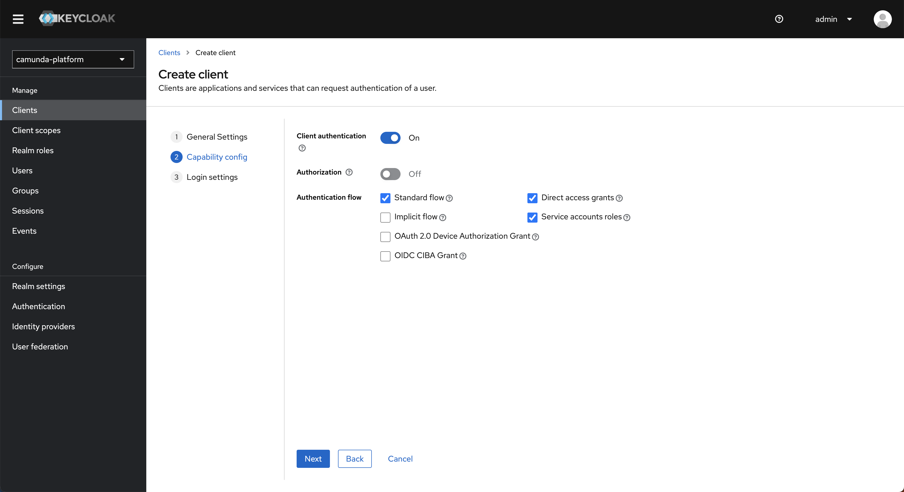
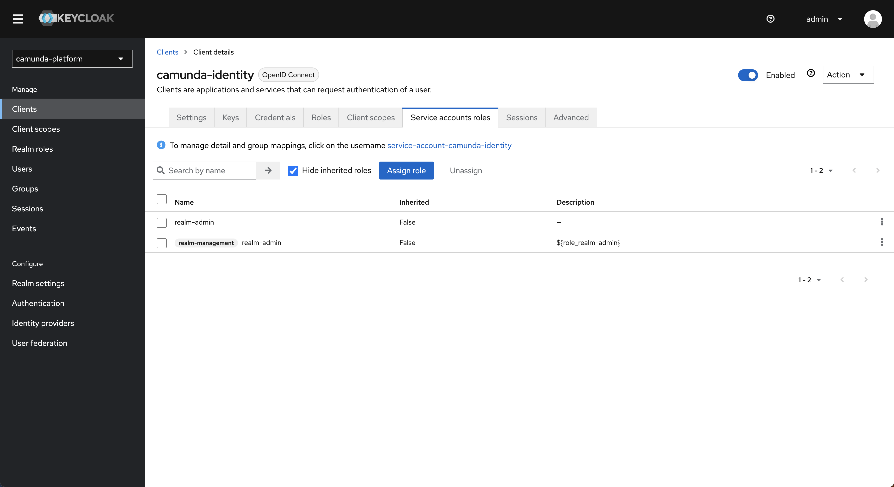
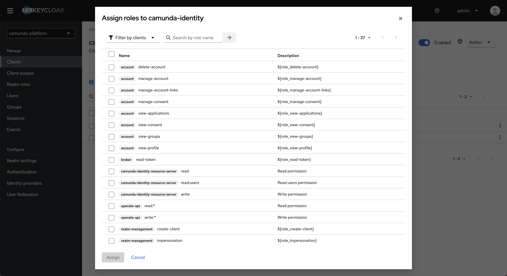

import Tabs from "@theme/Tabs";
import TabItem from "@theme/TabItem";

In this guide, we'll demonstrate how to connect Identity to your existing Keycloak instance.

## Prerequisites

- Access to your [Keycloak Admin Console](https://www.keycloak.org/docs/latest/server_admin/#using-the-admin-console)
- A basic understanding of [administering realms and clients](https://www.keycloak.org/docs/latest/server_admin/#assembly-managing-clients_server_administration_guide) in Keycloak

:::note
Clients in Camunda 8 SaaS and applications in Camunda 8 Self-Managed provide a similar purpose. One key difference is that for Camunda 8 SaaS, you can set up specific [client connection credentials](/guides/setup-client-connection-credentials.md), whereas in Identity, an application is created with credentials automatically assigned.
:::

## Steps

:::caution Keycloak URLs
As of the 8.5.3 release, Identity uses the Keycloak frontend URL instead of the backend URL. This change may affect you if you have blocked the Keycloak frontend URL from other services (including Camunda applications), and can potentially impact Identity's functionality.

To avoid connectivity issues, ensure your Keycloak frontend URL is accessible by adjusting your network, firewall, or security settings as needed. This adjustment is crucial to maintain the integration with Keycloak and ensure compatibility.
:::

To connect Identity to an existing Keycloak instance, take the following steps for your Camunda installation:

<Tabs groupId="install" defaultValue="non-helm" queryString values={
[
{label: 'Non-Helm installations', value: 'non-helm' },
{label: 'Helm installations', value: 'helm' },
]}>

<TabItem value='non-helm'>

1. Log in to your Keycloak Admin Console.
2. Select the realm you would like to connect Identity to. In our example, this is **camunda-platform**.
   
3. Select **Clients** in the navigation menu, and click the **Create** button to create a new client.
4. Enter a client ID and click **Next**.
   :::note What client ID should I use?
   By default, Identity uses the Client ID `camunda-identity`, so we recommend using this too. If you choose a different client ID, this will need to be set in the Identity application [environment variables](/self-managed/identity/deployment/configuration-variables.md).
   :::
   
5. Toggle **Client authentication** to `on`, select **Service accounts roles** and click **Next**.
   
6. Enter the URL of where your Identity instance will be hosted in the **Root URL** field and click **Save** to create the client.
   
7. On the page for the created client navigate to the **Service account roles** tab in the top navigation.
   
8. Click **Assign role** and change the filter to `Filter by clients`.
   
9. Select the `manage-clients`, `manage-realm`, and `manage-users` role from the list and click **Assign**.
   :::note Why does Identity need these roles?
   Identity is designed to allow users to manage the various entities related to Camunda. To achieve this, it requires specific access to the realm.
   :::
10. Navigate to the **Credentials** tab and copy the client secret.
11. Set the `IDENTITY_CLIENT_SECRET` [environment variable](/self-managed/identity/deployment/configuration-variables.md) with the value from **Step 9**.
12. Set the `KEYCLOAK_REALM` [environment variable](/self-managed/identity/deployment/configuration-variables.md) to the realm you selected in **Step 2**.
    :::tip
    If you are using a specific realm, you need to set additional variables to use the intended realm.
    See the [environment variables](/self-managed/identity/deployment/configuration-variables.md) page for details of Keycloak-specific variables to consider.
    :::
13. Start Identity.

</TabItem>
<TabItem value="helm">

1. Log in to your Keycloak Admin Console.
2. Verify the name of the realm you would like to connect Identity to. In our example, this is **camunda-platform**.
   
3. Set the `KEYCLOAK_REALM` [environment variable](/self-managed/identity/deployment/configuration-variables.md) to the realm you selected in **Step 2**.
4. Start Identity.

</TabItem>
</Tabs>

:::note What does Identity create when starting?
Identity creates a base set of configurations required to function successfully. To understand more about what is created and why, see [the starting configuration](/self-managed/identity/deployment/starting-configuration.md).
:::

## Considerations

When connecting Identity to a shared realm, accurately determining what clients should and should not be displayed in the Identity UI is not possible. Therefore, the clients in the realm you connect Identity to will be shown in the Identity UI and can
have their secrets viewed and updated. Users with access to Identity should be considered as having administrator-level access to the system.
