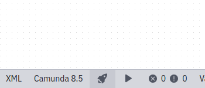
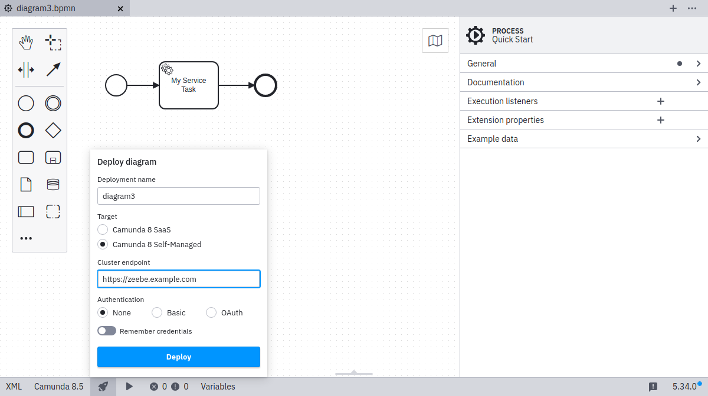
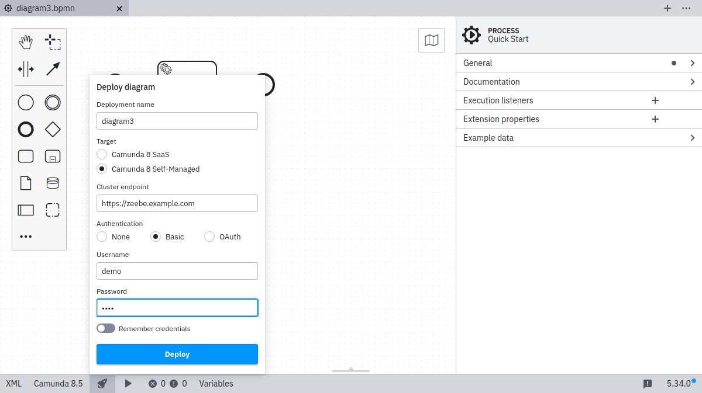
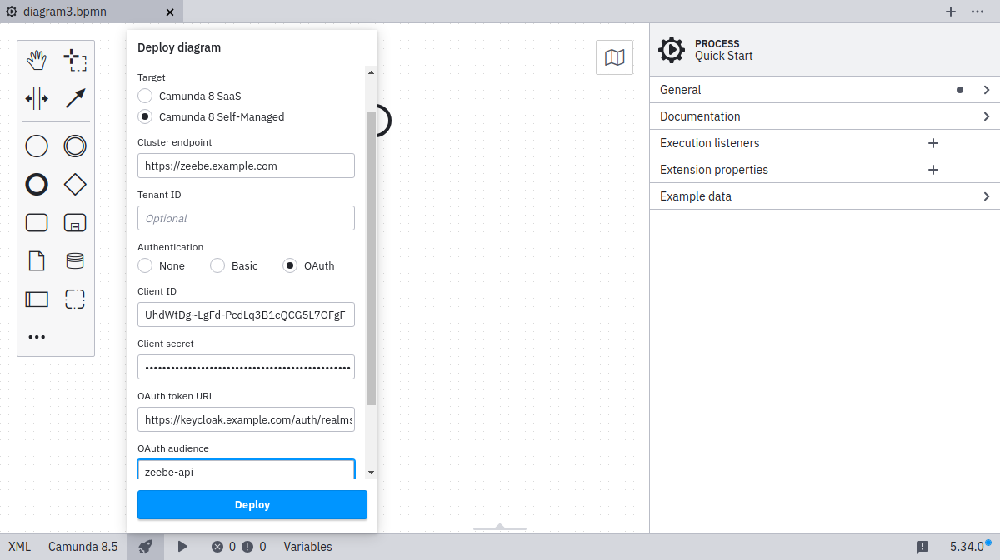
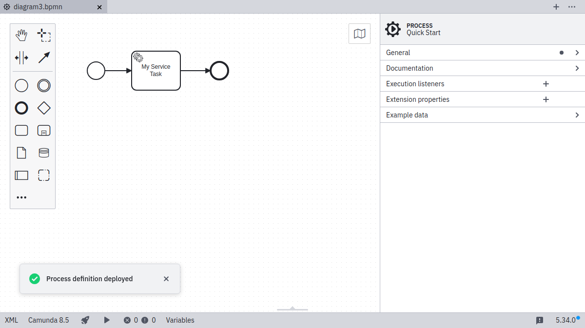

import Tabs from "@theme/Tabs";
import TabItem from "@theme/TabItem";

Desktop Modeler can directly deploy diagrams and start process instances in Camunda 8 Self-Managed. Follow the steps below to deploy a diagram:

1. Click the rocket-shaped deployment icon:

   

2. Click **Camunda 8 Self-Managed**:

   

3. Input the `Cluster endpoint`:

   :::note
   You can connect to Camunda 8 both securely and insecurely through the `https` and `http` protocols.

   Secured connections to a remote endpoint will only be established if the remote server certificate is trusted by the app. Ensure that signing trusted roots and intermediate certificates [are known to the app](/components/modeler/desktop-modeler/flags/flags.md#zeebe-ssl-certificate).
   :::

   :::caution

   Multi-tenancy is only available with authentication enabled [through Identity](/self-managed/identity/what-is-identity.md), and [enabled in all required components](/self-managed/concepts/multi-tenancy.md).

   :::

   

4. Select your authentication method, and input the required credentials:

   <Tabs groupId="auth" defaultValue="basic" queryString values={
   [
   {label: 'Basic', value: 'basic' },
   {label: 'OAuth', value: 'oauth' }
   ]}>

   <TabItem value='basic'>

   For **basic authentication**, input your username and password:

   

   </TabItem>

   <TabItem value='oauth'>

   For **OAuth**, input the credentials for your OAuth provider. These are configured as part of the default [Helm installation](/self-managed/setup/install.md) and can be discovered in [Identity](/self-managed/identity/what-is-identity.md), or are set by Zeebe [environment variables](/self-managed/zeebe-deployment/security/client-authorization.md#environment-variables).

   

   | Name            | Description                          | Example value                                                                             |
   | --------------- | ------------------------------------ | ----------------------------------------------------------------------------------------- |
   | Client ID       | The name of your Zeebe client.       | `zeebe`                                                                                   |
   | Client secret   | The password of your Zeebe client.   | `zecret`                                                                                  |
   | OAuth token url | The full path to the token endpoint. | `https://<keycloak base url>/auth/realms/camunda-platform/protocol/openid-connect/token`. |
   | OAuth audience  | The permission name for Zeebe.       | `zeebe-api`                                                                               |

   </TabItem>
   </Tabs>

5. Select the **Remember** checkbox if you want to locally store the connection information.

6. Click **Deploy** to perform the deployment.

