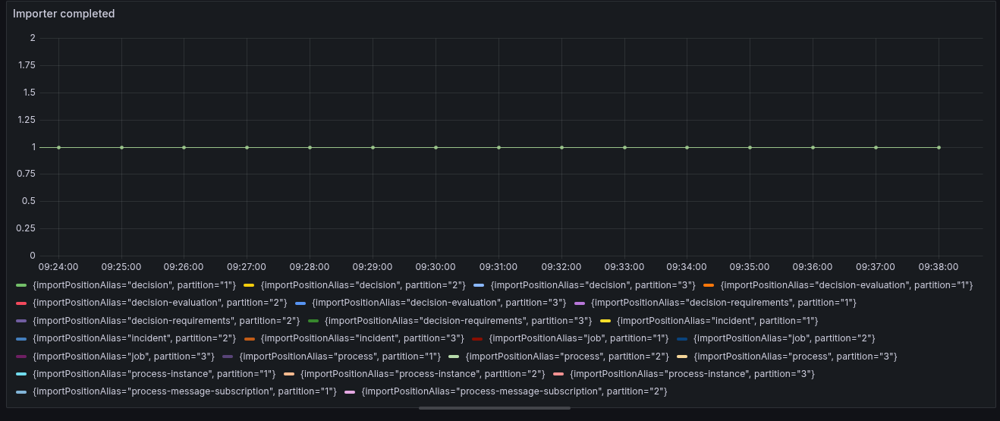

import Tabs from "@theme/Tabs";
import TabItem from "@theme/TabItem";

Review component-level actions that may be required when upgrading a Camunda 8 Self-Managed deployment from 8.7.x to 8.8.x.

## About

Use this page with the deployment upgrade guide for your environment. Start with the [Upgrade Camunda 8 overview](/self-managed/upgrade/index.md), then apply any component-specific steps that match your setup.

## Single Elasticsearch/OpenSearch instance

Using more than one isolated Elasticsearch/OpenSearch instance for exported Zeebe, Operate, and Tasklist data is no longer supported in Camunda 8.8.

If your environment uses multiple Elasticsearch/OpenSearch instances, you must manually migrate all data into a single Elasticsearch/OpenSearch cluster before upgrading to Camunda 8.8.

The migration must include:

- Zeebe indices
- Operate indices
- Tasklist indices
- Index templates
- Aliases
- ILM or ISM policies

:::important
This step must be completed before all other migration steps.
:::

## Update any custom prefixes

Camunda 8.8 introduces a harmonized index schema that uses a single common index prefix.

If your installation uses custom index prefixes, you must migrate all existing indices to a common prefix before upgrading. This ensures the Camunda Exporter, REST API, and other consumers are configured correctly.

### Prefix migration

:::warning
Prefix migration modifies the secondary storage in preparation for the Camunda 8.8 upgrade. These changes are irreversible.

Before you proceed:

- Create a full backup of your Elasticsearch/OpenSearch cluster.
- Schedule downtime.
- Ensure no access to Camunda indices during migration.

**Do not restart the cluster on Camunda 8.7 after this migration.**
:::

Complete the following steps:

1. Shut down your Camunda 8.7 cluster (for example, scale all components to zero replicas).
1. From the `camunda/bin` directory, run the `prefix-migration` script.
   - Make sure your configuration in `camunda/config` reflects the existing custom prefixes.
   - Expose the configuration to the script (for example, using `SPRING_CONFIG_ADDITIONALLOCATION=/path/to/application.yaml ./camunda/bin/prefix-migration`).
   - Alternatively, set the configuration using environment variables.

#### Prefix migration example

<Tabs groupId="prefix-db" defaultValue="elasticsearch" values={
[
{ label: 'Elasticsearch', value: 'elasticsearch', },
{ label: 'OpenSearch', value: 'opensearch', },
] }>
<TabItem value="elasticsearch">

Environment variables:

```shell
export CAMUNDA_OPERATE_ELASTICSEARCH_INDEX_PREFIX=old-operate-prefix ;\
export CAMUNDA_TASKLIST_ELASTICSEARCH_INDEX_PREFIX=old-tasklist-prefix ;\
export CAMUNDA_DATA_SECONDARYSTORAGE_ELASTICSEARCH_INDEXPREFIX=some-new-prefix ;\
export CAMUNDA_DATA_SECONDARYSTORAGE_ELASTICSEARCH_URL=http://localhost:9200 ;\
export CAMUNDA_DATA_SECONDARYSTORAGE_TYPE=elasticsearch ;\
./bin/prefix-migration
```

`application.yaml`:

```yaml
camunda:
  tasklist:
    elasticsearch-index-prefix: old-tasklist-prefix
  operate:
    elasticsearch-index-prefix: old-operate-prefix
  data:
    secondary-storage:
      type: elasticsearch
      elasticsearch:
        url: http://localhost:9200
        index-prefix: some-new-prefix
```

</TabItem>
<TabItem value="opensearch">

Environment variables:

```shell
export CAMUNDA_OPERATE_OPENSEARCH_INDEX_PREFIX=old-operate-prefix ;\
export CAMUNDA_TASKLIST_OPENSEARCH_INDEX_PREFIX=old-tasklist-prefix ;\
export CAMUNDA_DATA_SECONDARYSTORAGE_OPENSEARCH_INDEXPREFIX=some-new-prefix ;\
export CAMUNDA_DATA_SECONDARYSTORAGE_OPENSEARCH_URL=http://localhost:9200 ;\
export CAMUNDA_DATA_SECONDARYSTORAGE_TYPE=opensearch ;\
./bin/prefix-migration
```

`application.yaml`:

```yaml
camunda:
  tasklist:
    opensearch-index-prefix: old-tasklist-prefix
  operate:
    opensearch-index-prefix: old-operate-prefix
  data:
    secondary-storage:
      type: opensearch
      opensearch:
        url: http://localhost:9200
        index-prefix: some-new-prefix
```

</TabItem>

</Tabs>

If only Tasklist or Operate uses a custom prefix, set the prefix only for the affected component.

After prefix migration completes, update your configuration before upgrading to Camunda 8.8.

For example, if the new prefix is `some-new-prefix`:

```bash
CAMUNDA_DATA_SECONDARYSTORAGE_ELASTICSEARCH_INDEXPREFIX=some-new-prefix
ZEEBE_BROKER_EXPORTERS_CAMUNDA_ARGS_CONNECT_INDEXPREFIX=some-new-prefix
```

Once complete, the secondary storage is ready for the Camunda 8.8 upgrade.

## Camunda Orchestration Cluster Identity data migration

Camunda 8.8 introduces [Orchestration Cluster Identity](/self-managed/components/orchestration-cluster/identity/overview.md) as a dedicated identity component. Existing identity data stored in [Management Identity](/self-managed/components/management-identity/overview.md) must be migrated to ensure continued access to users, roles, groups, tenants, and authorizations.

For an overview of the architectural change, see [Identity and management changes in 8.8](../../../reference/announcements-release-notes/880/whats-new-in-88.md#identity-and-management-identity).

To support this transition, Camunda provides an Identity Migration Application that migrates identity data from Management Identity to Orchestration Cluster Identity.

:::warning RBA migration impact
If you use Resource-Based Authorization (RBA) and have users assigned to roles with `zeebe-api:write` permissions (including the default Zeebe role), users may receive wildcard permissions after migration.

While a user remains a member of such a role, access in Tasklist and Operate will not be restricted to specific resources.
:::

### Run the Identity Migration Application

You can run the migration application:

- [Locally (for manual setups)](/self-managed/deployment/manual/install.md)
- From a Docker container
- As a Kubernetes Job in Helm-based deployments

The migration is idempotent and can be safely re-run.

#### Run the migration natively

<Tabs groupId="os" defaultValue="maclinux" values={[
{ label: 'Mac OS + Linux', value: 'maclinux' },
{ label: 'Windows', value: 'windows' }
]}>

<TabItem value="maclinux">

```bash
./bin/identity-migration
```

</TabItem>

<TabItem value="windows">

```bash
./bin/identity-migration.bat
```

</TabItem>

</Tabs>

#### Run the migration using Docker

Override the default entrypoint of the official Camunda image:

```bash
docker run --entrypoint /usr/local/camunda/bin/identity-migration camunda/camunda:8.8.0
```

#### Helm chart deployments

In Helm-based deployments, the Identity Migration Application runs as a Kubernetes Job, independent of other migration processes.

Key characteristics:

- Idempotent execution
- Runs separately from data migration
- Produces detailed logs
- Migration resources can be removed after successful completion

The migration requires a dedicated Keycloak client with read-only access to your Identity Resource Server. When you enable Identity migration, the Helm chart automatically configures the required migration client. You can remove this client after migration is complete.

### Monitor migration completion

Verify successful completion by checking for the following log entries:

```text
INFO io.camunda.migration.identity.handler.sm.AuthorizationMigrationHandler - Authorization migration complete: Created {num} out of {num} authorizations. Skipped {num} as they already exist.
INFO io.camunda.migration.identity.handler.sm.ClientMigrationHandler - Client authorization migration complete: Created {num} out of {num} authorizations. Skipped {num} as they already exist.
INFO io.camunda.migration.identity.handler.sm.MappingRuleMigrationHandler - Mapping rule migration completed: Created {num} out of {num} mapping rules, the remaining existed already. Assigned {num} roles out of {num} attempted, the remaining were already assigned. Assigned  tenants out of {num} attempted, the remaining were already assigned.
INFO io.camunda.migration.identity.handler.sm.RoleMigrationHandler - Role Migration completed: Created {num} roles out of {num} total roles.
INFO io.camunda.migration.identity.handler.sm.TenantMigrationHandler - Tenant migration completed: Created {num} out of {num} tenants, the remaining existed already.
INFO io.camunda.migration.identity.handler.sm.UserRoleMigrationHandler - Tenant migration completed: User Role membership migration completed: Assigned {num} roles out of {num} roles.
```

### Configure the Identity Migration Application

The migration application supports two source setups:

- **Management Identity with Keycloak (default in 8.7)**
- **Management Identity with OIDC**

Configuration can be provided using:

- `application.yaml`
- Environment variables

The default configuration file locations are:

- `./config/application.yaml` (native)
- `/usr/local/camunda/config/application.yaml` (Docker)

#### Common configuration for the Identity Migration Application

The migration application must:

- Join the Orchestration Cluster to create Identity Access Management records
- Access the Management Identity API with read permissions

<Tabs>
  <TabItem value="env" label="Environment variables" default>

| Environment variable                                             | Description                                                                                                                                                                      | Required value                                                                                                                                                                                                                                                                                 |
| ---------------------------------------------------------------- | -------------------------------------------------------------------------------------------------------------------------------------------------------------------------------- | ---------------------------------------------------------------------------------------------------------------------------------------------------------------------------------------------------------------------------------------------------------------------------------------------- |
| `CAMUNDA_MIGRATION_IDENTITY_MODE`                                | Mode of the migration app.                                                                                                                                                       | In case of the [Camunda Identity 8.7 default (Keycloak)](/self-managed/upgrade/components/870-to-880.md) setup: `KEYCLOAK`. <br></br> In case of the [Camunda Identity 8.7 with OIDC](/self-managed/components/management-identity/configuration/connect-to-an-oidc-provider.md) setup: `OIDC` |
| `CAMUNDA_MIGRATION_IDENTITY_RESOURCEAUTHORIZATIONSENABLED`       | Signals whether [Resource Authorizations](../../../../version-8.7/self-managed/identity/access-management/resource-authorizations.md) were used in the 8.7, defaults to `false`. | Must be `true` in case [Resource Authorizations](../../../../version-8.7/self-managed/identity/access-management/resource-authorizations.md) were used.                                                                                                                                        |
| `CAMUNDA_MIGRATION_IDENTITY_CLUSTER_CLUSTERNAME`                 | Name of the Orchestration cluster.                                                                                                                                               | Same value as used on the cluster for [`ZEEBE_BROKER_CLUSTER_CLUSTERNAME`](../../components//orchestration-cluster/zeebe/configuration/broker.md#zeebebrokercluster)                                                                                                                           |
| `CAMUNDA_MIGRATION_IDENTITY_CLUSTER_CLUSTERSIZE`                 | Size of the Orchestration cluster.                                                                                                                                               | Same value as used on the cluster for [`ZEEBE_BROKER_CLUSTER_CLUSTERSIZE`](../../components//orchestration-cluster/zeebe/configuration/broker.md#zeebebrokercluster)                                                                                                                           |
| `CAMUNDA_MIGRATION_IDENTITY_CLUSTER_PARTITIONSCOUNT`             | Partition count of the Orchestration cluster.                                                                                                                                    | Same value as used on the cluster for [`ZEEBE_BROKER_CLUSTER_PARTITIONSCOUNT`](../../components//orchestration-cluster/zeebe/configuration/broker.md#zeebebrokercluster)                                                                                                                       |
| `CAMUNDA_MIGRATION_IDENTITY_CLUSTER_REPLICATIONFACTOR`           | Replication factor of the Orchestration cluster.                                                                                                                                 | Same value as used on the cluster for [`ZEEBE_BROKER_CLUSTER_REPLICATIONFACTOR`](../../components//orchestration-cluster/zeebe/configuration/broker.md#zeebebrokercluster)                                                                                                                     |
| `CAMUNDA_MIGRATION_IDENTITY_CLUSTER_INITIALCONTACTPOINTS`        | List of known cluster hosts within the Orchestration cluster.                                                                                                                    | Same value as used on the cluster for [`ZEEBE_BROKER_CLUSTER_INITIALCONTACTPOINTS`](../../components//orchestration-cluster/zeebe/configuration/broker.md#zeebebrokercluster)                                                                                                                  |
| `CAMUNDA_MIGRATION_IDENTITY_MANAGEMENTIDENTITY_AUDIENCE`         | The audience for accessing the [Management Identity](/self-managed/upgrade/components/870-to-880.md) API                                                                         | In case of a default Keycloak setup, it is `camunda-identity-resource-server`, in case of [OIDC, it is user defined](../../components/management-identity/configuration/connect-to-an-oidc-provider.md).                                                                                       |
| `CAMUNDA_MIGRATION_IDENTITY_MANAGEMENTIDENTITY_BASEURL`          | The URL under which [Management Identity](/self-managed/upgrade/components/870-to-880.md) can be accessed by the Identity Migration Application                                  | Must be a valid absolute URL to the [Management Identity](/self-managed/upgrade/components/870-to-880.md) server, e.g. `http://management-identity:8080`.                                                                                                                                      |
| `CAMUNDA_MIGRATION_IDENTITY_MANAGEMENTIDENTITY_CLIENTID`         | The client id for accessing [Management Identity](/self-managed/upgrade/components/870-to-880.md).                                                                               | The clientId set requires to have the `read` permission granted for the `Camunda Identity Resource Server` API in [Management Identity](../../components/management-identity/access-management/access-management-overview.md#permissions)                                                      |
| `CAMUNDA_MIGRATION_IDENTITY_MANAGEMENTIDENTITY_CLIENTSECRET`     | The client secret for accessing [Management Identity](/self-managed/upgrade/components/870-to-880.md).                                                                           | Matching secret for configured clientId.                                                                                                                                                                                                                                                       |
| `CAMUNDA_MIGRATION_IDENTITY_MANAGEMENTIDENTITY_ISSUERBACKENDURL` | The URL under which the Token Issuer can be accessed.                                                                                                                            | Use the same as used by Management Identity for [`CAMUNDA_IDENTITY_ISSUER_BACKEND_URL`](../../components/management-identity/configuration/connect-to-an-oidc-provider.md#configuration).                                                                                                      |

  </TabItem>
  <TabItem value="application.yaml" label="application.yaml">

| Application.yaml property                                           | Description                                                                                                                                                                      | Required value                                                                                                                                                                                                                                                                                 |
| ------------------------------------------------------------------- | -------------------------------------------------------------------------------------------------------------------------------------------------------------------------------- | ---------------------------------------------------------------------------------------------------------------------------------------------------------------------------------------------------------------------------------------------------------------------------------------------- |
| `camunda.migration.identity.mode`                                   | Mode of the migration app.                                                                                                                                                       | In case of the [Camunda Identity 8.7 default (Keycloak)](/self-managed/upgrade/components/870-to-880.md) setup: `KEYCLOAK`. <br></br> In case of the [Camunda Identity 8.7 with OIDC](/self-managed/components/management-identity/configuration/connect-to-an-oidc-provider.md) setup: `OIDC` |
| `camunda.migration.identity.resource-authorizations-enabled`        | Signals whether [Resource Authorizations](../../../../version-8.7/self-managed/identity/access-management/resource-authorizations.md) were used in the 8.7, defaults to `false`. | Must be `true` in case [Resource Authorizations](../../../../version-8.7/self-managed/identity/access-management/resource-authorizations.md) were used.                                                                                                                                        |
| `camunda.migration.identity.cluster.cluster-name`                   | Name of the Orchestration cluster.                                                                                                                                               | Same value as used on the cluster for [`zeebe.broker.cluster.cluster-name`](../../components//orchestration-cluster/zeebe/configuration/broker.md#zeebebrokercluster)                                                                                                                          |
| `camunda.migration.identity.cluster.cluster-size`                   | Size of the Orchestration cluster.                                                                                                                                               | Same value as used on the cluster for [`zeebe.broker.cluster.cluster-size`](../../components//orchestration-cluster/zeebe/configuration/broker.md#zeebebrokercluster)                                                                                                                          |
| `camunda.migration.identity.cluster.partitions-count`               | Partition count of the Orchestration cluster.                                                                                                                                    | Same value as used on the cluster for [`zeebe.broker.cluster.partitions-count`](../../components//orchestration-cluster/zeebe/configuration/broker.md#zeebebrokercluster)                                                                                                                      |
| `camunda.migration.identity.cluster.replication-factor`             | Replication factor of the Orchestration cluster.                                                                                                                                 | Same value as used on the cluster for [`zeebe.broker.cluster.replication-factor`](../../components//orchestration-cluster/zeebe/configuration/broker.md#zeebebrokercluster)                                                                                                                    |
| `camunda.migration.identity.cluster.initial-contact-points`         | List of known cluster hosts within the Orchestration cluster.                                                                                                                    | Same value as used on the cluster for [`zeebe.broker.cluster.initial-contact-points`](../../components//orchestration-cluster/zeebe/configuration/broker.md#zeebebrokercluster)                                                                                                                |
| `camunda.migration.identity.management-identity.audience`           | The audience for accessing the [Management Identity](/self-managed/upgrade/components/870-to-880.md) API                                                                         | In case of a default Keycloak setup, it is `camunda-identity-resource-server`, in case of [OIDC, it is user defined](../../components/management-identity/configuration/connect-to-an-oidc-provider.md).                                                                                       |
| `camunda.migration.identity.management-identity.base-url`           | The URL under which [Management Identity](/self-managed/upgrade/components/870-to-880.md) can be accessed by the Identity Migration Application                                  | Must be a valid absolute URL to the [Management Identity](/self-managed/upgrade/components/870-to-880.md) server, e.g. `http://management-identity:8080`.                                                                                                                                      |
| `camunda.migration.identity.management-identity.client-id`          | The client id for accessing [Management Identity](/self-managed/upgrade/components/870-to-880.md).                                                                               | The clientId set requires to have the `read` permission granted for the `Camunda Identity Resource Server` API in [Management Identity](../../components/management-identity/access-management/access-management-overview.md#permissions)                                                      |
| `camunda.migration.identity.management-identity.client-secret`      | The client secret for accessing [Management Identity](/self-managed/upgrade/components/870-to-880.md).                                                                           | Matching secret for configured clientId.                                                                                                                                                                                                                                                       |
| `camunda.migration.identity.management-identity.issuer-backend-url` | The URL under which the Token Issuer can be accessed.                                                                                                                            | Use the same as used by Management Identity for [`CAMUNDA_IDENTITY_ISSUER_BACKEND_URL`](../../components/management-identity/configuration/connect-to-an-oidc-provider.md#configuration).                                                                                                      |

  </TabItem>

</Tabs>

### Entity ID conversion rules

During migration, entity IDs are transformed to meet Orchestration Cluster validation rules:

- Converted to lowercase
- Characters outside `[a-z0-9_@.-]` replaced with `_`

You can customize this behavior using the provided configuration options.

<Tabs>
  <TabItem value="env" label="Environment variables" default>

| Environment variable                                        | Description                                                                                                                                                                                                                                                                                                                                                                                    | Default value   |
| ----------------------------------------------------------- | ---------------------------------------------------------------------------------------------------------------------------------------------------------------------------------------------------------------------------------------------------------------------------------------------------------------------------------------------------------------------------------------------- | --------------- |
| `CAMUNDA_MIGRATION_IDENTITY_ENTITIES_DEFAULT_LOWERCASE`     | If true, the IDs of ROLES, GROUPS, MAPPING RULES and USERS will be lowercased. Specific entities configuration have precedence.                                                                                                                                                                                                                                                                | `true`          |
| `CAMUNDA_MIGRATION_IDENTITY_ENTITIES_DEFAULT_PATTERN`       | Configure the regex character class that identifies characters to be replaced with an underscore (`_`) during entities migration. Specific entities configuration have precedence. This pattern must not be more permissive then the [Orchestration Cluster's ID validation pattern](/self-managed/components/orchestration-cluster/core-settings/configuration/properties.md#camundasecurity) | `[^a-z0-9_@.-]` |
| `CAMUNDA_MIGRATION_IDENTITY_ENTITIES_ROLE_LOWERCASE`        | If true, the IDs of ROLES will be lowercased, it has precedence against the default property.                                                                                                                                                                                                                                                                                                  |                 |
| `CAMUNDA_MIGRATION_IDENTITY_ENTITIES_ROLE_PATTERN`          | Configure the regex character class that identifies characters to be replaced with an underscore (`_`) in ROLE IDs. This takes precedence over the default property. This pattern must not be more permissive then the [Orchestration Cluster's ID validation pattern](/self-managed/components/orchestration-cluster/core-settings/configuration/properties.md#camundasecurity)               |                 |
| `CAMUNDA_MIGRATION_IDENTITY_ENTITIES_GROUP_LOWERCASE`       | If true, the IDs of GROUPS will be lowercased, it has precedence against the default property.                                                                                                                                                                                                                                                                                                 |                 |
| `CAMUNDA_MIGRATION_IDENTITY_ENTITIES_GROUP_PATTERN`         | Configure the regex character class that identifies characters to be replaced with an underscore (`_`) in GROUP IDs. This takes precedence over the default property. This pattern must not be more permissive then the [Orchestration Cluster's ID validation pattern](/self-managed/components/orchestration-cluster/core-settings/configuration/properties.md#camundasecurity)              |                 |
| `CAMUNDA_MIGRATION_IDENTITY_ENTITIES_USER_LOWERCASE`        | If true, the IDs of USERS will be lowercased, it has precedence against the default property.                                                                                                                                                                                                                                                                                                  |                 |
| `CAMUNDA_MIGRATION_IDENTITY_ENTITIES_USER_PATTERN`          | Configure the regex character class that identifies characters to be replaced with an underscore (`_`) in USER IDs. This takes precedence over the default property. This pattern must not be more permissive then the [Orchestration Cluster's ID validation pattern](/self-managed/components/orchestration-cluster/core-settings/configuration/properties.md#camundasecurity)               |                 |
| `CAMUNDA_MIGRATION_IDENTITY_ENTITIES_MAPPINGRULE_LOWERCASE` | If true, the IDs of MAPPING RULES will be lowercased, it has precedence against the default property.                                                                                                                                                                                                                                                                                          |                 |
| `CAMUNDA_MIGRATION_IDENTITY_ENTITIES_MAPPINGRULE_PATTERN`   | Configure the regex character class that identifies characters to be replaced with an underscore (`_`) in MAPPING RULE IDs. This takes precedence over the default property. This pattern must not be more permissive then the [Orchestration Cluster's ID validation pattern](/self-managed/components/orchestration-cluster/core-settings/configuration/properties.md#camundasecurity)       |                 |

  </TabItem>
  <TabItem value="application.yaml" label="application.yaml">

| Environment variable                                         | Description                                                                                                                                                                                                                                                                                                                                                                                    | Default value   |
| ------------------------------------------------------------ | ---------------------------------------------------------------------------------------------------------------------------------------------------------------------------------------------------------------------------------------------------------------------------------------------------------------------------------------------------------------------------------------------- | --------------- |
| `camunda.migration.identity.entities.defaults.lowercase`     | If true, the IDs of ROLES, GROUPS, MAPPING RULES and USERS will be lowercased. Specific entities configuration have precedence.                                                                                                                                                                                                                                                                | `true`          |
| `camunda.migration.identity.entities.defaults.pattern`       | Configure the regex character class that identifies characters to be replaced with an underscore (`_`) during entities migration. Specific entities configuration have precedence. This pattern must not be more permissive then the [Orchestration Cluster's ID validation pattern](/self-managed/components/orchestration-cluster/core-settings/configuration/properties.md#camundasecurity) | `[^a-z0-9_@.-]` |
| `camunda.migration.identity.entities.role.lowercase`         | If true, the IDs of ROLES will be lowercased, it has precedence against the default property.                                                                                                                                                                                                                                                                                                  |                 |
| `camunda.migration.identity.entities.role.pattern`           | Configure the regex character class that identifies characters to be replaced with an underscore (`_`) in ROLE IDs. This takes precedence over the default property. This pattern must not be more permissive then the [Orchestration Cluster's ID validation pattern](/self-managed/components/orchestration-cluster/core-settings/configuration/properties.md#camundasecurity)               |                 |
| `camunda.migration.identity.entities.group.lowercase`        | If true, the IDs of GROUPS will be lowercased, it has precedence against the default property.                                                                                                                                                                                                                                                                                                 |                 |
| `camunda.migration.identity.entities.group.pattern`          | Configure the regex character class that identifies characters to be replaced with an underscore (`_`) in GROUP IDs. This takes precedence over the default property. This pattern must not be more permissive then the [Orchestration Cluster's ID validation pattern](/self-managed/components/orchestration-cluster/core-settings/configuration/properties.md#camundasecurity)              |                 |
| `camunda.migration.identity.entities.user.lowercase`         | If true, the IDs of USERS will be lowercased, it has precedence against the default property.                                                                                                                                                                                                                                                                                                  |                 |
| `camunda.migration.identity.entities.user.pattern`           | Configure the regex character class that identifies characters to be replaced with an underscore (`_`) in USER IDs. This takes precedence over the default property. This pattern must not be more permissive then the [Orchestration Cluster's ID validation pattern](/self-managed/components/orchestration-cluster/core-settings/configuration/properties.md#camundasecurity)               |                 |
| `camunda.migration.identity.entities.mapping-rule.lowercase` | If true, the IDs of MAPPING RULES will be lowercased, it has precedence against the default property.                                                                                                                                                                                                                                                                                          |                 |
| `camunda.migration.identity.entities.mapping-rule.pattern`   | Configure the regex character class that identifies characters to be replaced with an underscore (`_`) in MAPPING RULE IDs. This takes precedence over the default property. This pattern must not be more permissive then the [Orchestration Cluster's ID validation pattern](/self-managed/components/orchestration-cluster/core-settings/configuration/properties.md#camundasecurity)       |                 |

  </TabItem>
</Tabs>

## Identity authorization and permission changes

Camunda 8.8 introduces a new authorization model for Orchestration Cluster Identity. As a result, existing permissions must be reviewed to ensure continued access to APIs and web applications.

These changes apply after the upgrade, regardless of whether the Identity Migration Application is used.

### Manual migration of roles and application permissions

Permissions previously assigned through [Management Identity roles](../../../../version-8.7/self-managed/identity/access-management/manage-permissions.md#assign-a-permission-to-a-role) and [Management Identity applications](../../../../version-8.7/self-managed/identity/access-management/manage-permissions.md#assign-a-permission-to-an-application) must be recreated using [Orchestration Cluster Identity authorizations](../../../components/identity/authorization.md).

You must:

- Recreate required [roles](../../../components/identity/role.md)
- Assign equivalent authorization records
- Ensure access parity with the previous setup

The tables below map [Management Identity permissions](/self-managed/components/management-identity/access-management/access-management-overview.md) to their equivalent Orchestration Cluster authorizations.

<table>
  <tr>
    <th colspan="2">[Management Identity Permission](/self-managed/components/management-identity/access-management/access-management-overview.md)</th>
    <th colspan="3">Equivalent [Camunda Orchestration Cluster 8.8 Authorizations](../../../components/identity/authorization.md)</th>
  </tr>
  <tr>
    <th>Component</th>
    <th>Permission</th>
    <th>Resource Type</th>
    <th>Resource ID</th>
    <th>Permission(s)</th>
  </tr>
  <!-- operate-api:read -->
  <tr>
    <td rowspan="12">Operate</td>
    <td rowspan="6">read</td>
    <td>`BATCH`</td>
    <td>`*`</td>
    <td>`READ`</td>
  </tr>
    <tr>
    <td>`COMPONENT`</td>
    <td>`Operate`</td>
    <td>`ACCESS`</td>
  </tr>
  <tr>
    <td>`MESSAGE`</td>
    <td>`*`</td>
    <td>`READ`</td>
  </tr>
  <tr>
    <td>`PROCESS_DEFINITION`</td>
    <td>`*`</td>
    <td>`READ_PROCESS_DEFINITION`, `READ_PROCESS_INSTANCE`</td>
  </tr>
  <tr>
    <td>`DECISION_DEFINITION`</td>
    <td>`*`</td>
    <td>`READ_DECISION_DEFINITION`, `READ_DECISION_INSTANCE`</td>
  </tr>
  <tr>
    <td>`DECISION_REQUIREMENTS_DEFINITION`</td>
    <td>`*`</td>
    <td>`READ`</td>
  </tr>
  <!-- operate-api:write -->
  <tr>
    <td rowspan="6">write</td>
    <td>`BATCH`</td>
    <td>`*`</td>
    <td>`CREATE`, `READ`, `UPDATE`</td>
  </tr>
    <tr>
    <td>`COMPONENT`</td>
    <td>`Operate`</td>
    <td>`ACCESS`</td>
  </tr>
  <tr>
    <td>`RESOURCE`</td>
    <td>`*`</td>
    <td>`DELETE_FORM`, `DELETE_PROCESS`, `DELETE_DRD`, `DELETE_RESOURCE`</td>
  </tr>
  <tr>
    <td>`PROCESS_DEFINITION`</td>
    <td>`*`</td>
    <td>`READ_PROCESS_DEFINITION`, `READ_PROCESS_INSTANCE`, `DELETE_PROCESS_INSTANCE`, `UPDATE_PROCESS_INSTANCE`, `MODIFY_PROCESS_INSTANCE` `CANCEL_PROCESS_INSTANCE`</td>
  </tr>
  <tr>
    <td>`DECISION_DEFINITION`</td>
    <td>`*`</td>
    <td>`READ_DECISION_DEFINITION`, `READ_DECISION_INSTANCE`, `CREATE_DECISION_INSTANCE`, `DELETE_DECISION_INSTANCE`</td>
  </tr>
  <tr>
    <td>`DECISION_REQUIREMENTS_DEFINITION`</td>
    <td>`*`</td>
    <td>`READ`, `UPDATE`, `DELETE`</td>
  </tr>
  <!-- tasklist-api:read -->
  <tr>
    <td rowspan="4">Tasklist</td>
    <td rowspan="2">read</td>
    <td><code>COMPONENT</code></td>
    <td><code>Tasklist</code></td>
    <td><code>ACCESS</code></td>
  </tr>
  <tr>
    <td><code>PROCESS_DEFINITION</code></td>
    <td><code>*</code></td>
    <td><code>READ_PROCESS_DEFINITION</code>, <code>READ_USER_TASK</code></td>
  </tr>
  <!-- tasklist-api:write -->
  <tr>
    <td rowspan="2">write</td>
    <td><code>COMPONENT</code></td>
    <td><code>Tasklist</code></td>
    <td><code>ACCESS</code></td>
  </tr>
  <tr>
    <td><code>PROCESS_DEFINITION</code></td>
    <td><code>*</code></td>
    <td><code>READ_PROCESS_DEFINITION</code>, <code>READ_USER_TASK</code>, <code>UPDATE_USER_TASK</code></td>
  </tr>
  <!-- camunda-identity-resource-server:read -->
  <tr>
    <td rowspan="15">Identity</td>
    <td rowspan="6">read</td>
    <td><code>AUTHORIZATIONS</code></td>
    <td><code>*</code></td>
    <td><code>READ</code></td>
  </tr>
  <tr>
    <td><code>COMPONENT</code></td>
    <td><code>Identity</code></td>
    <td><code>ACCESS</code></td>
  </tr>
  <tr>
    <td><code>GROUP</code></td>
    <td><code>*</code></td>
    <td><code>READ</code></td>
  </tr>
  <tr>
    <td><code>ROLES</code></td>
    <td><code>*</code></td>
    <td><code>READ</code></td>
  </tr>
  <tr>
    <td><code>TENANTS</code></td>
    <td><code>*</code></td>
    <td><code>READ</code></td>
  </tr>
  <tr>
    <td><code>USERS</code></td>
    <td><code>*</code></td>
    <td><code>READ</code></td>
  </tr>
  <!-- camunda-identity-resource-server:read:users -->
  <tr>
    <td rowspan="3">read:users</td>
    <td><code>COMPONENT</code></td>
    <td><code>Identity</code></td>
    <td><code>ACCESS</code></td>
  </tr>
  <tr>
    <td><code>USERS</code></td>
    <td><code>*</code></td>
    <td><code>READ</code></td>
  </tr>
  <tr>
    <td><code>ROLES</code></td>
    <td><code>*</code></td>
    <td><code>READ</code></td>
  </tr>
  <!-- camunda-identity-resource-server:write -->
  <tr>
    <td rowspan="6">write</td>
    <td><code>AUTHORIZATIONS</code></td>
    <td><code>*</code></td>
    <td><code>CREATE</code>, <code>READ</code>, <code>UPDATE</code>, <code>DELETE</code></td>
  </tr>
  <tr>
    <td><code>COMPONENT</code></td>
    <td><code>Identity</code></td>
    <td><code>ACCESS</code></td>
  </tr>
  <tr>
    <td><code>GROUP</code></td>
    <td><code>*</code></td>
    <td><code>CREATE</code>, <code>READ</code>, <code>UPDATE</code>, <code>DELETE</code></td>
  </tr>
  <tr>
    <td><code>ROLES</code></td>
    <td><code>*</code></td>
    <td><code>CREATE</code>, <code>READ</code>, <code>UPDATE</code>, <code>DELETE</code></td>
  </tr>
  <tr>
    <td><code>TENANTS</code></td>
    <td><code>*</code></td>
    <td><code>CREATE</code>, <code>READ</code>, <code>UPDATE</code>, <code>DELETE</code></td>
  </tr>
  <tr>
    <td><code>USERS</code></td>
    <td><code>*</code></td>
    <td><code>READ</code></td>
  </tr>
</table>

### User role membership

Recreate [Management Identity role memberships](/self-managed/components/management-identity/application-user-group-role-management/manage-roles.md) using Orchestration Cluster Identity role management:

<p><a href="../../../../components/identity/role#assign-users-to-a-role" class="link-arrow">Assign users to a role</a></p>

### Groups

Recreate groups setup in the [Management Identity groups](/self-managed/components/management-identity/application-user-group-role-management/manage-groups.md) using Orchestration Cluster Identity group management:

<p><a href="../../../../components/identity/group" class="link-arrow">Group management</a></p>

Alternatively, you can use [Bring your own Groups feature](/self-managed/components/orchestration-cluster/identity/connect-external-identity-provider.md#optional-step-8-configure-bring-your-own-groups) and recreate only the required [Orchestration Cluster authorization records](../../../components/identity/authorization.md). This is the default behavior of the Identity Migration Application.

### Resource authorizations

[Management Identity resource authorizations](../../../../version-8.7/self-managed/identity/access-management/resource-authorizations.md) are replaced with a more granular [Orchestration Cluster authorization management](../../../components/identity/authorization.md).

The table below lists equivalent Orchestration Cluster authorization records for former Management Identity resource authorizations.

_(resource authorization table preserved exactly as in the original document)_

<table>
  <tr>
    <th colspan="2">[Management Identity Resource Authorizations](../../../../version-8.7/self-managed/identity/access-management/resource-authorizations.md)</th>
    <th colspan="2">Equivalent [Camunda Orchestration Cluster 8.8 Authorizations](../../../components/identity/authorization.md)</th>
  </tr>
  <tr>
    <th>Resource Type</th>
    <th>Permission</th>
    <th>Resource Type</th>
    <th>Permission(s)</th>
  </tr>
  <tr>
    <td><code>PROCESS</code></td>
    <td><code>Read</code></td>
    <td><code>PROCESS_DEFINITION</code></td>
    <td><code>READ_PROCESS_DEFINITION</code>, <code>READ_PROCESS_INSTANCE</code></td>
  </tr>
  <tr>
    <td><code>PROCESS</code></td>
    <td><code>Delete</code></td>
    <td><code>RESOURCE</code></td>
    <td><code>DELETE_PROCESS</code></td>
  </tr>
  <tr>
    <td><code>PROCESS</code></td>
    <td><code>Update process instance</code></td>
    <td><code>PROCESS_DEFINITION</code></td>
    <td><code>UPDATE_PROCESS_INSTANCE</code></td>
  </tr>
  <tr>
    <td><code>PROCESS</code></td>
    <td><code>Delete process instance</code></td>
    <td><code>PROCESS_DEFINITION</code></td>
    <td><code>DELETE_PROCESS_INSTANCE</code></td>
  </tr>
  <tr>
    <td><code>PROCESS</code></td>
    <td><code>Start process instance</code></td>
    <td><code>PROCESS_DEFINITION</code></td>
    <td><code>CREATE_PROCESS_INSTANCE</code></td>
  </tr>
  <tr>
    <td><code>DECISION</code></td>
    <td><code>Read</code></td>
    <td><code>DECISION_DEFINITION</code></td>
    <td><code>READ_DECISION_DEFINITION</code>, <code>READ_DECISION_INSTANCE</code></td>
  </tr>
  <tr>
    <td><code>DECISION</code></td>
    <td><code>Delete</code></td>
    <td><code>RESOURCE</code></td>
    <td><code>DELETE_DRD</code></td>
  </tr>
</table>

### Tenants

Recreate [Management Identity tenants](../../../../version-8.7/self-managed/identity/managing-tenants.md) using Orchestration Cluster Identity tenant management:

<p><a href="../../../../components/identity/tenant" class="link-arrow">Tenant management</a></p>

### Mapping rules

Recreate [Management Identity mapping rules](../../../../version-8.7/self-managed/identity/mapping-rules.md) using Orchestration Cluster Identity mapping rule management:

<p><a href="../../../../components/identity/mapping-rules" class="link-arrow">Mapping rule management</a></p>

### API and web application permission migration

With changes to the [authorization system](/components/concepts/access-control/authorizations.md), access control for public APIs and component web applications has changed.

After upgrading to 8.8, review and update existing user and client permissions to:

- keep access to APIs you still use (including deprecated component endpoints), and
- keep the same visibility and actions in Operate and Tasklist as before the upgrade.

#### Migrate Operate V1 endpoint permissions

If you still use Operate V1 endpoints, follow the instructions in the [public API migration guides](/apis-tools/migration-manuals/migrate-component-apis.md).

#### Migrate Operate and Tasklist access permissions

UI permissions now control what users can see and what actions they can perform. Permissions are more granular (for example, a user can be limited to a specific process).

To keep the same access and behavior as in 8.7:

- Run the [Identity Migration Application](#run-the-identity-migration-application), **or**
- Apply the [manual migration of roles and application permissions](#manual-migration-of-roles-and-application-permissions) in this guide.

:::note
The authorization concept for batch operations in Operate has changed from user-based permissions to resource permissions.

After upgrading, users cannot see batch operations (including their own) unless they have read permissions for all batch operations.
:::

For guidance on customizing access using the new model, see:

- [Operate access control](/components/operate/userguide/access-control.md)
- [Tasklist access control](/components/tasklist/userguide/access-control.md)

## Camunda Exporter and harmonized data model

Camunda 8.8 introduces the harmonized data model and the [Camunda Exporter](/self-managed/components/orchestration-cluster/zeebe/exporters/camunda-exporter.md). This exporter replaces the legacy Elasticsearch and OpenSearch exporters.

For details about the new exporter and related changes, see the [8.8 announcements](/reference/announcements-release-notes/880/880-announcements.md).

:::note
With the Camunda Exporter introduction, Camunda is compatible with Elasticsearch 8.16+ and no longer supports older Elasticsearch versions. See [supported environments](/reference/supported-environments.md).
:::

### Ensure the importer backlog is drained

To import data from 8.7, importers must first process existing data. Importers read from existing Zeebe indices, and when they detect data written by a newer version, they mark themselves as complete. The Camunda Exporter starts exporting only after the importers are complete.

:::important
Drain the importer backlog as much as possible before upgrading. If the backlog grows during the upgrade, web application data can become out of date. Zeebe may not be able to clean up data, which can increase disk usage and cause downtime.
:::

You can validate importer latency using the following Prometheus metrics:

- `operate_import_time_seconds_sum`
- `operate_import_time_seconds_count`

For example, the following query shows import latency. If the result is in a range of seconds (ideally below 10 seconds), the system is typically ready to upgrade.

```promql
sum(rate(operate_import_time_seconds_sum{namespace=~"$namespace", partition=~"$partition", pod=~"$pod"}[$__rate_interval]))
/ sum(rate(operate_import_time_seconds_count{namespace=~"$namespace", partition=~"$partition", pod=~"$pod"}[$__rate_interval]))
```

### Data migration

Camunda 8.8 provides migration applications to preserve data integrity during the upgrade.

Migration applications are located in the `camunda/bin/` directory. You can run them:

- Locally, targeting the same Elasticsearch/OpenSearch instance
- As standalone tools
- Embedded in the standalone Camunda application (using Spring profiles)
- As part of your deployment upgrade process (for example, Helm migration jobs)

Camunda also provides a `data-migration` binary that wraps all data migrations in a single application (excluding `identity-migration`).

Data migration requires a configured [secondary storage](../../components/orchestration-cluster/core-settings/configuration/properties.md##data---secondary-storage). All migrations share the same base configuration, but you can adjust each migration as needed. Prometheus metrics for migration progress are exposed at the `:9600/actuator/prometheus` endpoint.

:::note
If you are upgrading with Helm, enable data migration in the Helm upgrade guide. See [Data migration](/self-managed/upgrade/helm/870-to-880.md#data-migration) in the Helm upgrade guide.

This section describes advanced migration configuration and tuning options.
:::

For details about each migration, see the sections below.

<Tabs groupId="migrations" defaultValue="process" values={
[
{ label: 'Process migration', value: 'process', },
{ label: 'Task migration', value: 'tasklist', },
{ label: 'Metrics migration', value: 'metrics', },
] }>

<TabItem value="process">

#### Scope

Process migration unifies the previously separate `operate-process` and `tasklist-process` indices. To achieve this, it extracts Camunda Form–related data from deployments that was previously used only by Tasklist.

_Depends on the Operate importer being completed._

#### Configuration

Spring profile: `process-migration`

`application.yaml`:

```yaml
camunda:
  migration:
    process:
      # How many process definitions are processed per round
      # Default 20
      batchSize: 5
      # How long the migration waits after the importer finishes before stopping
      # Default PT1M
      importerFinishedTimeout: PT1M
      # Timeout for the migration
      # Default PT2H
      timeout: PT2H
      # Retry properties (exponential backoff)
      retry:
        # How many times to retry failing operations before stopping the migration
        maxRetries: 5
        # Minimum retry delay applied to the backoff
        # Default PT1S
        minRetryDelay: PT10S
        # Maximum retry delay applied to the backoff
        # Default PT1M
        maxRetryDelay: PT1M
```

#### Exposed metrics

- `camunda_migration_processes_migrated` – Number of migrated processes so far
- `camunda_migration_processes_rounds` – Number of migration rounds performed so far
- `camunda_migration_processes_round_time` – Time taken to complete one migration round
- `camunda_migration_processes_single_process_time` – Time taken to process a single process definition

</TabItem>

<TabItem value="tasklist">

#### Scope

This migration updates the `tasklist-task` runtime and dated indices to remove the `dynamic:true` requirement from the `tasklist-task.customHeaders` field mapping.

:::note
This migration also upgrades all `tasklist-task` indices to 8.8.0. The original runtime `tasklist-task` index (8.5.0) is retained for data safety. If cluster retention is enabled, an ILM or ISM policy is applied to this original runtime index (8.5.0) for the configured retention period (default: 30 days).
:::

_Depends on the Tasklist importer being completed._

#### Temporary side effects

Because this migration moves data between indices, temporary side effects can occur:

- Some tasks may not be visible in the Tasklist UI or returned by the Tasklist API.
- With Tasklist API v1, some tasks cannot be assigned, unassigned, or completed. These requests return `404 Not Found`.
- With Tasklist API v2, tasks can be assigned, unassigned, or completed, but attempts to retrieve them (for example, via search) may return `500 Internal Server Error`.
- Refreshing the Tasklist UI while a task is selected may return `404 Not Found` if the task is still being migrated.
- Refreshing the Tasklist UI while a task is selected may return `500 Internal Server Error` if the task was completed or reassigned via API v2 but not yet fully migrated.
- Archiving is disabled during this period.

These issues resolve automatically once migration is complete.

#### Configuration

Spring profile: `task-migration`

`application.yaml`:

```yaml
camunda:
  migration:
    tasks:
      # How many tasks are processed per round
      # Default 20
      batchSize: 20
      # Retention age for the old `tasklist-task-8.5.0` runtime index (applies only if global retention is enabled)
      # Default 30d
      legacyIndexRetentionAge: 30d
      # Retry properties (exponential backoff)
      retry:
        maxRetries: 5
        minRetryDelay: PT10S
        maxRetryDelay: PT1M
```

#### Exposed metrics

- `camunda_migration_tasks_migrated` – Number of tasks processed so far
- `camunda_migration_tasks_rounds` – Total number of task batch update rounds
- `camunda_migration_tasks_round_time` – Duration of a task batch migration
- `camunda_migration_tasks_single_task_time` – Duration to process a single task

</TabItem>

<TabItem value="metrics">

#### Scope

This migration transfers existing usage metrics from Operate and Tasklist into the new data structure of their respective indices.

It consists of two parts: Operate metrics and Tasklist usage metrics, referenced as `metrics` and `tu-metrics` in the configuration.

_Each migration depends on its corresponding importer being completed._

#### Configuration

Spring profile: `usage-metric-migration`

`application.yaml`:

```yaml
camunda:
  migration:
    metrics:
      timeout: PT2H
      retry:
        maxRetries: 5
        minRetryDelay: PT10S
        maxRetryDelay: PT1M
    tu-metrics:
      timeout: PT2H
      retry:
        maxRetries: 5
        minRetryDelay: PT10S
        maxRetryDelay: PT1M
```

#### Exposed metrics

- `camunda_migration_operate_reindex_time` – Duration to reindex the Operate metrics index
- `camunda_migration_operate_task_importer_finished` – Duration until the Operate importer finishes
- `camunda_migration_tasklist_reindex_time` – Duration to reindex the Tasklist metrics index
- `camunda_migration_tasklist_task_importer_finished` – Duration until the Tasklist importer finishes

</TabItem>

</Tabs>

### Run migrations locally

When running a migration application separately (for example, locally), provide access to its configuration.

For example:

```shell
SPRING_CONFIG_ADDITIONALLOCATION=/path/to/application.yaml ./camunda/bin/process-migration
```

### Run migrations within the standalone Camunda application

When running the standalone Camunda application, you can execute a migration within it by enabling the corresponding Spring profile.

### Monitor migration completion

In addition to the exposed Prometheus metrics, you can verify completion from logs. Example:

```text
INFO io.camunda.migration.task.TaskMigrator - Task Migration completed successfully
INFO io.camunda.migration.process.ProcessMigrator - Process Migration completed
INFO io.camunda.migration.usagemetric.OperateMetricMigrator - Reindex task {id} completed successfully
INFO io.camunda.migration.usagemetric.TasklistMetricMigrator - Reindex task {id} completed successfully
```

### Turn off importers after completion

Importers are only required until migration completes. After migration is successful, you can turn them off.

:::note
To enable importers, set the following properties in `application.yaml`:

```yaml
camunda:
  operate:
    importerEnabled: true
  tasklist:
    importerEnabled: true
```

:::

To detect whether importers are complete, check the following indices:

- `tasklist-import-position-8.2.0_`
- `operate-import-position-8.3.0_`

If all entries show `completed: true`, importing is complete.

Alternatively, validate the following metrics:

- `operate_import_completed`
- `tasklist_import_completed`

Example query:

```text
sum(tasklist_import_completed{namespace="$namespace"}) by (importPositionAlias)
```



## Orchestration Cluster REST API

### Removed deprecated OpenAPI objects

In previous releases, entity keys were transitioned from `integer (int64)` to `string` types, while deprecated `integer (int64)` keys were still supported. As of Camunda 8.8, support for `integer (int64)` keys has been removed.

If you use API objects that still rely on `integer (int64)` keys, update them to use `string` keys and the `application/json` content type header before upgrading.

For more information, see the [8.7 API key attributes overview](../../../../version-8.7/apis-tools/camunda-api-rest/camunda-api-rest-overview.md#api-key-attributes).

### Streamlined variable OpenAPI objects

The OpenAPI specification streamlines the objects used for variable filtering in search requests. The supported Camunda Java client handles these changes transparently. The affected endpoints are alpha APIs and were already marked as subject to change in earlier releases.

If you generate a custom REST client from the OpenAPI specification, note the following changes:

- `VariableValueFilterProperty` replaces:
  - `ProcessInstanceVariableFilterRequest`
  - `UserTaskVariableFilterRequest`

- For naming consistency, `UserTaskVariableFilter` replaces `VariableUserTaskFilterRequest`

## Exported records

### `USER_TASK` records

To support [user task listeners](/components/concepts/user-task-listeners.md), backward-incompatible changes were required for exported `USER_TASK` records.

#### `assignee` no longer provided in the `CREATED` event

Previously, when a user task was activated with an assignee, the following events were exported:

- `CREATING` with the `assignee` property set
- `CREATED` with the `assignee` property set

In this case, the `ASSIGNING` and `ASSIGNED` events were not exported.

Starting with 8.8, the event sequence changes:

- `CREATING` with the `assignee` property set
- `CREATED` with `assignee` set to an empty string (`""`)
- `ASSIGNING` with the `assignee` property set
- `ASSIGNED` with the `assignee` property set

#### `ASSIGNING` renamed to `CLAIMING` for the `CLAIM` operation

When claiming a user task in earlier versions, the following events were exported:

- `CLAIM`
- `ASSIGNING`
- `ASSIGNED`

To distinguish claiming from assigning, a new `CLAIMING` intent has been introduced.

Starting with 8.8, claiming a user task produces:

- `CLAIM`
- `CLAIMING`
- `ASSIGNED`

For assignment operations, the following events are still exported:

- `ASSIGN`
- `ASSIGNING`
- `ASSIGNED`

### Zeebe record types

With the introduction of the Camunda Exporter, the Elasticsearch and OpenSearch exporters no longer export all Zeebe record types by default.

The following record types continue to be exported by default:

- `DEPLOYMENT`
- `PROCESS`
- `PROCESS_INSTANCE`
- `VARIABLE`
- `USER_TASK`
- `INCIDENT`
- `JOB`

To export additional record types, configure `includeEnabledRecords` for:

- [Elasticsearch exporter](/self-managed/components/orchestration-cluster/zeebe/exporters/elasticsearch-exporter.md#configuration)
- [OpenSearch exporter](/self-managed/components/orchestration-cluster/zeebe/exporters/opensearch-exporter.md#configuration)

### Exporter deletion

Removing exporter configuration no longer deletes the exporter from the system. Instead, the exporter enters a blocked state to prevent accidental data loss caused by manual or unintended configuration changes.

To permanently remove an exporter, use the [Exporters API](/self-managed/components/orchestration-cluster/zeebe/operations/management-api.md).

## Connectors

### Email connector

Starting with Camunda 8.8, angle brackets (`<` and `>`) are no longer removed from the `messageId` field. If you rely on the previous behavior, update your connector logic accordingly.

## Logging

### Default configuration

The default logging configuration is included inline for reference. For advanced settings, see the [logging configuration documentation](/self-managed/components/orchestration-cluster/core-settings/configuration/logging.md).

### Rolling file appender

The `RollingFile` appender is disabled by default.

To enable it, set the appropriate environment variable for each component:

```bash
ZEEBE_LOG_APPENDER=RollingFile
```

Other supported component variables:

- `OPERATE_LOG_APPENDER`
- `IDENTITY_LOG_APPENDER`
- `TASKLIST_LOG_APPENDER`

Use the variable that corresponds to the component you are configuring.

### Pattern layout changes

The default log pattern has changed.

**Previous pattern:**

```perl
[%d{yyyy-MM-dd HH:mm:ss.SSS}] [%t] %notEmpty{[%X] }%-5level%n\t%logger{36} - %msg%n
```

**New pattern:**

```perl
%d{HH:mm:ss.SSS} [%t] %notEmpty{[%X] }%-5level%logger{1.1.1.*} - %msg%n
```

| Aspect              | Previous pattern    | New pattern                        |
| ------------------- | ------------------- | ---------------------------------- |
| Timestamp           | Full date and time  | Time only                          |
| Logger name         | Up to 36 characters | Package initials + full class name |
| Newline after level | Yes                 | No                                 |
| Tab before logger   | Yes                 | No                                 |

## Elasticsearch

Starting with Camunda 8.8, the default replica count for Elasticsearch and OpenSearch indices changes from `0` to `1`. This ensures that Camunda is not blocked if a node becomes temporarily unavailable.

If you already override this value, no action is required.

Throughout this section, references to Elasticsearch (ES) also apply to OpenSearch (OS).

### Single-node cluster

If the cluster has only one node, a replica count of `1` results in a yellow cluster state because replica shards cannot be assigned.

To resolve this:

- Increase the number of master-eligible nodes to at least two.
- Review the [Bitnami Elasticsearch Helm chart values](https://artifacthub.io/packages/helm/bitnami/elasticsearch/21.6.3), particularly `master.replicaCount`.

  Bitnami recommends scaling the cluster down before resizing for consistency reasons. Follow their guidance carefully.

- See [Elastic Cloud: Resize deployment](https://www.elastic.co/docs/deploy-manage/deploy/cloud-enterprise/resize-deployment).

If you installed Elasticsearch using the Camunda Helm chart, the default `master.replicaCount` is `3`. For other setups, you can apply the same logic by setting `elasticsearch.master.replicaCount`.

## Multi-node cluster

Starting with Camunda 8.8, the default replica count for Camunda indices in Elasticsearch and OpenSearch is `1`. If your cluster previously used a replica count of `0`, disk usage will roughly double.

To ensure the cluster can reach a green status, provision disk capacity of at least 2.5x the previously used storage. This accounts for shard watermarks, operational overhead, and future growth.

For example:

- In 8.7, node disk usage is:
  - 30 GB / 50 GB
  - 35 GB / 50 GB
  - 40 GB / 50 GB

- The most used node consumes 40 GB
- To accommodate replicas, resize all disks to at least 100 GB (40 × 2.5)

### Resize Elasticsearch disk

If the current disk size cannot accommodate replicas, increase disk capacity. Whether a Persistent Volume Claim (PVC) can be expanded depends on the underlying `StorageClass`.

For Kubernetes-based deployments, see:

- [Expanding persistent volume claims](https://kubernetes.io/docs/concepts/storage/persistent-volumes/#expanding-persistent-volumes-claims)
- [Storage classes and volume expansion](https://kubernetes.io/docs/concepts/storage/storage-classes/#allow-volume-expansion)

For managed services, see:

- [Elastic Cloud: Fix master nodes out of disk](https://www.elastic.co/docs/troubleshoot/elasticsearch/fix-master-node-out-of-disk)
- [AWS OpenSearch: Modifying an EBS volume](https://docs.aws.amazon.com/ebs/latest/userguide/ebs-modify-volume.html)
  (AWS OpenSearch uses Amazon EBS for storage)

## Roll back

If you encounter issues after the upgrade and replica increase, revert the replica count to **0** and restart Zeebe.
When Zeebe restarts, it updates the index settings accordingly.

Set one of the following:

- `application.yaml`:

  ```yaml
  camunda:
    database:
      index:
        numberOfReplicas: 0
  ```

- Environment variable:

  ```bash
  CAMUNDA_DATABASE_INDEX_NUMBER_OF_REPLICAS=0
  ```

## Web Modeler

### Cluster configuration

#### Removed authentication methods

The previously deprecated authentication methods `OAUTH` and `CLIENT_CREDENTIALS` are no longer supported. If your Web Modeler installation still uses one of these methods, update the cluster configuration:

- Replace `OAUTH` with `BEARER_TOKEN` (the value was renamed).
- Replace `CLIENT_CREDENTIALS` with `BEARER_TOKEN` **if**:
  - The cluster is upgraded to 8.8, and
  - The cluster uses [OIDC authentication](/self-managed/components/orchestration-cluster/identity/connect-external-identity-provider.md), and
  - Web Modeler and the cluster use the same identity provider.

The previous requirement for the identity provider to support access tokens with multiple audiences no longer applies.
However, you must ensure the cluster accepts Web Modeler’s token audience by including it in the configured list of audiences. See [Configure the OIDC connection details](/self-managed/components/orchestration-cluster/identity/connect-external-identity-provider.md#step-4-configure-the-oidc-connection-details).

#### Changed configuration options

Available configuration options depend on the cluster version. For clusters running 8.8, additional configuration options are required.

If your existing configuration references a cluster that was upgraded from an earlier version, update it as follows:

- Change `CAMUNDA_MODELER_CLUSTERS_*_URL_ZEEBE_GRPC` to `CAMUNDA_MODELER_CLUSTERS_*_URL_GRPC`
- Change `CAMUNDA_MODELER_CLUSTERS_*_URL_ZEEBE_REST` to `CAMUNDA_MODELER_CLUSTERS_*_URL_REST`
- Add `CAMUNDA_MODELER_CLUSTERS_*_URL_WEBAPP`
- Add `CAMUNDA_MODELER_CLUSTERS_*_AUTHORIZATIONS_ENABLED`
- Remove `CAMUNDA_MODELER_CLUSTERS_*_URL_OPERATE`
- Remove `CAMUNDA_MODELER_CLUSTERS_*_URL_TASKLIST`

For more information, see [Additional configuration for cluster versions ≥ 8.8](/self-managed/components/modeler/web-modeler/configuration/configuration.md#additional-configuration-for-cluster-versions--88).
