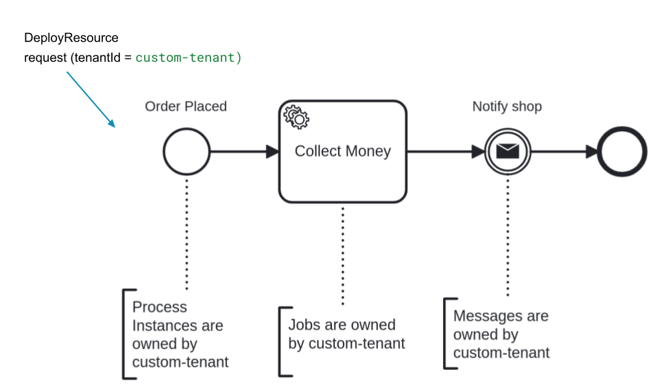

[Multi-tenancy](/reference/glossary.md#multi-tenancy) in Camunda 8 enables a single installation to serve multiple [tenants](/reference/glossary.md#tenant) such as departments, teams, or external clients, while keeping each tenant's data and processes logically isolated.

Multi-tenancy (logical tenancy) is available on both **Camunda 8 SaaS** and **Camunda 8 Self-Managed**.

The following sections explain how multi-tenancy works in Camunda 8.

## Isolation of data and processes

Each tenant's data and processes are logically isolated from others.
This ensures that one tenant's workflows, data models, and configurations do not interfere with or affect other tenants. Each tenant operates in a secure, independent space within the same Camunda 8 instance.

## Resource sharing

Multi-tenancy provides cost efficiency by allowing multiple tenants to share the same Camunda 8 installation and infrastructure. This reduces operational overhead while maintaining logical isolation between tenants.

## Efficient administration

Administrators can manage all tenants centrally using [Admin](../admin/tenant.md).
This unified management interface simplifies monitoring, configuration, and maintenance tasks across tenant environments.

:::note
If you are using [Optimize](/components/optimize/what-is-optimize.md), you must keep tenants synchronized with [Management Identity](#management-identity).
:::

## Security

Strong access control mechanisms prevent tenants from accessing each other's data or processes.
These controls ensure tenant-level security and maintain data integrity across all environments.

## Example: tenant membership in action

When a user deploys a process model or starts a process instance, the system validates the user's tenant assignments.

For example, assume a user belongs to `Tenant A` but not `Tenant B`:

1. **Deploying a process model**
   - If the user deploys to `Tenant A`, the Orchestration Cluster verifies the assignment. If valid, the model is deployed and all related process instances belong to `Tenant A`.
   - If the user deploys to `Tenant B`, the deployment fails because the user lacks access to that tenant.

2. **Running process instances**
   - When querying process instances, the user only sees instances belonging to `Tenant A`.

This mechanism ensures proper isolation and access control across tenants.

## How multi-tenancy works

Camunda 8 implements multi-tenancy using tenant identifiers within a single installation.
All tenant data is stored in the same database, with isolation enforced by appending a tenant identifier to each data object (e.g., process definitions, process instances, jobs).

### Tenant identifier

The tenant identifier is added to all data created in Camunda 8.
By default, all data is assigned to the `<default>` tenant identifier.

:::note
The `<default>` tenant identifier is reserved and cannot be changed by users.
:::

Organizations can create additional tenants. Tenant identifiers must meet the following requirements:

- Use only alphanumeric characters, dashes (`-`), underscores (`_`), or dots (`.`).
- Be no longer than 31 characters.

### Multi-tenancy checks

Multi-tenancy checks enforce tenant-based access control.

By default, multi-tenancy checks are **disabled**. This means that although tenants can be created and assigned, the system does not restrict access based on those assignments. All data is associated with the `<default>` tenant.

When **enabled**, the system verifies that users can only access resources associated with their assigned tenants. Users, groups, and roles not assigned to a tenant lose access to resources scoped to that tenant.

:::warning
Before you enable multi-tenancy checks, assign all users, groups, and roles that need access to their tenants and to the `<default>` tenant. Once checks are enforced, any principal not assigned to a tenant loses access to the resources scoped to that tenant.
:::

### Inherited tenant ownership

Tenant ownership in Camunda 8 is hierarchical.
A user can only deploy resources to authorized tenants. Any data created by those resources inherits the same tenant identifier.

The following diagram illustrates tenant ownership inheritance:

## Enable multi-tenancy checks

Tenants can be created and principals assigned regardless of whether checks are enabled. Enabling checks enforces the assignments. How you enable checks depends on your deployment model.

### SaaS

On SaaS, enable multi-tenancy checks per cluster using the **Multi-tenancy** toggle in Console:

1. Navigate to **Console**, and select the **Clusters** tab.
2. Select the cluster you want to manage, and select the **Settings** tab.
3. Enable the **Multi-tenancy** setting.

For details on the toggle, see [cluster settings](/components/console/manage-clusters/settings.md#multi-tenancy). The toggle is available for clusters running generation 8.8 and later, is disabled by default, and can be changed only by organization admins.

### Self-Managed

On Self-Managed, operators enable multi-tenancy checks through configuration properties. See [Orchestration Cluster configuration properties](/self-managed/components/orchestration-cluster/core-settings/configuration/properties.md#multi-tenancy).

## Optimize and multi-tenancy

Optimize multi-tenancy is available in **Self-Managed only**. On SaaS, Optimize can only access data from the `<default>` tenant.

## Management Identity

[Management Identity](/self-managed/components/management-identity/overview.md) is a component of Camunda 8 Self-Managed used for identity and access management of components outside the [Orchestration Cluster](/self-managed/components/orchestration-cluster/overview.md). Of those, only [Optimize](/self-managed/components/optimize/overview.md) is tenant aware, and can make use of multi-tenancy.

If you wish to use it with the same tenants as an Orchestration Cluster, you will have to manually synchronize the tenants in both the Orchestration Cluster and Management Identity. This means manually creating them, and updating them whenever they change. Two tenants are considered the same if they have the same ID.
