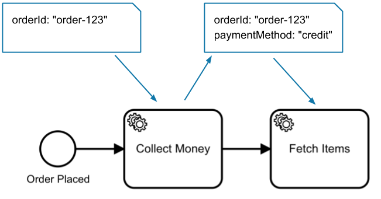
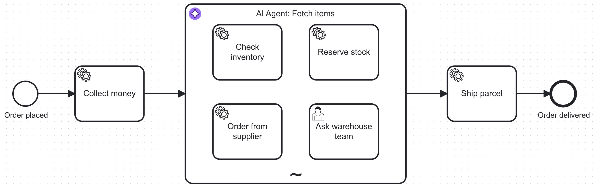

A [process](/reference/glossary.md#process) is a defined sequence of distinct steps or tasks representing your business logic. For example, an e-commerce shopping experience or onboarding a new employee.

Process orchestration is the technology that coordinates the various moving parts, or endpoints, of a business process, and sometimes ties multiple processes together. It helps you work with the people, systems, and devices you already have, while achieving goals around end-to-end process automation.

With Camunda, you can orchestrate [human tasks](../../guides/getting-started-orchestrate-human-tasks.md), [microservices](/guides/getting-started-example.md), [APIs](/guides/getting-started-orchestrate-apis.md), and [AI agents](/guides/getting-started-agentic-orchestration.md) as endpoints in the same process. For example, an order fulfillment process could run a fixed sequence of steps, then hand off a step to an [AI agent](/reference/glossary.md#ai-agent) that decides which tools to call, before returning control to the next fixed step.

A **[job worker](./job-workers.md)** implements the business logic required to complete a task. You can choose to write a worker as a microservice, or also as part of a classical 3-tier application, as a \(lambda\) function, via command line tools, etc.

Running a process broadly requires three steps:

1. Deploy a process to Camunda 8.
2. Implement and register job workers for tasks in the workflows.
3. Create new instances of the process.

However, if you haven't yet, design the process:

## BPMN

Camunda uses **[Business Process Model and Notation (BPMN) 2.0](/components/modeler/bpmn/bpmn.md)** to represent processes. The visual nature of BPMN enables greater collaboration between different teams, and is employed by numerous organizations globally.

:::note
New to BPMN? Visit our step-by-step introductory guide on [automating a process using BPMN](/components/modeler/bpmn/automating-a-process-using-bpmn.md)
:::

## Modeling BPMN

Camunda provides [Modeler](/components/modeler/about-modeler.md), a free and open source BPMN modeling tool to create BPMN diagrams and configure their technical properties.

Camunda offers two Modeler tools to design and implement your diagrams:

- [Web Modeler](/components/modeler/web-modeler/launch-web-modeler.md): Integrate seamlessly with Camunda 8 SaaS and Self-Managed installations alongside [Console](../console/introduction-to-console.md).
- [Desktop Modeler](/components/modeler/desktop-modeler/index.md): Design, view, and edit models using this desktop application. Install and use Desktop Modeler locally, all while integrating your local development environment.

:::note
New to modeling a process? Visit our [getting started guide](/components/modeler/web-modeler/collaboration/design-your-process.md).
:::

## Process execution

The simplest kind of process is an ordered sequence of tasks. Whenever process execution reaches a task, [Zeebe](/components/zeebe/zeebe-overview.md) (the workflow engine inside Camunda 8) creates a job that can be requested and completed by a job worker.

Process orchestration typically follows the steps below:

1. A process instance reaches a task, and Zeebe creates a job that can be requested by a worker.
2. Zeebe waits for the worker to request a job and complete the work.
3. Once the work is complete, the flow continues to the next step.
4. If the worker fails to complete the work, the process remains at the current step, and the job could be retried until it's successfully completed.

As Zeebe progresses from one task to the next in a process, it can move custom data in the form of [variables](/components/concepts/variables.md). Variables are key-value pairs and part of the process instance.

Any job worker can read the variables and modify them when completing a job so data can be shared between different tasks in a process.

### Agent-driven steps

Not every step has to follow a deterministic path you model in advance. Where a decision can't be fixed up front, you can hand part of the process to an [AI agent](/reference/glossary.md#ai-agent).

In the following order process, **Fetch items** is an AI agent rather than a fixed task.

Execution works as described above, with one difference: the AI agent chooses which activity runs next.

1. The process instance reaches the AI agent, which sends the prompt and the available tool definitions to a large language model (LLM).
2. If the LLM selects a tool, Camunda activates the matching activity inside the sub-process. **Check inventory**, **Reserve stock**, **Order from supplier**, and **Ask warehouse team** are ordinary service and user tasks, completed by the same job workers and users as any other task.
3. The tool result is passed back to the LLM, which decides whether more tool calls are needed.
4. Once the LLM returns a final response, the flow continues to **Ship parcel**.

The LLM decides which tools to call and in what order. Camunda runs them, moves the same [variables](/components/concepts/variables.md), and applies the same retries, incident handling, and audit trail as the fixed steps around them.

To learn more, see [agentic orchestration](/components/agentic-orchestration/agentic-orchestration-overview.md).
